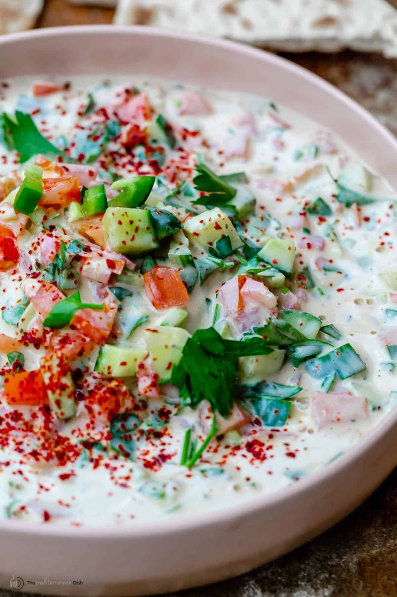

# Tahina Salad

*Egypt's tahina dip: tahini thinned with garlic, lemon, salt and water into a pourable savoury cream. Spread on a plate, drizzled with oil, scooped with bread.*

**Serves:** 4 as a mezze

**Prep Time:** 5 minutes

**Cook Time:** 0 minutes

## Overview
Good-quality tahini whisks with crushed garlic, fresh lemon juice and a pinch of salt. The mix tightens dramatically at first (chemistry of acid + tahini), then loosens with cold water added slowly until pourable. Pinch of cumin folds in. Spread on a wide plate; pool of olive oil on top; pinch of sumac and parsley.

## Ingredients

- 200 g good-quality tahini (Lebanese, Syrian or Palestinian brand - light and runny)
- 3 garlic cloves (crushed to a paste with ½ tsp salt)
- 1 ½ lemons (juice)
- ½ teaspoon ground cumin
- ½ teaspoon salt (to taste)
- 100-150 ml cold water (added gradually)

### To finish
- 1 tablespoon olive oil
- ½ teaspoon sumac (optional)
- 1 tablespoon fresh parsley (chopped)
- Egyptian flatbread (or pita to scoop)

## Method

### Stage 1 - Whisk
1. In a wide bowl, whisk the tahini, garlic-salt paste, lemon juice and cumin.
1. The mixture tightens at first into a stiff paste - that's expected.

### Stage 2 - Loosen
1. Whisk in cold water 1 tablespoon at a time.
1. After 5-6 tablespoons it loosens to a pourable cream the texture of double cream.
1. Continue adding water in small amounts until it just falls from the whisk in a smooth ribbon.

### Stage 3 - Season
1. Taste; adjust salt and lemon. The dish should be sharp, savoury, slightly nutty.

### Stage 4 - Plate
1. Spread on a wide shallow plate, making ridges with the back of a spoon.
1. Drizzle olive oil; sprinkle sumac and parsley.

### Stage 5 - Serve
1. Eat with warm pita or alongside ful, kofta, mezze.

## Notes
- **Tahini quality:** A good Lebanese / Syrian tahini is light, pours easily and tastes slightly nutty. Cheap supermarket tahini is bitter and grainy. Buy the good stuff.
- **Cold water for emulsification:** Hot water curdles tahini; cold water emulsifies smoothly. This trick is universal across Levantine cooking.
- **Adjust thickness to use:** Looser for a dip; thicker as a sauce drizzled over meats.

## Storage
- Refrigerate 5 days; the colour deepens but flavour holds.
- Loosen with a splash of water before serving from cold.
