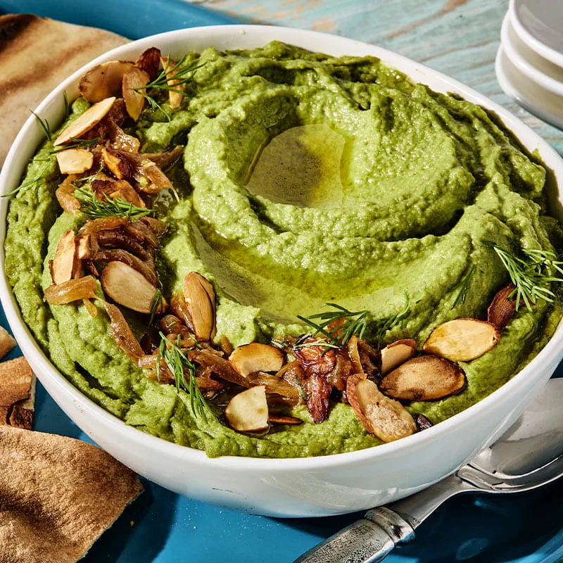

# Bessara

*Egypt's winter fava dip: dried fava beans simmered soft, blended with garlic and cumin, swirled with green oil. Served with hot baladi bread.*

**Serves:** 4

**Prep Time:** 15 minutes (plus overnight soak)

**Cook Time:** 1 hour 15 minutes

## Overview
Dried split fava beans (foul mudammas) soak overnight with bicarbonate of soda. Simmer with garlic, bay, coriander seeds and water for 1 hour until completely soft. Blitzed (or mashed) with garlic, ground cumin, ground coriander, salt and lemon juice into a thick spoonable purée, looser than hummus but thicker than soup. Plated in a wide shallow bowl: a swirl in the centre, doused with the green oil (olive oil + paprika + cumin + chopped parsley), maybe a sprinkle of dukkah on top, served warm with hot baladi bread.

## Ingredients

### Beans
- 250 g dried split fava beans (the yellow split bean - sold at Egyptian / Middle Eastern shops)
- 1 teaspoon bicarbonate of soda (for the soak)
- 1 ½ litres water (for the soak)

### Simmering
- 1 litre water (fresh, for cooking)
- 6 garlic cloves (whole, peeled)
- 1 bay leaf
- 1 tablespoon coriander seeds
- 1 teaspoon salt

### Blender
- 4 garlic cloves (extra - peeled)
- 1 ½ teaspoons ground cumin
- 1 teaspoon ground coriander
- ½ teaspoon Aleppo pepper
- Juice of 1 lemon
- 1 ½ teaspoons salt (to taste)
- 3 tablespoons olive oil

### Green oil for finishing
- 6 tablespoons extra-virgin olive oil
- 1 small bunch fresh parsley (finely chopped, about 20 g)
- 1 teaspoon sweet paprika
- ½ teaspoon ground cumin
- A pinch of dried mint

### To serve
- Hot baladi bread, pita or any flatbread
- Sliced raw onion (optional, traditional)
- Lemon wedges
- A small bowl of dukkah (optional)

## Method

### Stage 1 - Soak
1. Place fava beans in a deep bowl with 1 ½ litres of cold water and the bicarbonate of soda.
1. Soak 12 hours.
1. Drain; rinse thoroughly.

### Stage 2 - Cook
1. Place drained beans in a deep pot with 1 litre fresh water, garlic cloves, bay leaf, coriander seeds and 1 teaspoon salt.
1. Bring to a boil; skim foam.
1. Reduce to low simmer; partial lid.
1. Cook 1 hour to 1 hour 15 minutes until the beans are completely soft (crushable easily between fingers) and most of the water has been absorbed. Add water during cooking if it goes too dry.

### Stage 3 - Blitz
1. Discard the bay leaf and coriander seeds (or sieve them out).
1. Tip the beans, their cooking liquid, and the extra 4 garlic cloves into a food processor.
1. Add cumin, coriander, Aleppo pepper, lemon juice and 3 tablespoons olive oil.
1. Blitz until smooth.
1. Taste; adjust salt and lemon.
1. The texture should be like a thick hummus - spoonable but not stiff. Loosen with hot water if needed.

### Stage 4 - Green oil
1. In a small bowl, whisk extra-virgin olive oil with chopped parsley, paprika, cumin and dried mint.

### Stage 5 - Plate
1. Warm the bessara gently in a small saucepan (or microwave 1 minute).
1. Spread onto a wide shallow plate.
1. Make a shallow well in the centre with the back of a spoon.
1. Drizzle the green oil generously over.
1. Scatter dukkah if using.

### Stage 6 - Serve
1. Eat warm, scooping with torn hot baladi bread.
1. Offer sliced raw onion and lemon wedges on the side.

## Notes
- **Soak with bicarb:** Without baking soda in the soak, the bean skins stay tough and the puree never becomes silky.
- **Cook them very soft:** Underdone beans give grainy, harsh bessara. The beans should mash easily under finger pressure; if they don't, simmer longer.
- **Side or dip:** Bessara works as a side at a mezze table OR as the centre of a bread-and-dip lunch. Either way, eat warm - cold bessara dulls dramatically.

## Storage
- Refrigerate 4 days; warm with a splash of water (it thickens unappealingly cold).
- Freezes 3 months.
- The green oil is excellent on anything else - roast vegetables, fried eggs, grilled fish.
