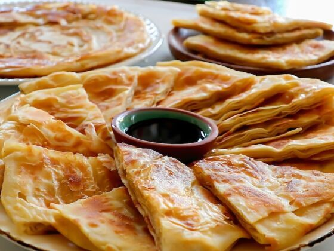

# Feteer Meshaltet

*Egypt's pillowy pastry: paper-thin dough folded with ghee into a square and baked till amber, the layers steaming soft inside.*

**Serves:** 4 (makes one 24 cm feteer; 8 wedges)

**Prep Time:** 45 minutes (plus 30 min rest)

**Cook Time:** 30 minutes

## Overview
A soft elastic dough rests; divides into 2 balls. Each ball stretches paper-thin on a heavily-oiled / ghee-buttered surface (similar to msemen or yufka, translucent dough). Layered with melted ghee between folds: stretch → ghee → fold into thirds → quarter-turn → stretch → ghee → fold. Repeated 3 times per ball. The two folded packets place stacked on top of each other in a buttered round dish (about 24 cm). Baked at 220°C 25-30 minutes until amber, golden, and the layers have separated dramatically. Served warm with honey, soft cheese, or molasses-and-tahini (the Egyptian classic dip).

## Ingredients

### Dough
- 400 g plain flour
- ½ teaspoon salt
- 1 teaspoon caster sugar
- 1 egg (large)
- 60 ml whole milk (warm)
- 200 ml water (warm)
- 1 teaspoon fast-action yeast (optional; some recipes skip; gives slightly puffier result)

### For laminating
- 150 g ghee (or unsalted butter, melted, Egyptian feteer traditionally uses samna, which is clarified butter / ghee)

### Sweet topping (choose one or assemble at the table)
- Honey (or date molasses)
- A drizzle of tahini whisked with the molasses
- Soft white cheese (like a mild Egyptian areesh, or substitute ricotta)
- Sweetened condensed milk
- Powdered sugar dusting

### Savoury topping (optional - for the assembled meshaltet)
- 150 g feta cheese (crumbled)
- 50 g melting cheese (mozzarella, grated)
- 2 tablespoons fresh dill (chopped)

## Method

### Stage 1 - Dough
1. Whisk flour, salt, sugar and (if using) yeast in a wide bowl.
1. Whisk milk + water + egg in a jug.
1. Add wet to dry; mix to a soft sticky dough.
1. Knead 10 minutes by hand - the dough should be very soft and elastic. Add a tablespoon of water if too dry, or a tablespoon of flour if unmanageably wet.
1. Rest in an oiled bowl, covered, 30 minutes.

### Stage 2 - Divide and oil
1. Divide into 2 balls.
1. Cover each with a generous layer of melted ghee. Let stand 10 minutes (the ghee softens the dough surface for stretching).

### Stage 3 - Stretch first time
1. Heavily ghee a wide work surface.
1. Take one ball; flatten gently with palms; pull and stretch outward into a paper-thin square / circle 40 cm across (similar technique to filo / yufka - translucent in the centre).
1. Drizzle 2 tablespoons of melted ghee across the surface; spread with fingers.

### Stage 4 - Fold (lamination)
1. Fold the stretched dough into thirds (like a letter): left edge over centre, right edge over.
1. Drizzle 1 tablespoon ghee.
1. Quarter-turn (90°).
1. Stretch again into a smaller rectangle (about 30 cm × 20 cm).
1. Drizzle ghee.
1. Fold into thirds the other way.
1. Drizzle ghee.
1. You should now have a thick packet about 12 cm square.

### Stage 5 - Repeat with second ball

### Stage 6 - Final assembly
1. Heat oven to 220°C (200°C fan).
1. Ghee a 24 cm round oven dish (or baking tin).
1. Place one folded packet in the centre.
1. Gently flatten with your palm into a disc 20 cm across.
1. Drizzle ghee.
1. Stack the second packet on top; flatten to match.
1. Drizzle ghee generously over the top.

### Stage 7 - Bake
1. Bake 22-28 minutes until deep golden brown on top, with visible flaky layers at the edges and dramatic puffing.

### Stage 8 - Serve
1. Cool 5 minutes.
1. Cut into wedges with a sharp knife.
1. Set out toppings: honey, date molasses, tahini, ricotta-style cheese.
1. Tear and dip, or layer toppings inside the warm wedges.

## Notes
- **Stretch paper-thin:** The signature of feteer is the dramatic flaky-layered cross-section. That happens only if each ball is stretched truly translucent - you should see your hand through the dough. Tears are fine; they fold over.
- **Ghee, generously:** Don't be timid with the fat between layers. Feteer is rich by design; sparingly-oiled feteer is flat and bread-like.
- **Hot oven, short bake:** 220°C is right. Lower temperatures give pale, undercooked layers. The bake is short (~25 min) because the dough is already thin.

## Storage
- Best within 4 hours of baking.
- Refrigerate 2 days; warm at 200°C 6 minutes (microwave makes it soggy).
- The layers stale relatively fast; freeze cooked feteer wrapped tightly 1 month; warm at 200°C 12 minutes from frozen.
