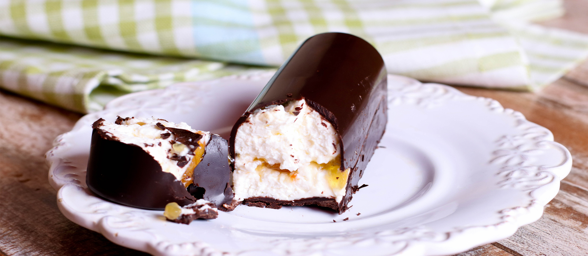

# Kohuke

*The Estonian fridge classic: sweetened fresh curd cheese rolled into a bar and dipped in dark chocolate, the after-school snack of every Estonian child.*

**Serves:** Makes 10 bars

**Prep Time:** 25 minutes

**Chilling Time:** 4 hours

## Overview
Kohuke is the Estonian (and Lithuanian, where it is called varškės sūrelis) chocolate-glazed sweet curd-cheese bar that has lived in Baltic fridges since Soviet days. It is built around kohupiim, the fresh slightly tangy farmers' curd that is sold in every Estonian supermarket. The curd is sweetened with sugar and vanilla, enriched with butter, optionally folded with raisins or a strip of jam, shaped into small bars and chilled until firm, then dipped in melted dark chocolate. The result is unmistakably Estonian: cold, soft, slightly cheesy in the middle, snapping with thin chocolate outside. Pack one in a school bag and it will not survive the morning.

## Ingredients

### For the curd centres
- 500 g fresh farmers' curd (kohupiim or quark; press dry first if very wet)
- 80 g unsalted butter, very soft
- 100 g icing sugar
- 1 tsp vanilla extract
- 1 tbsp double cream
- Optional: 50 g raisins, or 2 tbsp thick jam

### For the chocolate coating
- 250 g good dark chocolate (60-70% cocoa)
- 20 g coconut oil or neutral oil (helps the coating snap)

## Method

### Stage 1 - Drain the curd
1. If the curd is wet, line a sieve with muslin, tip the curd in, gather the ends and twist gently over a bowl. Let it drain 30 minutes; press out as much whey as you can. The curd should be firm and crumbly.

### Stage 2 - Mix the centres
1. Beat the soft butter with the icing sugar and vanilla for 1 minute until light.
2. Add the drained curd a spoonful at a time, beating between additions.
3. Add the cream; beat until smooth and thick (the mixture should hold a soft peak).
4. Fold in raisins if using.

### Stage 3 - Shape
1. Line a tray with baking parchment.
2. Scoop the curd mix into 10 portions of about 65 g each.
3. With damp hands, shape each into a small bar about 7 cm long, 3 cm wide and 2 cm thick. (If using a jam stripe, press a shallow channel down the centre, pipe in jam and fold the curd over.)
4. Chill on the tray for 3-4 hours, or freeze for 1 hour, until very firm.

### Stage 4 - Coat in chocolate
1. Melt the chocolate with the coconut oil gently in a heatproof bowl set over (not in) simmering water; stir until smooth.
2. Let the chocolate cool until just warm to the touch (a too-hot bath melts the curd centres).
3. Working one at a time, place a chilled bar on a fork, lower into the chocolate, lift, tap the fork on the rim to shed excess, and slide back onto a parchment-lined tray.
4. Repeat with the rest.
5. Chill 30 minutes until the chocolate has set.

### Stage 5 - Serve
1. Eat cold straight from the fridge.

## Notes
- **The curd is the whole point:** Estonian kohupiim is fresh, slightly grainy and tangy. German quark is the closest substitute. Cream cheese is too smooth and too rich; ricotta is too wet (it needs heavy draining).
- **Cold centres, warm chocolate:** A well-chilled bar dipped in just-warm (not hot) chocolate is what gives the thin, neat coating. If the chocolate is too hot it melts the bar; too cool and it goes thick and clumpy.
- **Variations:** Estonian shop kohuke comes in dozens of flavours including pear, banana, mocha, poppy-seed and biscuit. The home base is plain vanilla or vanilla-with-raisins.
- **Don't overbeat:** The curd mix should be smooth but not whipped to softness; you need it firm enough to shape.

## Serving
Serve cold as an after-school snack, with coffee, or sliced and tucked into a lunchbox. Some Estonians eat them frozen as a sort of cheesecake ice-cream bar.

## Storage
- Keeps 5 days refrigerated in a sealed container
- Freezes 1 month; eat partly thawed or fully frozen
- The chocolate coating may bloom (turn pale) in the fridge; this is harmless and disappears on warming slightly

