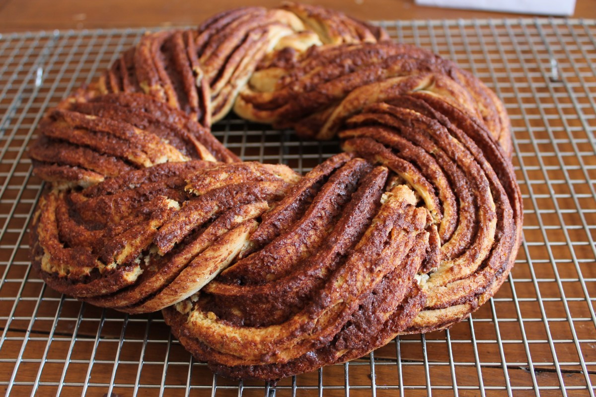

# Kringel

*The Estonian celebration bread: a soft enriched dough scented with cardamom and saffron, twisted into a long braid, brushed with egg and showered with sugar and almonds.*

**Serves:** 12

**Prep Time:** 30 minutes

**Rising Time:** 2.5 hours

**Bake Time:** 25 minutes

## Overview
Kringel is the Estonian (and broader Baltic-Nordic) twisted sweet bread that appears for birthdays, name days, Christmas morning and Sunday afternoon coffee. The dough is soft, milky and enriched with butter, eggs and a heady amount of ground cardamom; many bakers add a pinch of saffron for the colour and the lift. After the first rise the dough is rolled flat, spread with butter, sugar and cinnamon, rolled tight, sliced lengthways down the middle to expose the layers, then twisted into a long braid that is curled into a wreath. It bakes to a glossy, dark gold; the crumb tears in soft, buttery cardamom-scented strands.

## Ingredients

### For the dough
- 500 g strong white bread flour, plus more for dusting
- 250 ml whole milk, warm
- 7 g instant dried yeast
- 80 g caster sugar
- 80 g unsalted butter, softened
- 2 large eggs (1 whole, 1 separated; reserve the white for glazing)
- 1.5 tsp ground cardamom
- A pinch of saffron threads, crushed (optional)
- 1/2 tsp salt

### For the filling
- 80 g unsalted butter, softened
- 80 g light brown sugar
- 2 tsp ground cinnamon
- 1 tsp ground cardamom

### To finish
- 1 reserved egg white, beaten
- 2 tbsp pearl sugar (or crushed sugar cubes)
- 2 tbsp flaked almonds

## Method

### Stage 1 - Mix and knead
1. Warm the milk to body temperature (about 35 C); whisk in the yeast and 1 tsp of the sugar; let stand 5 minutes until frothy.
2. In a large bowl combine the flour, the remaining sugar, salt, cardamom and saffron.
3. Add the yeasted milk, the whole egg and the yolk; mix to a rough dough.
4. Turn out and knead 10 minutes, working the softened butter in piece by piece, until smooth, glossy and slightly sticky. (Or use a stand mixer with a dough hook for 8 minutes.)

### Stage 2 - First rise
1. Place the dough in a lightly oiled bowl, cover and leave somewhere warm for 1.5 hours, until doubled in size.

### Stage 3 - Fill and shape
1. Turn the dough out onto a lightly floured surface and roll into a rectangle about 50 cm long and 30 cm wide.
2. Spread the softened butter all over; mix the brown sugar with cinnamon and cardamom and scatter evenly.
3. Roll up tightly from a long edge into a long sausage.
4. With a sharp knife, slice the sausage in half lengthways from end to end, leaving 2 cm joined at one end. Open the two strands out with the cut sides facing up.
5. Twist the two strands over each other, keeping the cut sides facing up, until you reach the end.
6. Curl into a wreath; tuck the ends under. Transfer to a baking sheet lined with parchment.

### Stage 4 - Second rise
1. Cover loosely with a tea towel and prove 45-60 minutes until puffy.
2. Heat the oven to 190 C (170 C fan).

### Stage 5 - Glaze and bake
1. Brush the wreath gently with the beaten egg white.
2. Scatter pearl sugar and flaked almonds evenly over the top.
3. Bake 22-26 minutes until deep gold and the underside sounds hollow when tapped.
4. Cool on the baking sheet for 15 minutes before sliding onto a rack.

## Notes
- **Cardamom is the lead flavour:** Buy fresh green cardamom pods, crack and grind the seeds yourself. Pre-ground cardamom loses its perfume quickly.
- **The cut-and-twist:** Slicing the rolled sausage lengthways exposes the cinnamon-sugar layers and is what gives kringel its unmistakable look. A sharp serrated knife and a confident hand are key.
- **Glaze with egg white only:** A whole-egg wash darkens too much. Egg white gives the right glossy gold.
- **Saffron:** Optional, but a small pinch deepens the colour and lifts the cardamom.

## Serving
- Serve sliced with strong black coffee or tea. A small bowl of berry jam on the side for spreading.

## Storage
- Best eaten the day it is baked
- Keeps 2 days at room temperature wrapped in a tea towel
- Freezes 1 month sliced; refresh slices in a low oven for 5 minutes

