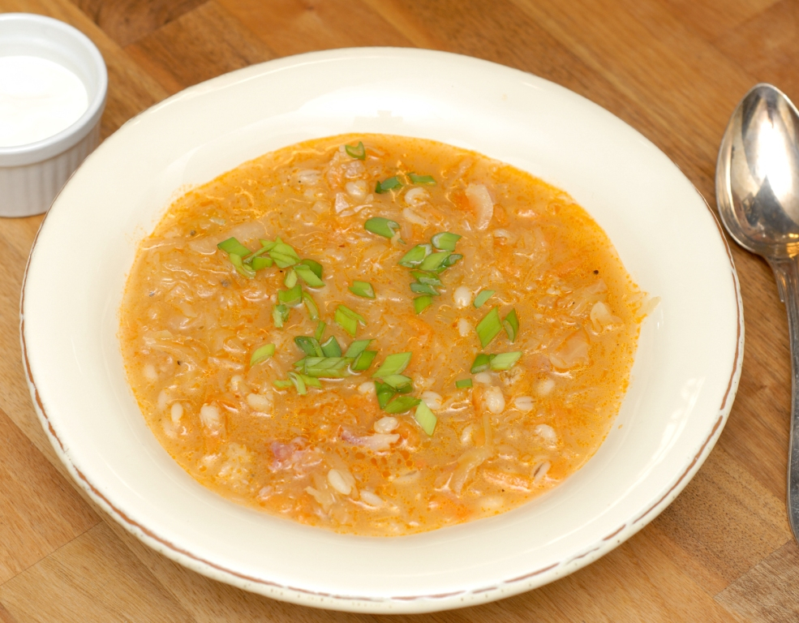

# Hapukapsasupp

*The Estonian winter soup of sauerkraut and pork ribs slow-simmered with barley, carrot and bay until the kraut is tender and the broth is golden.*

**Serves:** 6

**Prep Time:** 15 minutes

**Cook Time:** 2 hours

## Overview
Hapukapsasupp (literally "sour-cabbage soup") is the Estonian sister to Russian shchi and Polish kapuśniak, a long-cooked pork-and-sauerkraut soup that turns the most useful winter pantry items (a jar of fermented cabbage, smoked pork bones, a handful of barley) into a thick, sour, golden bowl. It defrosts a January body in minutes. The trick is to rinse the sauerkraut only lightly (leaving plenty of its sourness), simmer with smoked pork ribs or bones for the depth, and let pearl barley loose in the pot to thicken the broth. A spoon of sour cream and a hunk of rye bread make it a meal.

## Ingredients

- 700 g smoked pork ribs or smoked pork knuckle
- 600 g fermented sauerkraut (drained weight), lightly rinsed if very sour
- 100 g pearl barley
- 2 onions, finely chopped
- 2 carrots, peeled and diced
- 2 floury potatoes (about 300 g), peeled and cubed
- 2 bay leaves
- 8 allspice berries
- 8 black peppercorns
- 1 tbsp tomato paste
- 2 tbsp neutral oil
- 1 tsp sugar
- Salt
- 2.5 litres water

### To serve
- Sour cream
- Fresh dill, chopped
- Dark rye bread

## Method

### Stage 1 - Build the broth
1. Place the smoked pork ribs in a large pot with 2.5 litres cold water, the bay, allspice and peppercorns.
2. Bring to a simmer, skim, then simmer gently for 1 hour. Lift out the ribs to a board; strain the broth and return to the pot. Pick the meat off the bones, shred and reserve.

### Stage 2 - Cook the barley
1. Rinse the barley and add to the strained broth.
2. Simmer 25 minutes.

### Stage 3 - Soften the kraut
1. While the barley cooks, heat the oil in a wide pan; cook the onions for 8 minutes until soft and pale gold.
2. Add the carrots and cook 5 minutes more.
3. Add the sauerkraut, tomato paste and sugar; pour over a ladle of broth from the pot.
4. Cover and braise on low for 20 minutes until the kraut is tender (this softens the sourness; raw kraut tossed straight into a soup stays sharp and squeaky).

### Stage 4 - Bring it together
1. Add the braised kraut mix to the soup pot along with the diced potatoes.
2. Simmer 20 minutes until the potatoes are tender and the barley is fully soft.
3. Stir in the shredded pork.
4. Taste; the soup should be richly sour and salty enough on its own. Adjust salt; if too sharp, add another pinch of sugar.

### Stage 5 - Serve
1. Ladle into deep bowls.
2. Add a generous spoonful of sour cream on top of each.
3. Scatter with chopped dill. Pass rye bread.

## Notes
- **The smoke is the point:** Smoked pork bones, knuckle or ribs supply most of the soup's character. Unsmoked pork makes a different (paler) soup.
- **Braise the kraut:** Twenty minutes of slow braising in fat and tomato softens the cabbage and gives a rounded sourness. Don't skip the step.
- **Make ahead:** Day two is better than day one; the flavours settle and the broth thickens further.
- **No pork:** The soup can be made on a strong vegetable stock with smoked paprika and white beans instead of pork; not traditional but it works.

## Serving
- Serve hot in deep bowls with a spoon of sour cream, chopped dill on top and rye bread on the side. A glass of dark beer or kali alongside.

## Storage
- Keeps 4 days refrigerated
- Freezes 2 months
- Reheat gently in a pan; thin with water if it has thickened too much

