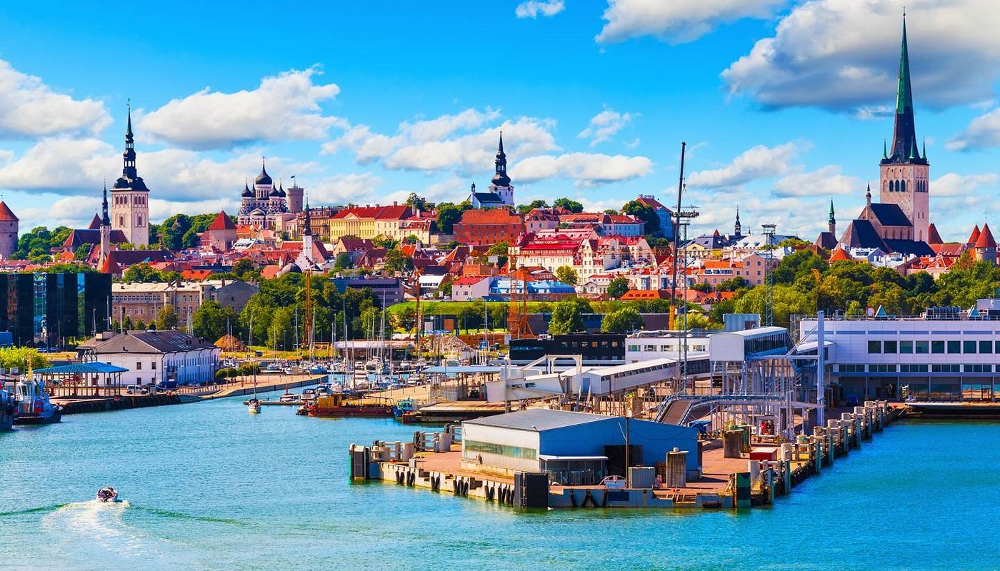

# Estonian Cuisine

A Baltic country kitchen built on rye, barley, potatoes and the catch of the Baltic Sea (herring, sprats, salmon and smoked white fish). Dairy runs deep: kefir, sour cream and fresh curd (kohupiim) appear in soups, salads and desserts. The flavour map is shaped by a Lutheran-German-Hanseatic layer (cardamom buns, brown sauces, rye crackers), a Russian and Soviet-era inheritance (pirukad, kissell, blood sausage) and the very Estonian kama tradition of roasted grain flour eaten with kefir or honey for breakfast and dessert. Sauerkraut, dill, juniper, caraway and lingonberry handle the seasoning.
