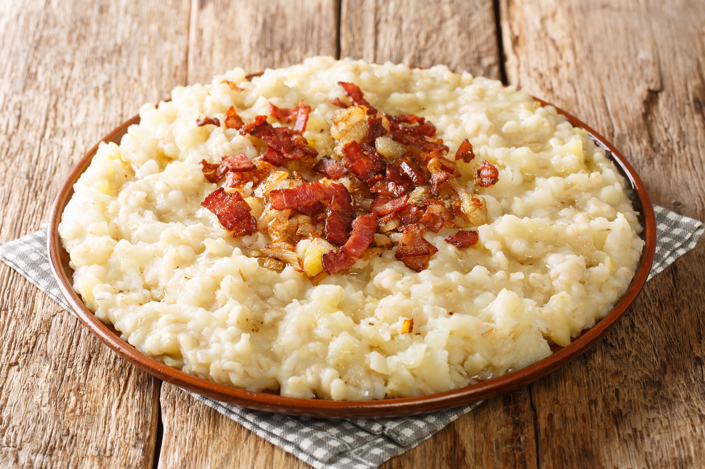

# Mulgipuder

*The everyday Estonian carb: pearl barley and floury potatoes mashed together with butter, milk and salt, finished with crisp fried onion and bacon.*

**Serves:** 4

**Prep Time:** 10 minutes

**Cook Time:** 50 minutes

## Overview
Mulgipuder takes its name from the Mulgimaa region of southern Estonia, where the barley and potato pairing has been a daily dish for generations. The two are cooked separately (barley needs 40 minutes, potato needs 20), then crushed together with warm milk and butter into a thick, off-white mash with a slightly chewy bite from the barley. The classic finish is a hot spoonful of bacon and onion fried in their own fat (called kaste, "the sauce") poured into a hollow in the mash at the table. It is the everyday partner to verivorst, sausages and roast pork, but it also stands on its own with a knob of butter melting in the middle.

## Ingredients

### For the mash
- 200 g pearl barley
- 800 g floury potatoes, peeled and cut into 3 cm chunks
- 500 ml whole milk, warmed
- 60 g butter
- 1.5 tsp salt, plus more to taste
- Black pepper

### For the bacon-onion topping
- 200 g smoked streaky bacon or pork belly, diced
- 2 onions, finely chopped
- Black pepper

## Method

### Stage 1 - Cook the barley
1. Rinse the barley under cold water until it runs clear.
2. Bring 600 ml water to the boil with 1/2 tsp salt; add the barley.
3. Reduce to a low simmer and cook covered for 35-40 minutes, until the grains are tender but still have a slight bite. Drain off any remaining water.

### Stage 2 - Cook the potatoes
1. While the barley simmers, boil the potatoes in salted water for 15-20 minutes until a knife slides through with no resistance. Drain.

### Stage 3 - Mash
1. Combine the drained potatoes and barley in the wider of the two pans.
2. Crush with a potato masher; do not use a food processor (it turns the barley gummy).
3. Pour in the warm milk a little at a time, working it in.
4. Beat in the butter, salt and a grind of black pepper. The texture should be thick, soft and slightly rough from the barley. Cover and keep warm.

### Stage 4 - Make the bacon-onion kaste
1. Place the diced bacon in a cold frying pan; bring up to medium heat.
2. Fry 6-8 minutes until the fat has rendered and the bacon is going crisp at the edges.
3. Add the chopped onions and fry 6-8 minutes more, stirring, until the onions are deep gold and soft in the bacon fat. Grind in a little pepper.

### Stage 5 - Serve
1. Spoon hot mulgipuder into wide bowls; make a deep well in the centre of each with the back of a spoon.
2. Spoon the hot bacon-onion mix (with all its fat) into the well.
3. Eat warm, working from the centre outwards.

## Notes
- **The barley:** Pearl barley (kruubid) is the standard. Hulled barley needs an overnight soak and an extra 20 minutes of cooking.
- **Don't over-mash:** A potato masher gives the right rough texture. A stick blender or food processor releases the starch from the barley and turns the mash into glue.
- **Smoked bacon:** Estonian küpsetatud peekon is heavily smoked. A good European smoked streaky bacon is the closest swap.
- **Vegetarian version:** Replace the bacon-onion kaste with a generous spoonful of brown butter, or serve under a fried egg.

## Serving
- Serve hot as the carb of a meal with verivorst (blood sausage), pan-fried sausages, roast pork or a fried egg. A spoon of lingonberry jam on the side cuts through the richness.

## Storage
- Keeps 3 days refrigerated
- Reheat in a pan with a splash of milk; stir over low heat
- The bacon-onion kaste keeps 5 days refrigerated; reheat in its own fat

