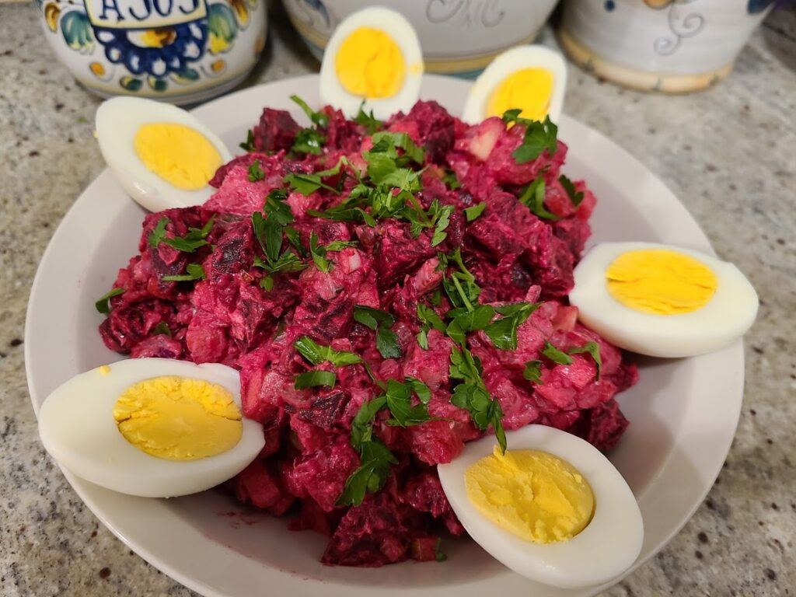

# Rosolje

*The pink-stained Estonian celebration salad: beetroot, potato, herring, pickled cucumber and apple under a tangy sour-cream dressing.*

**Serves:** 6 as a starter

**Prep Time:** 30 minutes

**Cook Time:** 1 hour

**Chilling Time:** 2 hours

## Overview
Rosolje is the Estonian relative of Russian vinegret and Scandinavian sillsallad, a pink mosaic of cooked beetroot, potato, carrot, salted herring, pickled cucumber, apple and onion bound in a sweet-sour sour-cream dressing. It belongs on the cold table of every Christmas, Easter and birthday across Estonia. Every kitchen has its own balance (more potato or more herring, more apple or more cucumber, beef sometimes added) but the colour is always the same vivid pink-violet from the beetroot bleeding into the dressing. Make it the day before; the flavours need overnight in the fridge to come together.

## Ingredients

### For the salad
- 3 medium beetroot (about 500 g), scrubbed
- 4 medium waxy potatoes (about 500 g), scrubbed
- 2 carrots, scrubbed
- 2 salted herring fillets (about 150 g), or matjes-style herring
- 1 large pickled cucumber (about 100 g)
- 1 small green apple, peeled and cored
- 1 small red onion, finely chopped
- 2 hard-boiled eggs, peeled

### For the dressing
- 200 ml sour cream
- 2 tbsp mayonnaise (optional, for richness)
- 2 tsp Estonian or Dijon mustard
- 1 tbsp white wine vinegar
- 1 tsp sugar
- 1/2 tsp salt
- Black pepper

### To finish
- Fresh dill, finely chopped

## Method

### Stage 1 - Boil the vegetables
1. Place the beetroot in one pan, the potatoes and carrots in another. Cover with cold water, add a pinch of salt.
2. Boil the potatoes 15-20 minutes, the carrots 20-25 minutes, the beetroot 50-60 minutes (test with a knife; it should slide through with no resistance).
3. Drain everything and cool completely. Peel.

### Stage 2 - Prep the herring
1. If using whole salted herring, soak the fillets in cold water or milk for 1 hour to draw out the salt; drain and pat dry. Matjes fillets are usually ready to use straight from the pack; taste and rinse if very salty.
2. Dice the herring into 5 mm pieces.

### Stage 3 - Dice everything
1. Dice the peeled beetroot, potato, carrot, pickled cucumber, apple and hard-boiled eggs all to a consistent 5-7 mm cube. Place in a wide bowl as you go (the beetroot will stain everything; this is correct).
2. Add the herring and the chopped red onion.

### Stage 4 - Dress
1. Whisk the sour cream, mayonnaise (if using), mustard, vinegar, sugar, salt and a grind of pepper in a small bowl.
2. Pour over the diced salad and fold gently with a spatula until evenly coated and uniformly pink-violet.
3. Cover and chill at least 2 hours, preferably overnight.

### Stage 5 - Serve
1. Taste, adjust salt or vinegar.
2. Mound on a plate or shallow dish; scatter with chopped dill.

## Notes
- **The herring:** Salt-cured Baltic herring (heeringas) is the original. Swedish matjes herring or any good pickled herring works. Smoked salmon offcuts are a non-traditional but Estonian-acceptable swap.
- **Uniform dice:** A 5-7 mm cube on everything is what gives rosolje its mosaic look. Rough chopping turns it into a beetroot soup.
- **Make ahead:** The salad genuinely improves overnight; the dressing thickens, the colour deepens and the flavours marry.
- **Beef variant:** Some Estonian families add 150 g of cold cooked beef, diced the same way, in place of (or alongside) the herring.

## Serving
Serve cold as a starter or part of a cold table. Dark rye bread, butter and a small glass of vodka are the partners of choice.

## Storage
- Keeps 3 days refrigerated, well covered
- Does not freeze
- The colour intensifies on the second day, which is when most Estonians prefer to eat it

