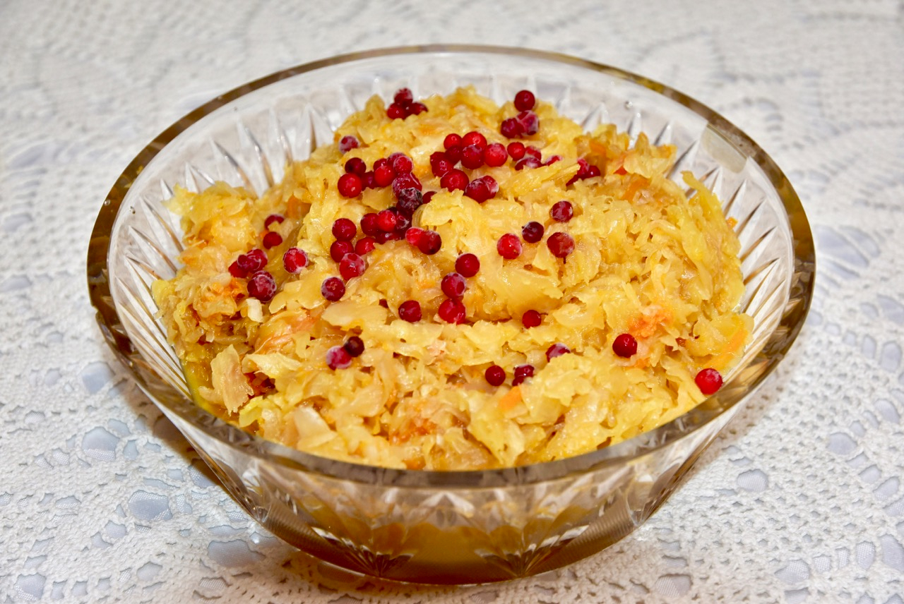

# Hapukapsas

*The Estonian fermented sauerkraut: cabbage and salt only, packed in a crock and left to lacto-ferment for two weeks into the sharp, tangy winter staple.*

**Serves:** Makes about 1.5 kg

**Prep Time:** 30 minutes

**Fermenting Time:** 14 days

## Overview
Hapukapsas is Estonian sauerkraut and it lives in every cellar, fridge and kitchen jar between November and May. The recipe is two ingredients: white cabbage and salt. The work is in the slicing (thin) and the packing (firm), then time and lactic acid bacteria do the rest. After two weeks at cool room temperature the cabbage has gone translucent, the brine is golden, and the smell has turned from raw cabbage to clean, sour, lightly fizzy. Hapukapsas is then eaten cold as a salad, simmered into hapukapsasupp (sauerkraut soup), or braised with pork. The taste is brighter, sharper and more alive than any shop-bought jar.

## Ingredients

- 2 kg white cabbage (1 large or 2 small heads), outer leaves removed
- 40 g fine sea salt (2% of the cabbage weight)
- 1 large carrot, grated (optional, for colour and a touch of sweetness)
- 1 tsp caraway seeds (optional)
- 1 tsp juniper berries, lightly crushed (optional)

### Equipment
- A 2-litre ceramic crock or wide-mouth glass jar
- A small plate or fermentation weight that fits inside
- A clean tea towel

## Method

### Stage 1 - Slice
1. Quarter the cabbage; cut out the cores.
2. Shred as thinly as possible (2-3 mm) with a sharp knife or a mandoline.
3. Pile the shredded cabbage into a very large bowl.

### Stage 2 - Salt and bruise
1. Sprinkle the salt evenly over the cabbage.
2. Massage and squeeze with your hands for 8-10 minutes. The cabbage will collapse to about half its volume and release a generous pool of liquid in the bottom of the bowl. This is the brine.
3. Stir in the carrot, caraway and juniper if using.

### Stage 3 - Pack
1. Transfer the cabbage to a clean ceramic crock or wide glass jar a handful at a time, pressing each layer down firmly with a fist or a wooden tamper.
2. Continue until all cabbage is packed in. Pour any remaining brine over the top.
3. The brine must cover the cabbage by 1-2 cm. If short, top up with a 2% salt solution (10 g salt in 500 ml water).

### Stage 4 - Weight and cover
1. Place a clean small plate (or a glass fermentation weight) on top of the cabbage so everything stays submerged.
2. Cover the crock with a clean tea towel or a lid set loosely (gas needs to escape).
3. Stand at cool room temperature (16-20 C) out of direct light for 10-14 days.

### Stage 5 - Watch the ferment
1. Day 1-3: bubbles appear, the brine turns cloudy, the smell goes sour.
2. Day 5-7: taste a strand. It should be tangy and pleasantly sour with a slight fizz.
3. Day 10-14: when the flavour is sharp and clean and the bubbling has slowed, the hapukapsas is ready.
4. Skim any white film (kahm) from the top if it appears; this is harmless yeast.
5. Transfer to clean jars with brine, lid down, and refrigerate. Fermentation slows almost to a stop at fridge temperature.

## Notes
- **2% salt by weight is non-negotiable:** Too little salt and the wrong bacteria take over (mushy, foul cabbage). Too much and lacto-fermentation stalls. Weigh accurately.
- **Submerge or rot:** Any cabbage above the brine line will go grey, slimy and mouldy. Push it down, weight it, and check.
- **Temperature:** A cool kitchen (16-20 C) is ideal. Warmer ferments are faster but coarser; cooler ferments are slower but cleaner.
- **Caraway and juniper:** The Estonian way is to leave them out and let the cabbage speak for itself. Include them if you like a more Baltic-German flavour.

## Serving
- Serve cold straight from the jar as a salad with a little oil and chopped onion; or braise with smoked pork and apple; or simmer into hapukapsasupp. A spoon on the side of any roast or sausage dish.

## Storage
- Keeps 6 months refrigerated in its own brine
- Does not freeze (the texture goes limp)
- Improves in flavour over the first 2 months in the fridge

