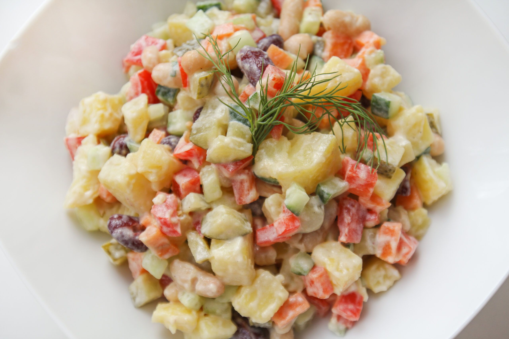

# Kartulisalat

*The Estonian birthday-table potato salad: cold waxy potatoes folded with peas, gherkins, egg, ham and a mustard-mayo-sour-cream dressing.*

**Serves:** 6 as a side

**Prep Time:** 20 minutes

**Cook Time:** 20 minutes

**Chilling Time:** 1 hour

## Overview
Kartulisalat is the Estonian potato salad and it lives on every birthday, christening and graduation buffet in the country. It is closer to a German Kartoffelsalat than to an American mayo-heavy version: waxy potatoes diced small, bound with a balanced dressing of sour cream, mayo, mustard and a splash of pickle brine, then folded with peas, chopped pickled gherkins, hard-boiled egg and pieces of cold ham or smoked sausage. The result is creamy and tangy, with sharpness from the gherkin and brightness from dill. It must be cold, must be made ahead, and must sit overnight if possible for the flavours to settle.

## Ingredients

### For the salad
- 800 g waxy potatoes (Charlotte, Anya or similar)
- 4 hard-boiled eggs, peeled
- 200 g cold cooked ham or smoked sausage
- 4 medium pickled gherkins (about 150 g)
- 200 g cooked or thawed green peas
- 1 small red onion, very finely chopped

### For the dressing
- 150 g sour cream
- 4 tbsp mayonnaise
- 2 tsp Estonian or Dijon mustard
- 2 tbsp gherkin brine
- 1/2 tsp salt
- Black pepper
- 3 tbsp fresh dill, chopped

## Method

### Stage 1 - Cook the potatoes
1. Place the potatoes (whole, skins on) in a large pan, cover with cold salted water.
2. Bring to a boil and simmer 15-20 minutes until a knife slides through with slight resistance (slightly undercooked is better than mushy).
3. Drain and cool completely. Peel and dice into 1 cm cubes.

### Stage 2 - Dice everything else
1. Dice the eggs, ham (or sausage) and gherkins all to the same 1 cm cube.
2. Combine in a wide bowl with the potatoes, peas and finely chopped onion.

### Stage 3 - Make the dressing
1. Whisk the sour cream, mayonnaise, mustard, gherkin brine, salt and pepper in a small bowl until smooth.
2. Stir in 2 tbsp of the dill.

### Stage 4 - Fold and chill
1. Pour the dressing over the salad and fold very gently with a spatula until everything is coated. Avoid mashing the potato.
2. Taste, adjust salt or brine.
3. Cover and refrigerate at least 1 hour, preferably 4-6 hours.

### Stage 5 - Serve
1. Stir once before serving; scatter the remaining dill on top.

## Notes
- **Waxy potatoes only:** Floury potatoes (Maris Piper, King Edward) fall apart and turn the salad into mash. Charlotte, Anya, fingerling or any waxy type holds shape.
- **Cold and salted brine:** The 2 tbsp of gherkin brine is the small Estonian trick that lifts the dressing; do not skip it.
- **Make ahead:** A few hours in the fridge let everything come together; overnight is fine.
- **Dairy balance:** All sour cream is too sharp, all mayo is too rich. The 150 g sour cream / 4 tbsp mayo ratio is the Estonian middle.

## Serving
Serve cold as a side to roast meats, sausages, fried herring, gravlax or alongside cold cuts on a buffet. A scatter of extra dill on top.

## Storage
- Keeps 3 days refrigerated, well covered
- Does not freeze
- Best from 4 hours to 24 hours after making
