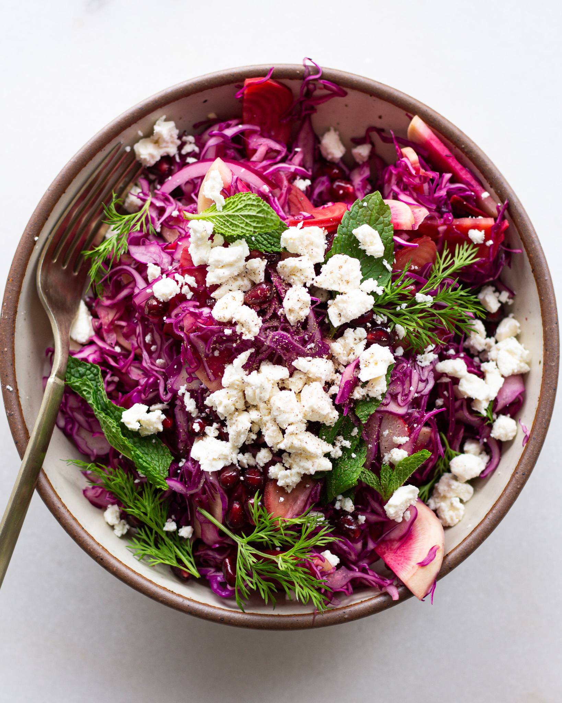

# Rosamunda

*The Estonian everyday cabbage salad: thin-sliced white cabbage and carrot massaged with salt, sugar and vinegar until tender, finished with oil and dill.*

**Serves:** 6 as a side

**Prep Time:** 15 minutes

**Resting Time:** 30 minutes

## Overview
Rosamunda is the cabbage-and-carrot vinegar slaw that turns up on the side of every Estonian school lunch and canteen plate, and at home alongside fried fish, schnitzels or roast chicken. It is essentially a quick, fresh, half-pickled coleslaw: finely shredded white cabbage and grated carrot are pressed firmly with salt and sugar until they collapse and release their liquid, then sharpened with white wine vinegar and loosened with a little neutral oil. Half an hour of rest is enough; overnight in the fridge is better. The texture is crunchy but yielding, the flavour is sweet-sour, and the colour is the pale gold of cabbage with orange flecks of carrot.

## Ingredients

- 600 g white cabbage (about half a small head), outer leaves removed and cored
- 2 medium carrots, peeled
- 1 tsp fine sea salt
- 2 tbsp sugar
- 3 tbsp white wine vinegar (or apple cider vinegar)
- 2 tbsp neutral oil (sunflower or rapeseed)
- Black pepper
- 2 tbsp fresh dill, finely chopped

## Method

### Stage 1 - Shred
1. Halve the cabbage, cut out the core, then slice as thinly as possible (1-2 mm) with a sharp knife or mandoline.
2. Grate the carrots on the coarse side of a box grater.
3. Combine in a wide bowl.

### Stage 2 - Press
1. Sprinkle the salt and sugar over the cabbage and carrot.
2. Massage with both hands for 3-4 minutes, squeezing the strands firmly. The cabbage will soften and visibly reduce in volume.
3. Pour over the vinegar and continue to massage gently for another minute.

### Stage 3 - Rest
1. Cover and leave at room temperature for at least 30 minutes (or in the fridge for up to 24 hours). The cabbage releases more liquid and softens further.

### Stage 4 - Finish
1. Drain off most of the released liquid (or leave it; some prefer the wet, brothy version).
2. Stir in the oil, a grind of black pepper and the chopped dill.
3. Taste, adjust salt, sugar or vinegar to balance sweet, salty and sour.

## Notes
- **Thin slicing matters:** Thick shreds stay tough and squeaky. The shred should be almost translucent.
- **Press, don't bruise:** Firm squeezing in the salt-sugar stage is what makes rosamunda tender. Don't mash; the cabbage should still have crunch.
- **Fresh, not fermented:** Unlike hapukapsas, rosamunda is a quick-pickle and is eaten within a few days. It does not need or want to ferment.
- **Variations:** A grated apple, a handful of cranberries or a few caraway seeds are all common additions; the version above is the standard canteen recipe.

## Serving
Serve cold as a side to schnitzel, fried fish, pan-fried sausages, roast pork or potato dishes. Also good piled into a rye-bread sandwich with cold ham.

## Storage
- Keeps 5 days refrigerated, sealed
- Does not freeze
- The flavour gets sharper on day two and is at its best on day three
