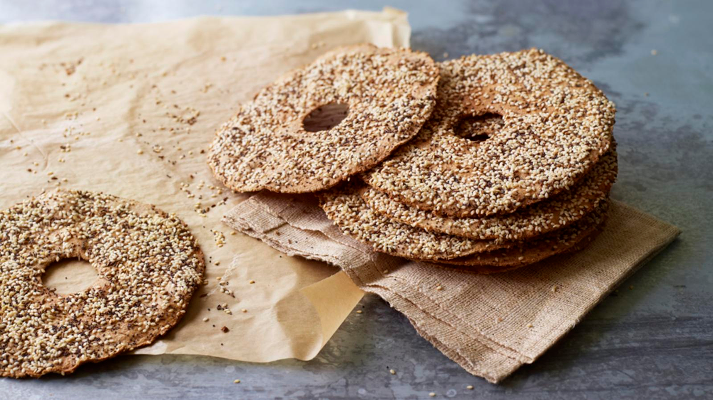

# Estonian Rye Crackers

*Thin, dark, snapping rye crispbreads with caraway and sea salt, baked until firm and eaten with butter, soft cheese and dill.*

**Serves:** Makes about 40 crackers

**Prep Time:** 20 minutes

**Resting Time:** 30 minutes

**Bake Time:** 15 minutes

## Overview
The Estonian rye cracker (näkileib in its Finnish-cousin form, leivake in some Estonian households) is a thin, hard, snapping crispbread baked from rye flour, a little salt and just enough water. The dough is rolled out as thin as a sheet of card, scored into squares or rounds, and baked in a hot oven until the surface is firm and dark and the smell of toasted rye fills the kitchen. The flavour is honest and grain-forward, slightly bitter, slightly sweet, with the herbal lift of caraway. Crackers go into the bread basket alongside a slab of butter and a wedge of fresh cheese; pile on a few slivers of smoked salmon and a frond of dill and you have a perfect open snack.

## Ingredients

- 300 g dark rye flour
- 100 g strong white bread flour, plus more for dusting
- 1.5 tsp fine sea salt
- 2 tsp caraway seeds
- 1 tbsp neutral oil
- 240 ml warm water, plus more if needed

### To finish
- A little water
- 1 tbsp caraway seeds (extra)
- Flaky sea salt

## Method

### Stage 1 - Make the dough
1. In a wide bowl whisk the rye flour, white flour, salt and 2 tsp caraway.
2. Add the oil and the warm water; mix with a wooden spoon and then your hand to a firm dough. Add a tablespoon more water if it is too dry.
3. Turn out and knead 5 minutes until smooth and just slightly tacky (rye doughs feel stickier than wheat doughs; do not over-flour).
4. Wrap and rest 30 minutes at room temperature.

### Stage 2 - Roll
1. Heat the oven to 220 C (200 C fan); line 2 baking trays with parchment.
2. Divide the dough into 4 pieces.
3. Working one piece at a time on a lightly floured surface, roll out as thin as possible (1-2 mm). The thinner the better; the cracker will be crisper.
4. Transfer to a tray. Repeat with the other pieces.

### Stage 3 - Score and top
1. With a pizza wheel or sharp knife, score (do not cut through) into squares or rectangles roughly 5 by 7 cm.
2. Prick all over with a fork.
3. Brush very lightly with water; scatter with the extra caraway seeds and a pinch of flaky sea salt; press gently so they stick.

### Stage 4 - Bake
1. Bake one tray at a time on the middle shelf for 12-15 minutes, until firm to the touch, dark brown at the edges and the kitchen smells deeply toasty.
2. Lift onto a rack to cool completely; the crackers crisp further as they cool.
3. Once cold, snap along the score lines.

## Notes
- **Roll thin:** This is the only thing that matters. A cracker rolled at 3-4 mm will be a flatbread; rolled at 1-2 mm it shatters cleanly when you bite.
- **Dark rye:** Wholegrain dark rye gives the proper colour and the proper flavour. Light rye works but the cracker is paler and milder.
- **Storage moisture:** Crackers go soft if stored damp. Cool completely before sealing in a tin, and add a small twist of greaseproof paper inside if the air is humid.
- **Variations:** Sunflower seeds, fennel seeds, dried dill or a brush of beaten egg white before baking are all classic Estonian flourishes.

## Serving
- Serve in a bread basket with cold butter and a wedge of fresh cheese; or topped with smoked salmon, cream cheese and dill; or with a bowl of soup as the cracker on the side.

## Storage
- Keeps 2 weeks at room temperature in an airtight tin
- Do not freeze (they soften on thawing)
- Re-crisp briefly in a 150 C oven for 3-4 minutes if they go soft

