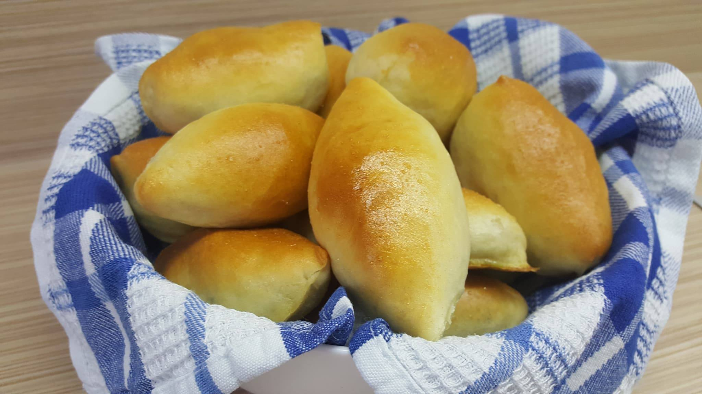

# Pirukad

*The Estonian small pastry: a soft enriched yeast dough wrapped around a savoury filling of cabbage, bacon and onion or minced meat, baked to a glossy gold.*

**Serves:** Makes about 16

**Prep Time:** 45 minutes

**Rising Time:** 1.5 hours

**Bake Time:** 18 minutes

## Overview
Pirukad are the small Estonian baked pastries that sit on every party table, every long-distance bus station counter and every grandmother's kitchen for the after-school snack. They are descended from the Russian pirozhki tradition but are softer, smaller and more enriched: an egg-and-butter yeast dough rolled into discs, filled with cabbage-and-bacon or savoury minced meat, sealed into oval boats and brushed with egg yolk before baking. The crust is shiny and tender, the filling is salty and savoury, and they eat just as well warm from the oven as cold from a bag. Two with a mug of broth makes lunch.

## Ingredients

### For the dough
- 500 g strong white bread flour, plus more for dusting
- 250 ml whole milk, warm
- 7 g instant dried yeast
- 1 tbsp sugar
- 60 g unsalted butter, softened
- 2 large eggs (1 whole, 1 separated; reserve the yolk for glazing)
- 1 tsp salt

### For the cabbage-bacon filling
- 400 g white cabbage, finely shredded
- 150 g smoked streaky bacon, diced small
- 1 large onion, finely chopped
- 30 g butter
- 1 tbsp fresh dill, chopped
- 1 tsp salt
- Black pepper

### To finish
- 1 reserved egg yolk
- 1 tbsp milk

## Method

### Stage 1 - Mix and rise the dough
1. Warm the milk to body temperature (about 35 C); whisk in the yeast and sugar; let stand 5 minutes until frothy.
2. In a large bowl combine the flour and salt.
3. Add the yeasted milk, the whole egg and the egg white; mix to a rough dough.
4. Turn out and knead 8-10 minutes, working in the soft butter piece by piece, until smooth and elastic.
5. Place in an oiled bowl, cover and prove 1 hour until doubled.

### Stage 2 - Make the filling
1. Melt the butter in a wide pan; add the bacon and cook 5 minutes until the fat has rendered.
2. Add the onion and cook 5-6 minutes until soft and pale gold.
3. Add the cabbage; cook covered on low for 15-20 minutes, stirring occasionally, until the cabbage is fully tender and reduced by half. Lift the lid for the last 5 minutes to drive off any excess moisture.
4. Stir in the dill, salt and pepper. Cool completely before filling. (Hot filling collapses the dough.)

### Stage 3 - Shape
1. Turn the risen dough out onto a lightly floured surface; divide into 16 equal pieces (about 50 g each).
2. Roll each into a ball, then flatten with a rolling pin into an oval about 10 cm long and 7 cm wide.
3. Place 1 heaped tablespoon of cold filling along the centre of each oval.
4. Bring the two long edges up over the filling and pinch firmly down the centre to seal; tuck and pinch the ends shut to make a small oval boat.
5. Place seam-down on baking sheets lined with parchment, leaving 3 cm between each.

### Stage 4 - Second rise and bake
1. Cover loosely and prove 30 minutes until visibly puffed.
2. Heat the oven to 200 C (180 C fan).
3. Whisk the reserved yolk with the milk; brush each pirukas with the glaze.
4. Bake 16-20 minutes until deep gold and shiny.
5. Cool on a rack for 5 minutes (the filling is very hot straight from the oven) before eating warm.

## Notes
- **Seal carefully:** Any gap in the seal lets the filling escape during baking. Pinch firmly and place seam-down.
- **Cold filling, warm dough:** A cold filling keeps the dough from sagging; a warm dough rolls easily.
- **Meat filling:** A common alternative: fry 400 g minced beef or pork with chopped onion, season with marjoram, salt and pepper, and cool before using.
- **Make ahead:** Shaped pirukad can be refrigerated overnight (slow second rise) and baked straight from the fridge with 2 extra minutes in the oven.

## Serving
- Serve warm or at room temperature as a snack, with a bowl of clear broth as a light lunch, or as part of a buffet. Mustard or sour cream on the side.

## Storage
- Keeps 2 days at room temperature in a paper bag
- Refresh in a low oven (160 C) for 5-7 minutes
- Freezes 2 months baked; thaw and reheat at 170 C for 10 minutes

