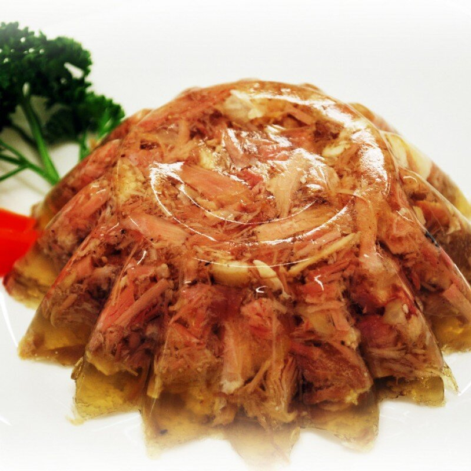

# Sült

*The Estonian Christmas-table cold-cut: slow-simmered pork shoulder and trotters set in their own clear jelly, sliced thin and eaten with mustard and rye bread.*

**Serves:** 8 as a starter

**Prep Time:** 30 minutes

**Cook Time:** 4 hours

**Setting Time:** 8 hours

## Overview
Sült (also known as külmsült, "cold jelly") is the Baltic cousin of Polish galareta and Russian kholodets, and it owns a permanent slot on the Estonian Christmas table. Pork trotters and shoulder are simmered for hours with onion, carrot, allspice and bay until the meat falls off the bone and the cooking liquid is thick with collagen. The meat is shredded into a deep dish, the strained broth is poured over, and the lot sets overnight into a firm, savoury jelly studded with pink pork. It is sliced cold, served with sharp Estonian mustard and dark rye bread, and washed down with chilled vodka or rye beer.

## Ingredients

- 2 pork trotters (about 1 kg total), split lengthways by the butcher
- 1 kg pork shoulder, boneless, cut into large chunks
- 2 onions, peeled and halved
- 2 carrots, peeled
- 1 small head of garlic, halved across
- 2 bay leaves
- 10 allspice berries
- 10 black peppercorns
- 1 tbsp salt, plus more to taste
- 2.5 litres cold water

### To serve
- Estonian (or Dijon) mustard
- Dark rye bread
- Pickled gherkins
- Fresh dill

## Method

### Stage 1 - Blanch the bones
1. Place the trotters and pork shoulder in a large pot, cover with cold water and bring to the boil.
2. Boil 5 minutes, then drain and rinse the meat under cold water (this removes scum and gives a clear jelly).

### Stage 2 - Simmer the stock
1. Return the meat to a clean pot. Add the onions, carrots, garlic, bay, allspice, peppercorns and 1 tbsp salt. Pour over 2.5 litres cold water.
2. Bring slowly to a bare simmer (small bubbles only, never a boil).
3. Skim any foam from the surface for the first 30 minutes.
4. Simmer uncovered or partially covered for 3.5 to 4 hours, until the trotter meat is collapsing off the bone and the broth is sticky to the lip.

### Stage 3 - Pick the meat
1. Lift the meat out onto a board; discard the vegetables and aromatics.
2. Strain the broth through a fine sieve lined with damp muslin into a clean bowl. Taste and add more salt (cold food needs firmer seasoning; aim for slightly assertive).
3. While still warm enough to handle, pick all the meat from the trotters and shoulder, discarding bones, gristle and any large fat pieces. Shred the meat into small pieces with two forks.

### Stage 4 - Set
1. Distribute the shredded meat evenly across a deep dish (or several small ramekins). Press lightly so it sits in a flat layer.
2. Pour the strained broth over to cover the meat by about 1 cm.
3. Cool to room temperature, then refrigerate uncovered until cold, then cover and chill overnight (at least 8 hours) until firmly set.

### Stage 5 - Serve
1. Run a knife around the edge and turn out onto a board, or serve straight from the dish.
2. Slice thick with a sharp knife; serve cold with mustard, rye bread, gherkins and dill.

## Notes
- **The clear jelly:** A bare simmer and a careful skim in the first 30 minutes are what give the classic clear amber jelly. A rolling boil turns it cloudy.
- **Trotters are essential:** They supply the natural gelatine that sets the jelly without added powdered gelatine. Pig's ear or rind also works.
- **Season firmly:** Cold dishes need more salt than hot ones. Taste the warm broth and push it slightly past what feels right.
- **The right slice:** Sült is sliced cold, about 1 cm thick, and eaten on rye bread with a smear of mustard.

## Serving
Serve cold on a plate with strong Estonian mustard, sliced rye bread, pickled gherkins and a small mound of fresh dill. A small glass of cold vodka or dark beer makes the pairing.

## Storage
- Keeps 5 days refrigerated, sealed
- Does not freeze well (the jelly weeps on thawing)
- Best within 3 days of setting
