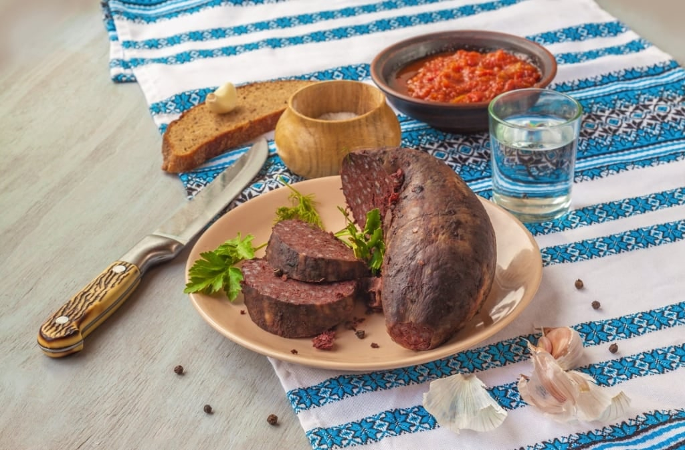

# Verivorst with Mulgipuder

*The Estonian Christmas-table classic: pork-blood-and-barley sausages pan-fried in butter and served on a mound of barley-and-potato mash with lingonberry jam.*

**Serves:** 4

**Prep Time:** 20 minutes

**Cook Time:** 1 hour

## Overview
Verivorst is Estonia's blood sausage and the centrepiece of jõululaud, the long Christmas Eve table. Cooked pork blood is mixed with pearl barley, fried onion, marjoram and small cubes of pork fat, then piped into casings and gently poached or oven-baked. On the day of eating the sausages are pan-fried in butter until the skins go dark and crisp, the barley inside loosens, and the marjoram lifts. They sit on mulgipuder (barley-and-potato mash) with a spoon of lingonberry jam to cut the richness. The dish is dense, savoury and unmistakably Baltic; nothing else on the Christmas table works without it.

## Ingredients

### For the verivorst
- 500 g pork blood (fresh or thawed)
- 200 g pearl barley
- 150 g pork back fat or fatty pork belly, finely diced
- 2 onions, finely chopped
- 50 g butter (for frying the onion)
- 2 tsp dried marjoram
- 1 tsp ground allspice
- 2 tsp salt
- 1/2 tsp black pepper
- 1.5 m natural hog casings, rinsed
- 30 g butter, for pan-frying

### For the mulgipuder
- 200 g pearl barley
- 800 g floury potatoes, peeled and cut into chunks
- 500 ml whole milk
- 50 g butter
- 1.5 tsp salt
- Black pepper

### To serve
- Lingonberry jam (or cranberry sauce)
- Sour cream
- Pickled pumpkin or pickled cucumbers

## Method

### Stage 1 - Cook the barley for the sausage
1. Rinse the barley well in cold water.
2. Bring 600 ml water to the boil with 1 tsp salt; add the barley and simmer covered for 35-40 minutes until tender. Drain and cool.

### Stage 2 - Build the sausage mix
1. Melt 50 g butter in a pan; cook the onions over medium heat for 8-10 minutes until soft and pale gold. Cool.
2. In a wide bowl combine the cooled barley, onions, diced pork fat, blood, marjoram, allspice, salt and pepper. Mix thoroughly.
3. Slide a casing over a sausage funnel and tie a knot at one end.
4. Pipe the mix loosely into the casings (the barley swells on cooking, so do not pack tight). Twist into 12-15 cm links and tie the ends.

### Stage 3 - Poach the sausages
1. Bring a wide pan of water to a bare simmer (do not boil; the casings split).
2. Prick each sausage with a needle once or twice.
3. Slide the sausages in and poach gently for 30-35 minutes. Lift out and cool. At this point they can be refrigerated 3 days or frozen.

### Stage 4 - Make the mulgipuder
1. Rinse the barley and simmer in 600 ml lightly salted water for 35-40 minutes until very soft.
2. In a second pan boil the potatoes in salted water for 15-20 minutes until tender; drain.
3. Combine the cooked barley and potatoes; warm the milk and add gradually as you mash. Beat in the butter and season.
4. Keep warm.

### Stage 5 - Fry and serve
1. Heat 30 g butter in a heavy frying pan over medium heat.
2. Pan-fry the sausages, turning, for 8-10 minutes until the skins are dark, crisp and slightly blistered.
3. Spoon mulgipuder onto warm plates, lay the sausages on top, finish with a generous spoon of lingonberry jam.

## Notes
- **Pork blood:** Eastern European butchers and Baltic delis sell it fresh or frozen. Stir gently before use; do not whisk (you will introduce air pockets that split the sausage).
- **Barley:** Pearl barley (kruubid) is the right grain. Quick-cook barley goes mushy and changes the texture.
- **Don't boil:** A bare simmer (around 80 C) is essential when poaching the sausages. A rolling boil bursts the casings every time.
- **Make ahead:** The sausages are usually poached a day or two before Christmas Eve and finished in the pan on the night.

## Serving
Serve hot on a bed of mulgipuder with lingonberry jam, a spoon of sour cream and pickled pumpkin or cucumbers. A glass of dark Estonian rye beer on the side.

## Storage
- Poached sausages keep 3 days refrigerated and freeze 2 months
- Mulgipuder keeps 2 days refrigerated; loosen with milk when reheating
- Reheat fried sausages in a low oven (160 C) for 10 minutes

