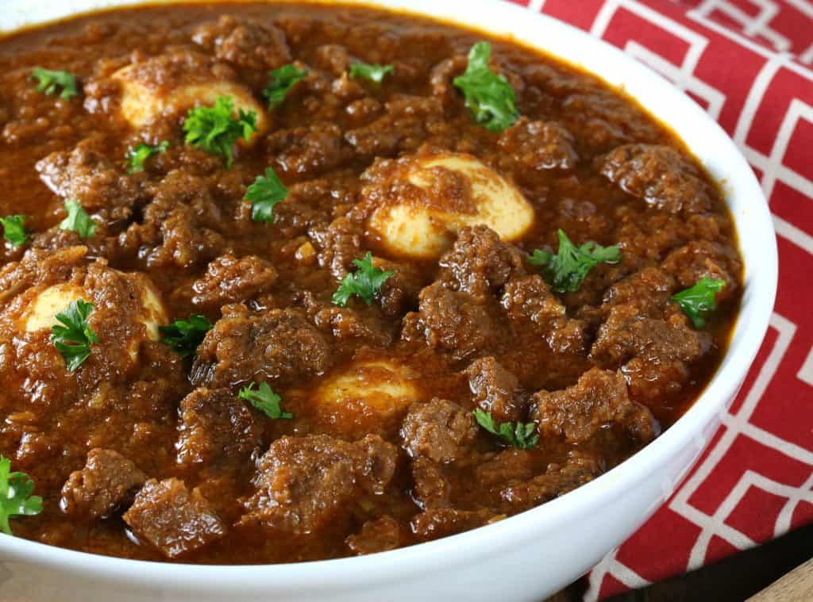

# Key Wat (Siga Wat)

*Ethiopia's deep-red beef stew: cubed beef simmered for hours with berbere, niter kibbeh, onions caramelised till they collapse, and an entire head of garlic. The beef cousin of doro wat, eaten on Sundays and feast days across the Ethiopian highlands.*

**Serves:** 6

**Prep Time:** 30 minutes

**Cook Time:** 2 hours

## Overview
Key wat (sometimes called siga wat) is Ethiopia's deep-red beef stew, the meaty Sunday-and-feast-day counterpart to the chicken-based doro wat: cubed beef simmered slowly with onions cooked down till they collapse into a sweet base, berbere stirred in to build the signature dark-red sauce, niter kibbeh stirred through for richness, and a generous quantity of garlic, ginger and fresh chilli. The name "key" means red in Amharic; "wat" means stew. Together the dish is the most-served Sunday lunch across the Ethiopian highlands, eaten with injera and accompanied by gomen (collards), atakilt (cabbage and potato), ayib (cottage cheese) and tibs (sautéed meat) on a large round shared platter. The technique is patient onion-cooking. The dish lives or dies on the onion base. Two large onions per kilogram of meat, finely sliced, are sweated dry in a heavy pot for 20-25 minutes (no oil at first, just the onions in their own moisture; this is called "the onion cook") till they collapse into a soft sweet pale-brown mass. Only then does the niter kibbeh go in. Then the berbere is stirred through and toasted in the kibbeh for a full minute till the oil turns deep red and the kitchen smells of warm spice; this blooming step is what makes the difference between dull berbere stew and the proper rich complex flavour. Cubed beef goes in next, gets coated in the spice oil, then simmered slowly in stock and water for 90 minutes till the sauce darkens, the oil rises to the surface (the visual signal of a finished wat) and the beef goes spoonable tender. Finish with hard-boiled eggs simmered in the sauce for the last 15 minutes if you want; the eggs absorb the colour and become an iconic part of the platter.

## Ingredients

### Onion base
- 3 large red onions (finely sliced, about 800 g total)

### Spice
- 4 tablespoons berbere (Ethiopian red spice blend; quality really matters here)
- 1 tablespoon tomato purée

### Fat and aromatics
- 80 g niter kibbeh (spiced clarified butter; or plain clarified butter with cardamom and cumin added)
- 1 whole head of garlic (cloves separated, peeled, crushed)
- 3 tablespoons fresh ginger (finely grated)
- 2 jalapeño or other fresh green chillies (deseeded if you want; finely chopped)

### Beef
- 1 kg beef shin or chuck (cut into 4 cm cubes; tough cuts work better here because they go silky over slow cooking)
- 2 teaspoons fine sea salt
- 1 teaspoon black pepper
- 500 ml beef stock (or water plus a beef stock cube)
- 1 teaspoon dried fenugreek leaves (optional)

### Optional traditional addition
- 4 hard-boiled eggs (peeled, scored lightly with a knife so they take colour)

### To serve
- 2-3 large rounds of injera
- Gomen (collards), atakilt (cabbage and potato), tibs and ayib for the proper platter

## Method

### Stage 1 - The onion cook (the foundation)
1. Tip the sliced onions into a wide heavy-bottomed casserole or Dutch oven. Don't add any oil yet; this is the dry-onion stage.
2. Set over medium-low heat, covered.
3. Cook 20-25 minutes, stirring every 5 minutes, till the onions release their moisture, then collapse into a soft sweet pale-brown mass. The kitchen will smell sweet. If they catch and start to scorch, drop the heat and add a splash of water.
4. The onions should reduce to about a quarter of their original volume.

### Stage 2 - Add the kibbeh and aromatics
1. Add the niter kibbeh to the cooked onions.
2. Stir till melted and the onions are coated in the spiced butter.
3. Add the crushed garlic, grated ginger and chopped green chillies. Cook 2-3 minutes till the raw garlic smell goes.

### Stage 3 - Bloom the berbere
1. Stir in the berbere and tomato purée.
2. Cook for a full minute, stirring constantly, till the berbere darkens slightly, the oil takes on a deep red colour, and the kitchen smells of warm spice. This blooming step is what extracts the colour and aromatic compounds from the berbere into the oil. Skip it and the wat tastes raw and dusty.
3. Drop the heat if the berbere threatens to scorch.

### Stage 4 - Add the beef
1. Season the cubed beef with the salt and pepper.
2. Add to the pot and stir to coat every cube in the red spiced onion-kibbeh paste.
3. Cook 5 minutes, stirring, so the beef browns slightly and takes up the spice colour.

### Stage 5 - Slow simmer
1. Pour in the beef stock; the liquid should just cover the beef.
2. Stir well, bring to a gentle simmer, then drop the heat to low.
3. Cover with the lid slightly ajar and cook for 90 minutes, stirring every 15 minutes. The sauce darkens and thickens; the beef goes from firm to spoonable tender.
4. Check 60 minutes in; if the sauce is too thick, add a splash more stock. If too thin, leave the lid fully off for the rest of the cook.

### Stage 6 - Optional eggs
1. About 15 minutes before the end of cooking, gently nestle the peeled hard-boiled eggs into the sauce so they're half-submerged.
2. Spoon sauce over the tops as they sit.
3. The eggs absorb the red colour and the spice as they sit in the sauce.

### Stage 7 - Finish
1. Stir in the dried fenugreek leaves (if using) for the last 5 minutes; they add a faint hay-like aroma traditional in finished wats.
2. Taste; adjust salt.
3. The finished wat should have visible red oil pooling at the edges and on top; this is the signal that the wat is properly done.

### Stage 8 - Serve
1. Lay one or two large rounds of injera over a wide shared platter.
2. Spoon the key wat into the centre, sauce and all.
3. Halve or quarter the eggs (if used) and tuck them around the meat.
4. Arrange small mounds of gomen, atakilt, tibs and ayib around the wat for the proper communal Ethiopian platter.
5. Serve with extra injera in a basket for diners to tear and scoop.

## Notes
- **The onion cook is everything:** the long dry-onion stage at the start is what gives the wat its deep sweet base. Rushing it (or skipping straight to adding oil and meat) gives a thin one-note stew. The onions must collapse to about a quarter of their starting volume and turn pale gold-brown.
- **Bloom the berbere properly:** the minute spent toasting berbere in the spiced butter at moderate heat is non-negotiable. The blooming extracts colour and aromatics; raw berbere stirred into liquid tastes dusty and harsh.
- **Berbere quality:** the dish is only as good as the spice blend. Fresh well-made berbere is fragrant, vibrant red, and properly spicy. Old or generic supermarket berbere has lost its colour and aromatics; the wat will taste flat. Look for Ethiopian-made berbere or make your own.
- **Tough cuts go silky:** shin, chuck or shoulder are the right cuts. The connective tissue dissolves over the slow simmer into a silky gravy that loins or sirloins can't produce.
- **The oil split is the visual finish:** a properly cooked wat shows pools of red niter kibbeh on the surface and at the edges. If the sauce still looks dull and uniform after 90 minutes, simmer 15 minutes more uncovered.

## Variations
**Doro wat:** the chicken version of this same dish, with chicken pieces in place of beef. Cook time drops to 45 minutes; otherwise identical technique.
**Yebeg wat:** lamb version, often considered the most prestigious. Slightly more delicate than beef; reduce simmer time to 75 minutes.
**Misir wat (lentil):** the vegetarian counterpart in technique: red split lentils replace the beef, cooked 30 minutes till soft. Same berbere-onion-kibbeh base.
**Alicha (yellow stew):** the mild yellow variant: omit berbere entirely, replace with 2 teaspoons turmeric and 1 teaspoon ground ginger. The non-spicy alternative; common at fasting meals and for children.
**Key wat with shiro:** some highland families add a couple of tablespoons of shiro powder (ground roasted chickpea flour) in the last 15 minutes to thicken the sauce. Adds nutty depth.

## Serving
On a large shared round of injera at the centre of the table with gomen, atakilt, ayib and tibs arranged around the wat. Diners eat communally, tearing strips of injera and scooping meat and sauce with their right hand. Drink: tej (Ethiopian honey wine), tella (home-brewed beer), or buna (the formal Ethiopian coffee ceremony after the meal).

## Storage
- Keeps refrigerated 4 days; the flavour deepens significantly overnight and day-after key wat is better than day-of.
- Freezes 3 months. Defrost slowly in the fridge and reheat gently over low heat.
- Don't microwave; the kibbeh splits and the meat turns rubbery.
