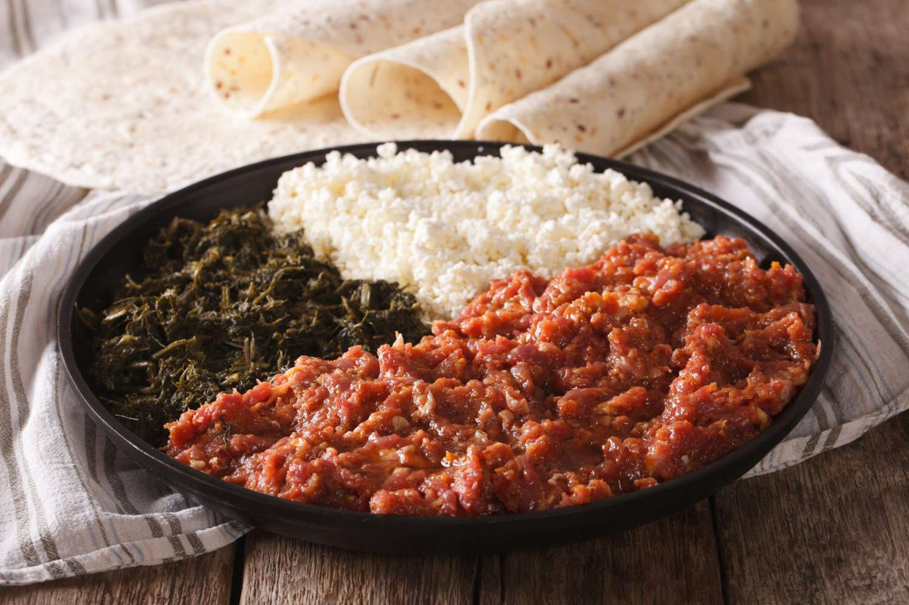

# Kitfo

*Ethiopia's hand-minced raw beef: lean tenderloin chopped fine with the back of a knife, mixed warm with niter kibbeh, mitmita and korarima. Served immediately on injera with a side of cottage cheese and collard greens.*

**Serves:** 4

**Prep Time:** 25 minutes

**Cook Time:** 5 minutes (just for warming the spiced butter)

## Overview
Kitfo is Ethiopia's most iconic raw-meat dish and the celebration dish of the Gurage people of southern Ethiopia, served at weddings, holidays and Orthodox feast days: lean beef tenderloin hand-minced fine with the back of a knife, mixed warm with melted niter kibbeh (clarified butter spiced with cardamom, cumin, fenugreek and basil), seasoned with mitmita (the small-batch Ethiopian chilli powder, more pungent than berbere) and a pinch of ground korarima (Ethiopian false-cardamom). Served leb-leb (lightly warmed in the kibbeh as you stir it through) or tere (completely raw), with ayib (fresh Ethiopian cottage cheese), gomen (collard greens) and a large round of injera. The meat must be impeccably fresh; buy lean tenderloin or top sirloin on the day, prepare and serve within an hour. Hand-mince with the back of a knife; a grinder squeezes the meat and warms it, while hand-mincing keeps the fibres distinct and the texture silky. The niter kibbeh wants to be fingertip-warm (35 to 40°C); cold sets into chunks, hot cooks the beef.

## Ingredients

### The meat
- 500 g beef tenderloin (or top sirloin; impeccably fresh, kept refrigerated till the moment of cooking)
- 1 teaspoon fine sea salt

### The spiced butter
- 80 g niter kibbeh (spiced clarified butter; or substitute 80 g clarified butter melted with ¼ tsp ground cardamom, ¼ tsp ground cumin, pinch fenugreek and pinch dried basil)

### Spice
- 1 ½ teaspoons mitmita (Ethiopian chilli powder; substitute 1 teaspoon hot paprika + ½ teaspoon cayenne if unavailable)
- ¼ teaspoon ground korarima (Ethiopian black cardamom; or substitute 1/8 teaspoon ground green cardamom)
- ¼ teaspoon ground black pepper

### To serve
- 200 g ayib (fresh Ethiopian cottage cheese; or use fresh-style cottage cheese drained of excess whey)
- 200 g gomen (collard greens, see [gomen recipe](side-dishes/gomen.md); or steamed collards)
- 1 large round of injera (see [injera recipe](side-dishes/injera.md))

## Method

### Stage 1 - Prepare the meat surface
1. Trim any silver skin or gristle from the tenderloin with a small sharp knife.
2. Cut the meat into rough 2 cm cubes.

### Stage 2 - Hand-mince
1. Pile the cubes on a clean cutting board.
2. Take a sharp heavy knife (a chef's knife or cleaver works) and chop the meat with the flat edge of the blade, pressing down to crush rather than slice. Push the meat back into a pile, chop again, and continue working through till the meat is finely minced into a soft uniform paste with the texture of a fine paté. This should take 5-7 minutes of steady work.
3. The hand-mincing keeps the meat cool and the fibres distinct, unlike a grinder which warms and compresses.
4. Tip the minced meat into a clean wide bowl. Sprinkle with the salt and toss through gently with two forks.

### Stage 3 - Warm the niter kibbeh
1. Place the niter kibbeh in a small pan over the lowest heat.
2. Warm just till melted and fingertip-warm (35-40 C); never hot. The kibbeh should feel just warm when you dip a finger in. Hot kibbeh starts cooking the meat as you mix; cold kibbeh sets into solid chunks that won't disperse.

### Stage 4 - Combine
1. Pour the warm spiced butter over the minced beef.
2. Sprinkle in the mitmita, ground korarima and black pepper.
3. Mix everything through gently with two forks, lifting and folding rather than stirring vigorously, till the spices and butter are evenly distributed and the meat takes on a rust-red colour.
4. Taste a small spoonful; adjust salt or mitmita if needed. The kitfo should taste richly meaty, gently warm from the spices, with the butter coating every fibre.

### Stage 5 - Serve immediately
1. Place a large round of injera on a wide serving platter or directly on the table.
2. Mound the kitfo in the centre of the injera.
3. Arrange a portion of fresh ayib (cottage cheese) on one side and a portion of gomen (collards) on the other.
4. Serve at once. Diners tear small pieces of injera and use them to scoop up kitfo with a little cheese and greens together.

## Notes
- **Freshness is non-negotiable:** kitfo is raw beef. Quality of the meat matters more than for any cooked dish. Buy lean tenderloin or top sirloin from a trusted butcher on the day you plan to eat it, keep it refrigerated till you start, prepare it within 30 minutes, and serve within an hour. Don't make kitfo from supermarket pre-packed mince; you don't know the age, source or temperature history.
- **Pregnant women, young children and the immunocompromised should skip:** raw beef carries some small risk regardless of quality. The traditional warm-leb-leb version (where the meat is barely warmed by the hot kibbeh) reduces the risk slightly but doesn't eliminate it.
- **Hand-mince by knife, not by grinder:** a grinder squeezes the meat fibres and warms them through friction, leaving a compressed grey paste. Hand-mincing with the flat blade of a heavy knife preserves the silky texture and keeps the meat cool. Worth the 5 extra minutes.
- **Niter kibbeh warm, not hot:** the kibbeh should be melted and fingertip-warm only. Hot kibbeh would cook the beef; cold kibbeh sets back into solid clumps in the mince.
- **Mitmita over berbere:** the proper Ethiopian seasoning is mitmita, a small-batch chilli powder spiced with korarima and cloves. Berbere (the more common Ethiopian spice blend) is a poor substitute because it's been roasted and has different aromatic notes; if you can only find berbere, halve the quantity.
- **Leb-leb vs tere:** "leb-leb" means lightly warmed (the meat is briefly stirred in a warm pan with the kibbeh till just barely warmed through; never cooked). "Tere" means completely raw, the most traditional version. Both are valid; modern restaurants often default to leb-leb.

## Variations
- **Kitfo leb-leb:** as above, but the kitfo is briefly stirred in a warm dry pan (about 50 C) with the niter kibbeh for 30-60 seconds till the meat is warmed through but still mostly raw. The most common restaurant version outside Ethiopia.
- **Kitfo wot:** fully cooked version, where the kitfo is sautéed in the niter kibbeh till browned, more like a finely-minced beef ragout. Eaten in Ethiopian-Western restaurants by diners who prefer not to eat raw meat.
- **Kitfo with cheese melted in:** some Gurage households mix the ayib cottage cheese directly into the kitfo at the end for a richer dish. The texture is creamier; the flavour rounder.

## Serving
- On a large round of injera at the centre of the table, with ayib (Ethiopian cottage cheese) and gomen (collard greens) as the traditional accompaniments. Diners eat communally, tearing pieces of injera and scooping kitfo with cheese and greens together. Drink: tej (Ethiopian honey wine), tella (homemade beer), or strong fresh-roasted buna (Ethiopian coffee) traditionally served after the meal in the coffee ceremony.

## Storage
- Don't store. Kitfo is raw beef; it must be prepared and eaten within an hour of mincing.
- Leftovers should be discarded for safety; raw minced beef beyond a few hours at room temperature is a real food safety risk.
- If you must save: covered, refrigerated, eaten within 4 hours and cooked through (so it's not raw kitfo any more, it's a quick sauté).
