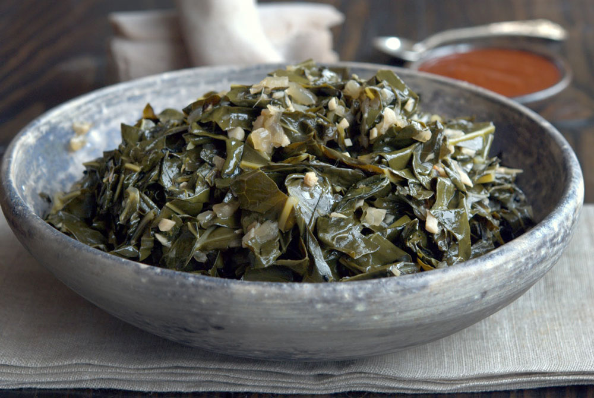

# Gomen

*Ethiopia's collard greens: shredded collards stewed slowly with onion, garlic, ginger and niter kibbeh till the leaves go tender and silky and the spiced butter coats every piece. The vegetable side that always appears on the injera platter.*

**Serves:** 4

**Prep Time:** 15 minutes

**Cook Time:** 35 minutes

## Overview
Gomen is the Ethiopian collard greens side, the green vegetable component that always appears on the shared injera platter alongside meat wats and lentil stews: shredded collard greens stewed slowly with finely chopped onion, garlic, ginger and niter kibbeh (the spiced clarified butter) till the leaves go properly tender and silky and the buttery oil coats every ribbon. Unlike the snappier sautéed greens of East and Southern African cooking (sukuma wiki, morogo), Ethiopian gomen is cooked long and patient; the leaves go from firm and bright green through a softening stage to a properly tender silky stew over 30-40 minutes. The technique builds in two passes. First, sweat the onion, garlic and ginger in niter kibbeh till the onions go soft and the kitchen smells of spiced butter. Then add the shredded collards in two or three handfuls, stirring each batch in till it wilts before adding the next. Add a splash of water, cover, and simmer slowly for 25-30 minutes till the greens turn properly tender. Two ingredient details matter. First, use actual collard greens (covo, sukuma) rather than kale; collards have the slightly thicker leaf and milder bitterness that suits the long Ethiopian-style cook. Kale works in a pinch but goes drabber and the leaves turn slightly stringy after 30 minutes. Second, niter kibbeh is what makes this Ethiopian gomen rather than a generic stewed-greens dish. The spiced clarified butter (cardamom, cumin, fenugreek, basil) is what gives the dish its distinctive aromatic finish. Plain butter or oil works but the flavour is much less specific. Skip the spice blend in the butter and you've made a different dish.

## Ingredients

### Greens
- 600 g collard greens (covo; or cavolo nero / lacinato kale as substitute)

### Aromatics
- 60 g niter kibbeh (spiced clarified butter; or 60 g clarified butter + ¼ tsp cardamom + ¼ tsp cumin)
- 1 large onion (finely chopped)
- 4 garlic cloves (finely chopped)
- 1 tablespoon fresh ginger (finely grated)
- 1 fresh jalapeño or green chilli (deseeded and finely chopped, optional)

### Seasoning
- ½ teaspoon fine sea salt
- ¼ teaspoon ground black pepper
- ½ teaspoon ground turmeric (optional, traditional)

### Liquid
- 150 ml water (or vegetable stock)

### To finish
- ½ lemon (juice)

## Method

### Stage 1 - Prepare the greens
1. Strip the leaves from the thick central stems (run your hand down the stem to pull the leaves off; the lower thick stem goes to compost, the upper thinner stem can stay with the leaf).
2. Stack 4-5 leaves on top of each other, roll the stack into a tight cigar, and slice across with a sharp knife into 1 cm ribbons.
3. Continue with the rest of the leaves. You should have a generous pile of shredded greens.
4. Wash and drain in a colander.

### Stage 2 - Sweat the aromatics
1. Heat the niter kibbeh in a wide heavy saucepan over medium heat till melted.
2. Add the chopped onion and sweat for 6-8 minutes till soft and lightly gold; don't let it brown.
3. Stir in the chopped garlic, grated ginger and chopped chilli (if using). Cook 30 seconds till fragrant.
4. Sprinkle in the turmeric (if using) and stir for 15 seconds; the oil turns yellow.

### Stage 3 - Wilt the greens
1. Add the shredded greens to the pan in 2 or 3 batches, stirring each batch in till it wilts down before adding the next. The mountain of greens reduces to a fraction of its volume as they cook.
2. Once all the greens are in and wilted, sprinkle in the salt and pepper.

### Stage 4 - Slow cook
1. Pour in the 150 ml of water (or vegetable stock).
2. Bring to a gentle simmer, then drop the heat to low.
3. Cover the pan and cook 25-30 minutes, stirring once every 5 minutes. The greens should go from bright dark green to a deeper olive green and turn properly tender and silky.
4. Check the moisture level every 10 minutes; if the pan is going dry before the greens are done, add another splash of water. If the pan is too wet at the end, lift the lid and cook 3-4 minutes uncovered to drive off excess liquid.

### Stage 5 - Finish and serve
1. Taste; adjust salt and pepper.
2. Off the heat, squeeze in the lemon juice and stir through.
3. Spoon into a serving bowl. The gomen should have a glossy oily sheen and the greens should be soft and tender but still hold their shape rather than collapse into mush.
4. Serve warm on the shared injera platter as one of the vegetable accompaniments to wats and tibs.

## Notes
- **Collards not kale:** collard greens are the traditional Ethiopian gomen leaf and work best for this style of long-cooked greens dish. Cavolo nero (lacinato kale) is the next best substitute. Curly kale works but the texture goes slightly stringy after 30 minutes. Spinach is wrong; it collapses to mush.
- **Niter kibbeh matters:** if you can find or make proper niter kibbeh (spiced clarified butter with cardamom, cumin, fenugreek, basil and korarima), use it. Plain clarified butter works but tastes generic. The spiced butter is what makes the dish distinctly Ethiopian rather than just stewed greens.
- **Cook till silky, not crunchy:** Ethiopian gomen is meant to be properly tender and almost silky after 30 minutes of slow cooking. If you're used to snappy bright greens, the texture might feel like overcooking; trust the technique. The long cook is the dish.
- **Skip the chilli if serving with key wat:** if the rest of the platter is going to have spicy berbere-rich wats, you may want the gomen as a mild contrast rather than an additional heat source. Reduce or omit the chopped chilli.
- **Make ahead:** gomen actually improves overnight as the flavours meld. Make a day ahead, refrigerate, and reheat gently for a more developed flavour.

## Variations
**Ye'abesha gomen:** the traditional Ethiopian highland variant that includes a piece of smoked or fresh meat (often a knuckle of lamb or a chunk of beef) in the simmer for additional depth. Adds 30 minutes to the cook time.
**Gomen with cottage cheese:** stir 100 g of crumbled ayib (Ethiopian cottage cheese) or fresh ricotta into the gomen in the last 5 minutes; turns the dish into a richer side that approaches a main course.
**Quick gomen (sautéed):** for a brighter snappier version, cook the gomen sukuma-wiki-style: hot oil, all the greens in at once, 5-6 minutes uncovered, finish with lemon. Less traditional but works for a quick meal.
**Alicha gomen:** omit any berbere or chilli that some recipes call for; this gives you the mild yellow turmeric-flavoured version that pairs with mild alicha stews.

## Serving
As one of the small mounds around the meat wat on the shared injera platter, the vegetable counter to the meat heat. Eat with the right hand, scooping with torn injera. Drink: tej, tella, or buna.

## Storage
- Keeps refrigerated 3 days; the flavour deepens overnight. Reheat in a covered pan with a splash of water.
- Freezes 2 months. Defrost in the fridge and reheat gently.
- Don't microwave; the niter kibbeh splits.
