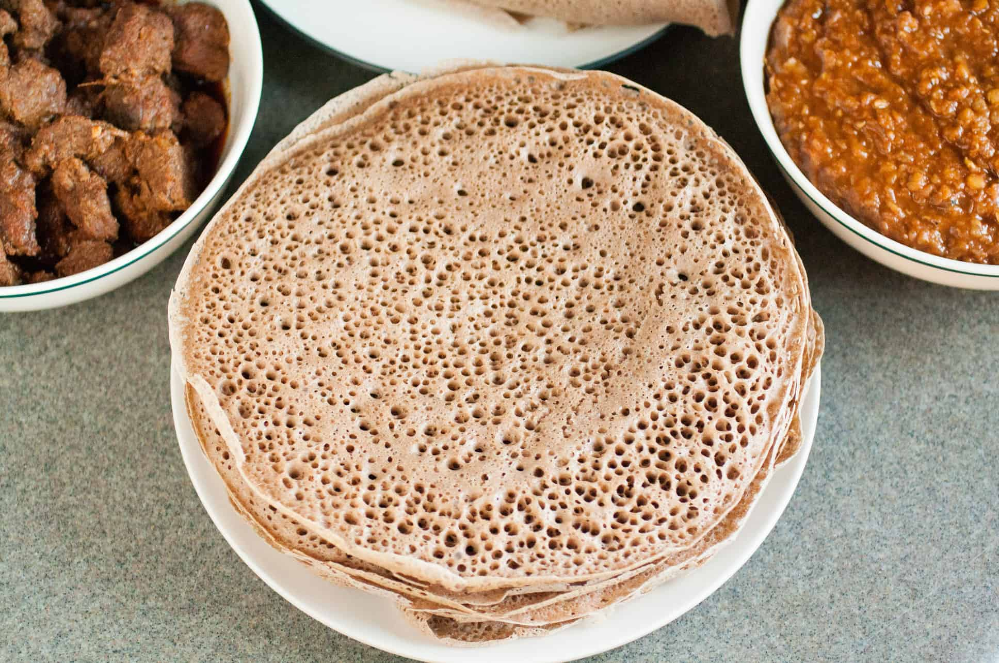

# Injera

*Ethiopia's foundational sourdough flatbread: a large round of fermented teff flour batter ladled thin onto a hot mitad griddle, cooked dry till the surface puffs into thousands of tiny bubbles ("eyes"). The plate, the bread and the utensil all at once.*

**Serves:** 6-8 (makes 4-5 large rounds)

**Prep Time:** 20 minutes (plus 2-4 days fermentation)

**Cook Time:** 15 minutes

## Overview
Injera is the foundational bread of Ethiopia and Eritrea: a large round of fermented teff flour batter cooked on a hot mitad griddle into a pale grey-brown flatbread covered in thousands of tiny bubble holes (the "eyes" or insira). The plate, the bread and the eating utensil all at once. Every Ethiopian and Eritrean meal is built around it; diners tear pieces with the right hand to scoop wats, tibs and gomen off the surface. The defining flavour is the gentle sour tang from wild-yeast fermentation. True injera is 100% teff flour; any substitution with wheat moves the result toward a generic crepe. The batter ferments for 2 to 4 days till it develops the proper sour smell and surface bubbles. The hot dry griddle is non-negotiable; injera is poured from the outside in a spiral, the lid goes on briefly, and the bread is never flipped.

## Ingredients

### Batter
- 500 g teff flour (ideally a mix of brown and white teff, or all-brown for darker injera)
- 750 ml warm water (around 30-35 C; lukewarm)
- 1 teaspoon active dry yeast (optional shortcut for the first fermentation; traditional injera relies on wild yeast in the air)

### For cooking
- 1.5 litres water (extra, for the final batter consistency)
- ¼ teaspoon fine sea salt
- Vegetable oil (for very lightly greasing the griddle on the first round only; minimal)

## Method

### Stage 1 - Start the fermentation
1. Tip the teff flour into a large bowl or food-grade plastic container with a loose-fitting lid.
2. Pour in the 750 ml of warm water and whisk thoroughly till smooth (a balloon whisk; you want no dry lumps).
3. Sprinkle the dry yeast over the surface (this is the shortcut; traditional injera uses wild yeast from the air, which takes longer but gives a more complex sour flavour).
4. Whisk in the yeast.
5. Cover loosely (not airtight; the fermentation needs to vent gas) and leave in a warm spot (kitchen counter or near a radiator, 20-25 C ideally) for 48 hours.

### Stage 2 - Watch the fermentation
1. After 24 hours: the batter should have separated, with a thin watery layer on top and the dense teff settled at the bottom. The watery layer may be slightly dark or even greenish; this is normal.
2. At 48 hours: the batter should smell distinctly sour (like sourdough or yogurt), and you should see small bubbles on the surface. If the smell is mild, leave another 12-24 hours till properly sour.
3. Don't let it go longer than 4 days total; past that, the fermentation turns aggressively acidic and the injera will taste sharp.

### Stage 3 - Prepare for cooking
1. When the fermentation smells right, gently pour off the thin watery layer on top (this is normal Ethiopian practice; it's called the absit and is sometimes saved for a separate dish).
2. Whisk the thick settled teff slurry from the bottom of the container.
3. In a separate small pan, bring 250 ml of the extra water to a boil.
4. Take 200 ml of the thick fermented batter and whisk it into the boiling water; cook on medium heat for 2-3 minutes, stirring constantly, till you have a thick paste (this is called the absit cook, and it gelatinises some of the starches to give the finished injera its characteristic bouncy texture).
5. Whisk this hot paste back into the main batter. Add the salt.
6. Gradually whisk in the remaining 1.25 litres of water till the batter reaches a heavy-cream consistency that drops from a ladle in a smooth pour. The exact amount depends on your teff and humidity; add water gradually and stop when the texture looks right.

### Stage 4 - Heat the griddle
1. Place a wide flat non-stick frying pan (28-30 cm, or as wide as you have) or a flat cast-iron crepe pan on the hob.
2. Heat over medium heat for 3-4 minutes till properly hot. A drop of water flicked on should sizzle and evaporate within a second.
3. For the very first round only, brush very lightly with vegetable oil; subsequent rounds need nothing.

### Stage 5 - Pour and cook
1. Ladle about 250 ml of the batter onto the centre of the hot pan.
2. Immediately swirl the pan to spread the batter, or use the back of the ladle to spread in a spiral from the centre outward; you want a thin even layer covering most of the pan, slightly thicker than a crepe.
3. Almost immediately, the top of the batter will start to bubble; thousands of tiny "eyes" pop open across the surface. This is the signature texture.
4. Cover the pan with a tight-fitting lid for 90 seconds. Don't lift the lid during this time; the trapped steam sets the top of the injera.

### Stage 6 - Lift off
1. After 90 seconds, lift the lid. The top should be matte and set (no longer wet); the surface should be covered in small holes.
2. Loosen the edges gently with a spatula. The bottom should release from the pan easily; if it sticks, give it another 30 seconds.
3. Slide the injera onto a clean plate or wide platter, eyes-up. Don't flip; injera is cooked only on one side.
4. Cover with a clean cloth to keep warm.
5. Repeat with the rest of the batter to make 4-5 large rounds. The pan stays hot between rounds; no need to re-oil.

### Stage 7 - Serve
1. Bring the stack of injera to the table on a wide platter or wooden board.
2. Lay one round flat on a wide serving platter to act as the eating surface; arrange the wats and sides on top.
3. Place the rest of the injera in a basket, often loosely rolled, for diners to tear from and use as scoops.

## Notes
- **100 percent teff is the gold standard:** authentic injera uses only teff flour. Outside Ethiopia, you'll sometimes see versions that cut teff with sorghum, barley or wheat flour to save money and ease the technique; these aren't true injera but workable approximations. If you can't find pure teff, a 50/50 teff and sorghum mix is the closest substitute.
- **Fermentation needs time and warmth:** 2-4 days at 20-25 C is the target. Cold kitchens slow the fermentation to a crawl; place the bowl near a warm spot (above the fridge, near a radiator). Hot kitchens speed it up; check at 24 hours.
- **The watery top layer is normal:** during fermentation, a thin watery layer separates and sits on top of the thick teff slurry. This is absit and is poured off before cooking (or saved to make a small porridge dish). Don't be alarmed.
- **The absit cook (Step 3): non-negotiable for proper texture.** Taking a portion of the fermented batter and cooking it briefly into a paste, then whisking it back into the main batter, gelatinises starches and gives the finished injera its characteristic bouncy spongy texture. Skipping this step gives flat thin injera that lacks the proper bite.
- **No flipping:** injera is cooked one-sided. The top steams under the lid; the bottom browns on the pan. Never flip; you'd ruin the eyes pattern that defines the bread.
- **Don't over-grease:** the first round needs the lightest brush of oil; after that, the pan is conditioned and subsequent rounds need none. Heavy greasing gives you greasy injera with closed eyes (no bubble pattern).

## Variations
**Wheat-injera (the everyday substitute):** 50/50 teff and wheat flour, or 30/70 teff and wheat. Easier to handle, less authentic, faster to ferment. Found in many Ethiopian restaurants outside the country.
**Sorghum injera:** in regions where teff is unavailable, sorghum flour with a small amount of barley is the traditional substitute. Goes a different colour (darker, almost reddish) and tastes earthier.
**Quick injera:** for emergencies, mix teff flour, warm water, plain yogurt and a pinch of baking soda; rest 2-3 hours rather than 2-3 days, then cook the same way. The flavour lacks the proper sour complexity but the texture works.
**Sourdough-starter injera:** instead of dry yeast, use 4 tablespoons of an established sourdough starter (rye, white wheat, or whole-wheat) as the fermentation kick. Gives a more complex flavour faster (24-36 hours rather than 48-72).

## Serving
Lay flat on a wide tray or board to serve as the platter for wats, tibs, gomen and other stews. Tear pieces with the right hand from the basket of additional injera and scoop the food. The shared platter at the centre of the table is the proper Ethiopian eating form. Drink: tej, tella, or buna.

## Storage
- Best eaten the day of cooking; the injera goes from soft and pliable to slightly leathery as it sits.
- Keeps wrapped in cling film at room temperature for 1 day; refrigerate for up to 3 days. To soften before serving, sprinkle lightly with water and steam briefly in a covered pan.
- Freezes 1 month wrapped tightly; defrost at room temperature and steam to revive.
- The fermented batter keeps refrigerated for up to 5 days; bring back to room temperature and whisk before cooking. The flavour gets more sour over time.
