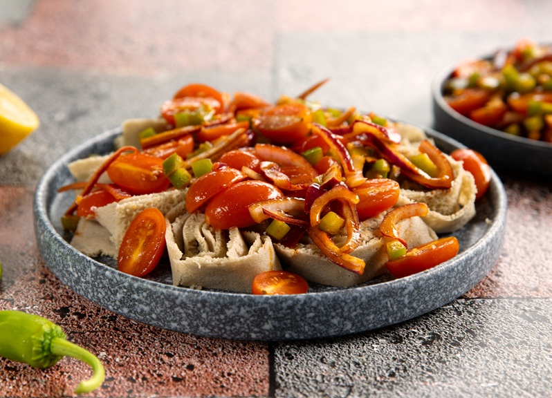

# Timatim Fitfit

*Ethiopia's tomato-and-injera salad: ripe tomato, red onion, green chilli and lime tossed with torn pieces of injera that drink the dressing into their spongy holes. The bright vegetable counter to the heavy red wats on the shared platter.*

**Serves:** 4

**Prep Time:** 15 minutes

**Cook Time:** 0 minutes

## Overview
Timatim fitfit is Ethiopia's bright tomato-and-injera salad, the fresh acidic counterpart to the heavy red wats on the shared injera platter: chopped ripe tomato, finely chopped red onion, slivers of green chilli and a generous squeeze of lime tossed with torn pieces of fresh or day-old injera that drink up the dressing through their hundreds of tiny bubble holes. The name combines "timatim" (tomato) with "fitfit" (the general Ethiopian technique of torn injera mixed with a wet element, also used for genfo and ergo dishes). It's a fresh raw-vegetable side, served chilled or at room temperature, and the contrast of its bright acidity against the spicy long-simmered wats on the rest of the platter is what makes Ethiopian meals so balanced. The dish is essentially a salad where the injera takes the place of bread or croutons; the spongy holes in the bread absorb the tomato juice and lime, transforming from dry flatbread into a savoury vinaigrette-soaked element. Two technique points matter. First, use fresh injera (or day-old at the outside); injera older than a day or two goes leathery and won't absorb the dressing properly. Day-old is actually ideal because the slight stiffness gives the torn pieces some bite. Second, tear by hand rather than slicing. The torn edges of injera have rough surfaces that catch and hold the tomato juices in their bubble holes much better than the clean edges of knife-cut pieces. Chop the tomatoes and onion fine, toss with chopped chilli, salt, pepper and a generous squeeze of lime. Tear the injera into bite-sized pieces (3-4 cm) and add to the bowl. Toss gently with the tomato so the injera pieces absorb the juices. Rest 10 minutes for the bread to soak through, then serve at room temperature.

## Ingredients

### The salad
- 4 large ripe tomatoes (the ripest you can find; chopped into 1 cm dice)
- 1 small red onion (finely diced; about 80 g)
- 1-2 fresh jalapeño or green chillies (deseeded and finely chopped)
- 2 tablespoons fresh parsley or coriander (finely chopped)

### The injera
- 2 small rounds of [injera](injera.md) (or 1 large round; day-old is ideal); torn into 3-4 cm pieces

### Dressing
- 3 tablespoons olive oil (or sunflower oil)
- 1 lime (juice)
- ½ teaspoon fine sea salt
- ¼ teaspoon ground black pepper
- ½ teaspoon mitmita or berbere (optional, for spicier version)
- 1 garlic clove (very finely crushed, optional)

## Method

### Stage 1 - Prepare the vegetables
1. Chop the tomatoes into 1 cm dice. If your tomatoes are particularly juicy, drain the chopping board juices into the salad bowl (they're flavour); some cooks remove the seeds first for a less wet salad, but I find the juices help soak the injera.
2. Finely dice the red onion. If your onion is particularly sharp, rinse the diced onion under cold water and pat dry.
3. Finely chop the green chillies. Leave the seeds in for more heat or remove them for milder.
4. Chop the parsley or coriander.

### Stage 2 - Mix the dressing
1. In a small bowl, whisk together the olive oil, lime juice, salt, pepper, mitmita or berbere (if using) and crushed garlic (if using).
2. Taste; adjust salt or lime. The dressing should be bright and well-seasoned.

### Stage 3 - Combine
1. Tip the chopped tomatoes, onion, chillies and herbs into a wide bowl.
2. Pour over the dressing and toss gently with a wooden spoon till everything is coated.

### Stage 4 - Tear the injera
1. Tear the injera into bite-sized pieces (about 3-4 cm across); tear by hand rather than cutting with a knife, because the rough torn edges hold dressing better than clean cut edges.
2. Don't worry about uniform shapes; rustic torn pieces are part of the dish.

### Stage 5 - Combine and rest
1. Add the torn injera pieces to the bowl with the dressed vegetables.
2. Toss gently with two spoons (lifting and folding, not stirring) so the injera pieces coat in the tomato dressing without breaking apart.
3. Cover the bowl and rest at room temperature for 10 minutes. During this rest, the injera pieces drink up the tomato juice and the dressing through their bubble holes, transforming from dry to savoury and tender.

### Stage 6 - Serve
1. Taste and adjust salt or lime juice if needed (the injera tends to absorb seasoning, so a final correction is often needed after resting).
2. Tip into a wide serving bowl or onto a flat platter.
3. Serve at room temperature as part of the shared injera platter, or as a standalone light meal.

## Notes
- **Day-old injera is ideal:** fresh-from-the-pan injera is so soft and spongy that it dissolves into the dressing in minutes. Day-old injera has a slight stiffness that gives the torn pieces some bite while still absorbing the dressing through the bubble holes. Two-day-old is fine; older than that and the injera goes leathery and won't soften.
- **Ripe tomatoes are non-negotiable:** the dish lives or dies on the tomatoes. Use the ripest most flavourful tomatoes you can find; supermarket out-of-season tomatoes are flat and watery and give a flat watery salad. In peak summer, beefsteak or vine tomatoes are ideal.
- **Tear by hand:** the rough edges of torn injera have more surface area and bubble-hole exposure than clean knife cuts, so they absorb dressing much better. Visual aesthetics aside, hand-torn pieces taste better.
- **Don't add the injera too early:** the 10-minute rest is enough; longer and the injera collapses into mush. Time your prep so the dish sits exactly 10 minutes between tossing in the injera and serving.
- **Spicy version:** adding mitmita or berbere to the dressing transforms timatim fitfit from a refreshing side into a punchy seasoned salad that holds its own next to even the spiciest wats. The mild version is what you want with already-spicy meals; the spicy version is what you serve with milder alichas.

## Variations
**Awaze timatim:** stir 2 tablespoons of awaze (Ethiopian chilli-and-wine paste) into the dressing for a deeply red, properly spicy version. Often served as a stand-alone light meal in Ethiopian-Eritrean homes.
**Selata (the simpler version):** sometimes timatim fitfit is served as a plain chopped salad without the injera (just tomato, onion, chilli, lime); this is also called Ethiopian selata. The injera version is more substantial.
**With cucumber:** add 1 small cucumber (deseeded and diced) for a fresher, more salad-like version. Less traditional but works for a light meal in hot weather.
**Genfo fitfit (sweet version):** the same fitfit technique applied to porridge instead of tomatoes; a breakfast dish. Worth knowing as a reference.

## Serving
On the shared injera platter as one of the small mounds around the meat wats, providing fresh acidic contrast to the rich slow-cooked stews. Also wonderful as a standalone light lunch with extra injera on the side. Drink: bottled water or homemade ginger drink; the salad needs no further accompaniment.

## Storage
- Best eaten within an hour of mixing. The injera continues to absorb the dressing and eventually breaks down into mush.
- Doesn't store overnight; the textures both go bad. Make the dressing and chop the vegetables ahead if you need to prep, but add the injera only at serving time.
- Don't freeze.
