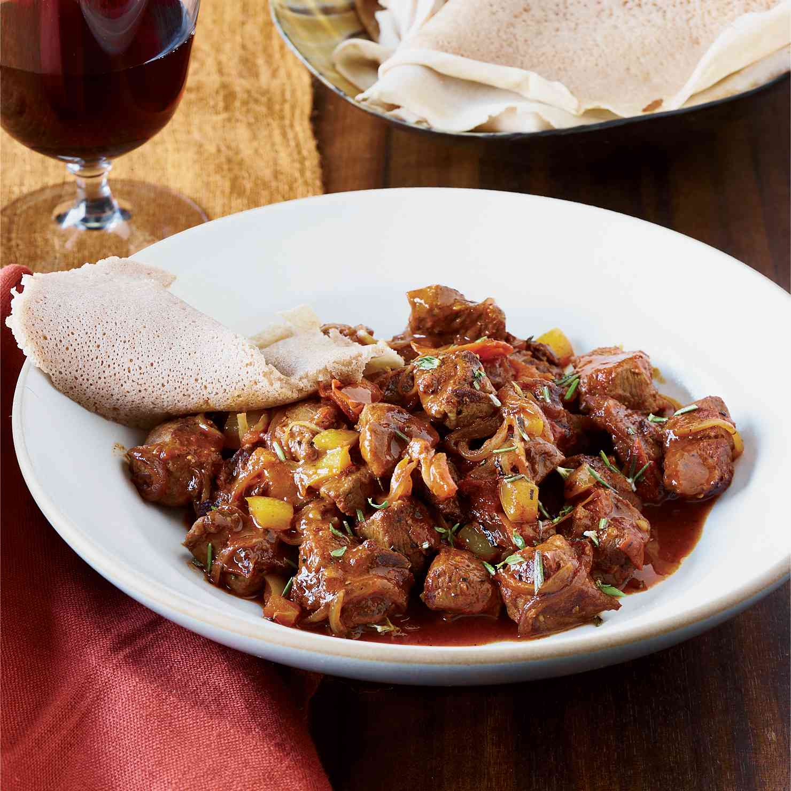

# Tibs

*Ethiopia's everyday sautéed meat: cubed beef or lamb seared hard in niter kibbeh with onion, garlic, ginger, fresh rosemary and a generous hit of berbere or fresh green chillies. The street-food and home-kitchen counterpart to the long-simmered wot stews.*

**Serves:** 4

**Prep Time:** 20 minutes

**Cook Time:** 15 minutes

## Overview
Tibs is the everyday sautéed meat dish of Ethiopia, the quick-cook counterpart to the long-simmered wot stews: cubed beef, lamb or goat seared hard in niter kibbeh (spiced clarified butter) with onion, garlic, ginger, fresh rosemary and either dry berbere for a deep red traditional flavour, or fresh green chillies for a brighter version (awaze tibs). It turns up everywhere from village kitchens to upmarket Addis Ababa restaurants, eaten with injera and a side of fresh chopped tomato and chilli (timatim salata) or rolled into pieces of injera with a smear of berbere paste. The meat-to-pan ratio is the technique that separates restaurant tibs from a stir-fry. The pan must be hot, the meat must be patted bone-dry, and the cubes must go into the pan in small batches so the surface temperature stays high and the meat sears rather than steams; crowd the pan and you'll get grey braised cubes instead of properly caramelised tibs. Three classic versions exist: regular tibs (medium-spiced, the standard restaurant version), awaze tibs (with fresh green chilli and lemon, brighter and hotter), and zilzil tibs (long thin strips rather than cubes, often served sizzling on a charcoal brazier at table for the dramatic restaurant presentation). The recipe below is the regular cubed version, the everyday home cooking choice. Heat the niter kibbeh hard, sear the cubed meat in batches, add onion, garlic, ginger, rosemary and berbere and toss together for the last 3-4 minutes of cooking. Finish with a squeeze of lemon and serve immediately on injera with timatim salata and a piece of cottage cheese on the side.

## Ingredients

### Meat
- 600 g beef sirloin or lamb leg (cut into 2 cm cubes; or goat shoulder, slightly tougher but classic)
- 1 teaspoon fine sea salt
- ½ teaspoon black pepper

### Sauté base
- 50 g niter kibbeh (or substitute clarified butter; or 30 g clarified butter + 20 g olive oil)
- 1 large red onion (cut into 1.5 cm wedges)
- 4 garlic cloves (finely chopped)
- 1 tablespoon fresh ginger (finely grated)
- 2 fresh rosemary sprigs (or 1 teaspoon dried rosemary)
- 2-3 jalapeño or other fresh green chillies (deseeded and sliced into rings)
- 2 tablespoons berbere spice (Ethiopian red spice blend)
- 1 tablespoon tomato purée (optional, for a deeper red colour)

### To finish
- ½ lemon (juice)
- 2 tablespoons fresh coriander (chopped, optional)

### To serve
- 1-2 large rounds of injera
- Timatim salata (chopped tomato, onion, jalapeño with lemon and oil)
- Ayib (Ethiopian cottage cheese) or any fresh mild cottage cheese

## Method

### Stage 1 - Prepare the meat
1. Pat the meat cubes dry thoroughly with kitchen paper. Wet meat steams instead of sears.
2. Toss with the salt and black pepper.
3. Leave at room temperature for 15 minutes if it came straight from the fridge; cold meat cools the pan and prevents proper searing.

### Stage 2 - Heat the kibbeh
1. Heat a wide heavy frying pan (cast iron is best) over high heat for 2 minutes till properly hot.
2. Add the niter kibbeh and let it melt and start to shimmer. The pan should be hot enough that a single cube of meat dropped in sizzles violently.

### Stage 3 - Sear the meat
1. Add the meat to the pan in a single layer, working in 2 batches if needed to avoid crowding. The first batch should fit with space between cubes.
2. Let the cubes sear undisturbed for 90 seconds till the underside is deep brown.
3. Toss or turn the cubes and continue searing for another 1-2 minutes till most surfaces are well-browned but the meat is still pink in the centre. (The meat will keep cooking in the final stage.)
4. Tip the seared meat into a bowl. Repeat with the second batch if needed.

### Stage 4 - Build the aromatic base
1. With all the meat removed from the pan, add the onion wedges to the residual hot fat.
2. Toss and sauté for 3 minutes till the onions soften slightly and start to take colour but still hold their shape.
3. Add the chopped garlic, grated ginger, rosemary sprigs and sliced green chillies. Toss for 30 seconds till fragrant.
4. Stir in the berbere and tomato purée (if using). The berbere will hiss and turn the oil a deep glossy red.

### Stage 5 - Combine and finish
1. Return the seared meat and any resting juices to the pan.
2. Toss everything together hard for 2-3 minutes till the meat is coated in the red spiced oil and the onions have softened to your liking. The meat should be cooked through but still juicy; don't overcook past medium.
3. Off the heat, squeeze in the lemon juice and stir.
4. Taste; adjust salt.

### Stage 6 - Serve immediately
1. Lay a large round of injera on a wide platter.
2. Spoon the tibs into the centre of the injera.
3. Place a small mound of timatim salata and a portion of ayib alongside.
4. Scatter the chopped coriander over the tibs.
5. Bring straight to the table; tibs is best eaten the moment it's plated.

## Notes
- **Hot pan, dry meat, no crowding:** the three pillars of proper tibs. The pan must be properly hot before the meat goes in; the cubes must be patted bone-dry; and they must go in in small batches with space between them so the pan stays hot. Skip any of these and you get grey steamed meat rather than caramelised tibs.
- **Niter kibbeh matters:** the spiced butter is what gives tibs its distinctive Ethiopian flavour. Plain clarified butter substitutes acceptably; vegetable oil substitutes poorly. If you can find or make proper niter kibbeh (clarified butter cooked with cardamom, cumin, fenugreek, basil, korarima and bishop's weed), use it; the difference is significant.
- **Berbere quality:** Ethiopian berbere should be deeply red, fragrant and properly spicy. A fresh well-made berbere can take 2 tablespoons in this dish without overwhelming. An old or generic substitute may need less or more; taste as you cook.
- **Don't overcook:** the meat should be cooked to medium at most; over-cooked tibs goes tough and dry quickly. Pull it from the heat when it's still juicy in the centre.
- **Restaurant zilzil version:** for the dramatic presentation, cut the meat into long thin strips rather than cubes, cook fast in a very hot pan, and serve on a sizzling clay or cast-iron brazier at the table. Adjust cooking time downward; strips cook in 3-4 minutes total.

## Variations
**Awaze tibs:** add 2-3 tablespoons of awaze (a berbere-and-wine paste sold in Ethiopian shops) instead of dry berbere, and finish with a generous handful of chopped fresh chilli. Brighter and hotter; restaurant favourite.
**Doro tibs:** swap the beef for boneless chicken thigh cut into 2 cm cubes. Cook through in the same way; chicken needs no more than 5-6 minutes total. Lighter and milder.
**Lamb tibs (yebeg tibs):** use lamb leg or shoulder cubed; the most flavourful variant. Slightly higher fat content than beef means more intense richness with the kibbeh.
**Tibs wat:** the long-cooked version where the tibs are simmered with extra berbere and onion for 30-40 minutes till stew-like, halfway between tibs and wot.
**Vegetarian tibs:** swap meat for cubed mushroom (king oyster works well) or firm tofu; same technique. Less authentic but works for Orthodox fasting days.

## Serving
On a round of injera at the centre of the table with timatim salata and ayib alongside, plus a small bowl of awaze (chilli-and-wine paste) or extra berbere for those who want more heat. Drink: tej (Ethiopian honey wine), tella (homemade barley beer), or cold St George (Ethiopian lager). The traditional finish: fresh-roasted Ethiopian coffee in the buna ceremony after eating.

## Storage
- Best eaten fresh from the pan; the meat goes from tender to tough fast as it cools.
- Keeps refrigerated 2 days. Reheat in a hot dry pan for 2-3 minutes; never microwave (the meat goes rubbery and the kibbeh splits).
- Doesn't freeze well.
