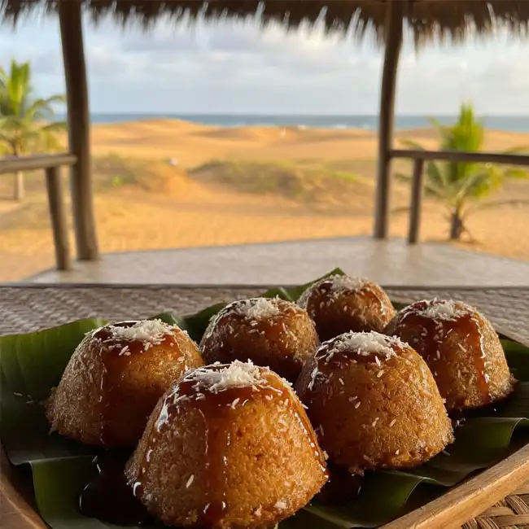

# Purini

*Fijian steamed banana-coconut pudding: ripe bananas mashed with flour, coconut and a touch of sugar, wrapped in banana leaves and steamed soft. The Pacific cousin of a banana cake without the bake.*

**Serves:** 6

**Prep Time:** 15 minutes

**Cook Time:** 1 hour

## Overview
Purini sits beside vakalolo as the other Fijian steamed dessert; where vakalolo is dense cassava-based, purini is lighter and banana-based, with a soft pudding-cake texture closer to a steamed sponge. Very ripe bananas (the kind with brown patches all over) are mashed with self-raising flour, grated coconut and a small amount of sugar; vanilla and a pinch of salt complete the mix; everything is wrapped in banana leaves and steamed until set. The result is moist, fragrant, gently sweet, with the banana flavour intense and the coconut adding texture. Eaten warm with thick coconut cream poured over.

## Ingredients
- 6 very ripe bananas (about 600 g flesh weight) - black-spotted is right
- 200 g self-raising flour
- 100 g grated fresh coconut (or 70 g desiccated, rehydrated)
- 80 g brown sugar
- 1 tsp vanilla extract
- 1/2 tsp salt
- 2 tbsp coconut oil, melted
- 4-6 banana leaves, softened over a flame
- For serving: 100 ml thick coconut cream

## Method

### Stage 1 - Mash and mix
1. Peel the bananas; mash thoroughly in a wide bowl with a fork until almost smooth (some small lumps are fine).
2. Add the brown sugar, vanilla, salt and melted coconut oil; stir to combine.
3. Add the flour and grated coconut. Fold gently until just combined - do not overmix.

### Stage 2 - Wrap
1. Soften the banana leaves over a gas flame, 5 seconds per side.
2. Lay 2-3 leaves overlapping on a board.
3. Tip the batter into the centre; spread into a slab about 5 cm thick.
4. Fold the leaves over to enclose; tie with twine.

### Stage 3 - Steam
1. Place the parcel on a rack over boiling water; cover the pot.
2. Steam 1 hour, topping up water as needed.
3. The purini is done when a skewer inserted into the centre comes out clean.

### Stage 4 - Rest and serve
1. Let the parcel rest 10 minutes before opening.
2. Slice into thick wedges or scoop with a spoon - the texture is between cake and pudding.
3. Pour thick coconut cream over each portion.

## Notes
- **Banana ripeness:** Very ripe is essential. Underripe bananas give a starchy, under-sweet pudding; black-spotted ripeness gives the right sweetness and fragrance.
- **Self-raising flour:** The traditional Fijian home version uses self-raising flour. To make from plain flour, add 2 tsp baking powder per 200 g flour.
- **Texture:** Purini is moist and tender, not light and fluffy. Steamed puddings are denser than baked cakes by their nature.

## Serving
Serve warm, with thick coconut cream poured generously over each portion. A scoop of vanilla ice cream is non-traditional but works beautifully.

## Storage
- Refrigerate wrapped 3 days; reheat in the steamer or microwave.
- Freezes 2 months.
