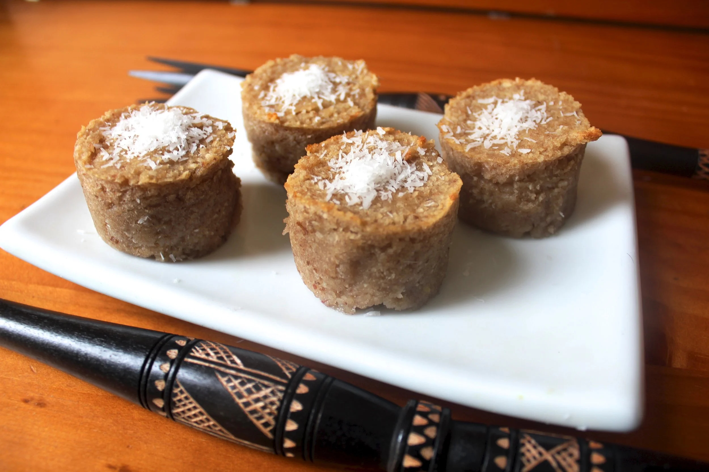

# Vakalolo

*Fijian steamed cassava-coconut cake: grated cassava mixed with sugar, coconut and a hit of vanilla, wrapped in banana leaves and steamed until set into a dense sweet block.*

**Serves:** 8

**Prep Time:** 25 minutes

**Cook Time:** 1 hour 30 minutes

## Overview
Vakalolo is the dessert that completes a Fijian Sunday lunch. Fresh cassava is peeled and finely grated; the wet pulp is mixed with brown sugar, freshly grated coconut, a generous splash of vanilla and a pinch of salt; the mixture is wrapped in softened banana leaves into a tight parcel and steamed for an hour and a half. The result is a dense, slightly chewy, deeply sweet cake with the unmistakable banana-leaf perfume on the surface. Sliced and eaten warm or at room temperature, with a small dish of thick coconut cream alongside for spooning over.

## Ingredients
- 1 kg fresh cassava (or 800 g frozen grated cassava, thawed)
- 300 g grated fresh coconut (or 200 g desiccated coconut, rehydrated in 100 ml hot water for 10 min)
- 200 g brown sugar (light muscovado works best)
- 1 tsp vanilla extract
- 1/2 tsp salt
- 2 tbsp coconut oil, melted
- 4-6 large banana leaves, softened over a flame
- Optional for serving: 100 ml thick coconut cream

## Method

### Stage 1 - Prepare the cassava
1. Peel the cassava carefully (skin off, pink layer off, white flesh only).
2. Grate finely on the small holes of a box grater, or pulse in a food processor to a coarse pulp.
3. **Important:** Cassava must be cooked - never tasted raw. The cyanogenic compounds destroy with cooking.
4. Place the grated cassava in a tea towel; squeeze hard over a bowl to extract some moisture (don't squeeze fully dry - vakalolo wants some moisture).

### Stage 2 - Mix
1. In a large bowl, combine the squeezed cassava, grated coconut, brown sugar, vanilla, salt and melted coconut oil.
2. Mix thoroughly with a wooden spoon for 2 minutes until even.

### Stage 3 - Wrap
1. Soften the banana leaves over a gas flame, 5 seconds per side, until pliable.
2. Lay 2-3 leaves overlapping on a board to form a wide rectangle.
3. Tip the cassava mixture into the centre; shape into a compact block about 20 x 15 cm and 5 cm thick.
4. Fold the leaves over to enclose tightly; tie with kitchen twine or strips of leaf to hold the shape.

### Stage 4 - Steam
1. Set the parcel on a rack over a pot of boiling water; cover the pot.
2. Steam 1 hour 30 minutes, topping up the water as needed.
3. The vakalolo is done when a skewer inserted into the centre comes out clean, and the cassava has set into a firm dense block.

### Stage 5 - Rest and serve
1. Let the parcel rest 10 minutes before unwrapping.
2. Open the leaves; slice the cake into thick wedges.
3. Serve warm or at room temperature, with thick coconut cream spooned over the top.

## Notes
- **Cassava poison:** Mandatory cooking. The grated cassava must steam fully through to neutralise the cyanogenic compounds. Don't taste the raw mixture.
- **Banana leaves:** Available frozen at African, Caribbean and South-East Asian shops. Foil is a poor substitute - the leaf adds the signature aroma.
- **Texture:** Vakalolo is dense and chewy, not light or fluffy. Many bites are unfamiliar to anyone expecting a Western sponge cake; the satisfaction is in the dense sweetness.

## Serving
Serve warm or at room temperature, in thick slices, with a small dish of thick coconut cream spooned alongside or over. Mango or pineapple slices complement well.

## Storage
- Refrigerate wrapped 4 days; reheat briefly in the steamer or microwave.
- Freezes 2 months wrapped tightly; thaw overnight in the fridge.
