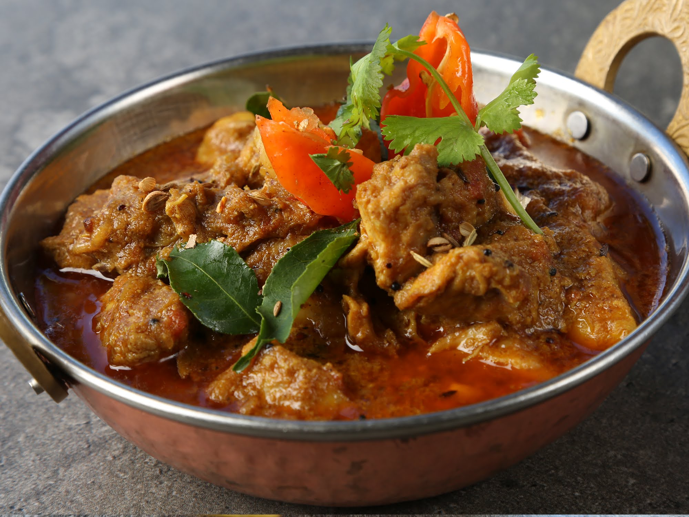

# Indo-Fijian Goat Curry

*The Sunday curry of Indo-Fijian households: bone-in goat slow-cooked with onion, garlic-ginger paste, the Fijian curry powder mix, and a finishing handful of fresh coriander. Eaten with roti or rice.*

**Serves:** 6

**Prep Time:** 25 minutes

**Cook Time:** 2 hours

## Overview
A century of Indian indentured labour reshaped Fijian cuisine; Indo-Fijian curry is the result, a distinct branch of South Asian cooking that uses slightly different spice ratios from North or South Indian curry while reaching the same destination. Goat (or mutton) on the bone is browned, simmered slowly in a paste of onion, garlic, ginger and the Fijian curry powder blend (heavier on cumin and coriander, lighter on chilli than the Madras version). After two hours the meat falls off the bone, the sauce has reduced to a glossy gravy, and a final stir of fresh coriander goes through. Served with hot roti (or rice) and a small dish of lime pickle.

## Ingredients

- 1.2 kg goat on the bone (shoulder or leg), cut into 4 cm pieces
- 4 tbsp vegetable oil
- 2 large onions, finely chopped
- 6 cloves garlic, finely minced
- 1 thumb of ginger, finely grated
- 2 green chillies, finely chopped (or to taste)
- 2 tbsp Madras-style or Fijian [curry powder](../../base-ingredients/curry-powder/bir-curry-powder.md)
- 1 tsp ground turmeric
- 1 tsp ground coriander
- 1 tsp ground cumin
- 1 tsp [garam masala](../../base-ingredients/curry-powder/garam-masala.md)
- 2 tbsp tomato paste
- 400 g tinned chopped tomatoes
- 700 ml water
- 1 cinnamon stick
- 4 cardamom pods, cracked
- 4 cloves
- 1 bay leaf
- 1 tsp salt
- 1 large potato, peeled and cut into 3 cm cubes (optional but traditional)
- A handful of fresh coriander, chopped

## Method

### Stage 1 - Brown the goat
1. Heat 2 tbsp oil in a heavy pot over high heat.
2. Pat the goat dry. Brown in batches, 4 minutes per side, until well coloured. Set aside.

### Stage 2 - Build the base
1. Reduce heat to medium. Add the remaining oil.
2. Add the cinnamon stick, cardamom, cloves and bay leaf; sizzle 30 seconds.
3. Add onions; cook 12-15 minutes until deeply browned, almost golden-brown - this slow cooking is the foundation of the curry's depth.
4. Add garlic, ginger and chillies; cook 2 minutes.
5. Stir in the curry powder, turmeric, ground coriander, cumin and garam masala. Cook 30 seconds until fragrant.
6. Add the tomato paste; cook 2 minutes until darkened.

### Stage 3 - Build the sauce
1. Add the chopped tomatoes; cook 5 minutes, stirring, until oil pools at the edges.
2. Return the goat to the pot with any juices.
3. Add water and salt. Stir to combine.

### Stage 4 - Slow cook
1. Bring to a simmer. Reduce heat to low, cover, and cook 1 hour 30 minutes, stirring every 20 minutes to prevent sticking.
2. If using potatoes, add them at 1 hour into the cook. They are tender by the time the meat is done.
3. The curry is finished when the goat is falling off the bone and the sauce has reduced to a glossy gravy coating the meat (about 2 hours total).

### Stage 5 - Finish
1. Off heat, stir in half the chopped coriander.
2. Taste; adjust salt and chilli.

## Notes
- **Goat vs mutton:** Goat is the traditional Indo-Fijian protein - slightly leaner and more savoury than lamb. Mutton (older sheep) is the closest substitute; lamb works too but loses a bit of character.
- **Curry powder choice:** Fijian curry powder is widely available across the Pacific; Madras-style curry powder is the closest substitute. Adjust chilli to taste - traditional Indo-Fijian curry is moderately hot, not blisteringly so.
- **The slow brown:** 12-15 minutes on the onions is what builds the curry's foundation. Rushing this gives a thinner, less complex result.

## Serving
- Serve hot with fresh roti, paratha or steamed basmati rice. Sliced cucumber, lime pickle, and a coconut chutney complete the table. A bowl of sliced raw onion and green chilli for those who want extra heat.

## Storage
- Refrigerate 4 days. The curry improves overnight as the spices marry; many Indo-Fijian cooks make it the day before serving.
- Freezes 3 months.
