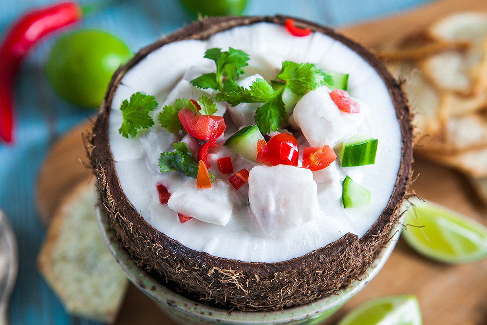

# Kokoda

*Fijian citrus-cured fish in coconut milk: white fish marinated briefly in lime, dressed with coconut cream, chilli, tomato and red onion. The Pacific cousin of South American ceviche, served cold in a halved coconut shell.*

**Serves:** 4 as a starter, 2 as a main

**Prep Time:** 20 minutes (plus 30-60 min cure)

**Cook Time:** None

## Overview
Kokoda is the dish that announces a Fijian meal. Fresh firm white fish is cubed and bathed in lime juice for half an hour, just long enough for the acid to firm the flesh and turn it opaque white. The cured fish is then folded through a dressing of fresh coconut cream, finely diced tomato, red onion, fresh chilli and a generous squeeze more lime. The result is bright, creamy, sharp and gentle all at once - the coconut cream rounds the lime's edge, the tomato lifts the fish, the chilli sits at the back. Served cold, ideally spooned into a halved young coconut shell or a small bowl.

## Ingredients
- 500 g firm white fish (snapper, mahi-mahi, walu, sea bass), skinless and boneless
- Juice of 4-5 limes (about 150 ml)
- 1 tsp salt
- 200 ml thick coconut cream (the top layer skimmed from a tin of full-fat coconut milk, or fresh-pressed)
- 1 small red onion, very finely diced
- 2 ripe tomatoes, deseeded and diced 5 mm
- 1/2 cucumber, deseeded and diced 5 mm
- 1 small red chilli, finely chopped (or to taste)
- 1 tbsp finely chopped fresh coriander
- 1 spring onion, finely sliced
- Black pepper

## Method

### Stage 1 - Cube and cure
1. Cut the fish into 1 cm cubes - small enough to cure through, large enough to keep some bite.
2. Combine fish, lime juice and 1/2 tsp salt in a glass bowl.
3. Refrigerate 30-60 minutes. The fish turns opaque white and firms; longer cures over-cook the texture.

### Stage 2 - Drain and dress
1. Drain the fish in a fine sieve, gently pressing out excess lime juice (the dish should not be soupy).
2. Return to a clean bowl. Add the coconut cream, diced tomato, cucumber, onion, chilli, coriander and spring onion.
3. Toss gently to coat. Add remaining 1/2 tsp salt and a grind of pepper.
4. Taste; add more lime if needed - the dish should be bright but not punishingly sour.

### Stage 3 - Rest and serve
1. Rest 10 minutes in the fridge so the flavours marry.
2. Serve cold in halved coconut shells, or in small bowls, with a wedge of lime alongside.

## Notes
- **Fish quality:** Must be sushi-grade fresh. The lime cures rather than cooks; bad fish stays bad. Buy from a fishmonger or sushi-grade counter; freeze first if the source is uncertain (-20 C for 24 hours kills parasites).
- **Cure time:** Half an hour is the right window for 1 cm cubes. Over an hour and the fish turns rubbery and the lime overpowers.
- **Coconut cream:** Thick cream, not milk. Skim the top of a tin of full-fat coconut milk that has been refrigerated overnight; the solid white layer is the cream.

## Serving
Serve very cold as a starter or light lunch. The coconut shell presentation is traditional but a chilled bowl is fine. Bread and lime wedges alongside.

## Storage
- Eat within 4 hours of mixing. After that the coconut cream separates and the fish toughens.
- Do not freeze.
