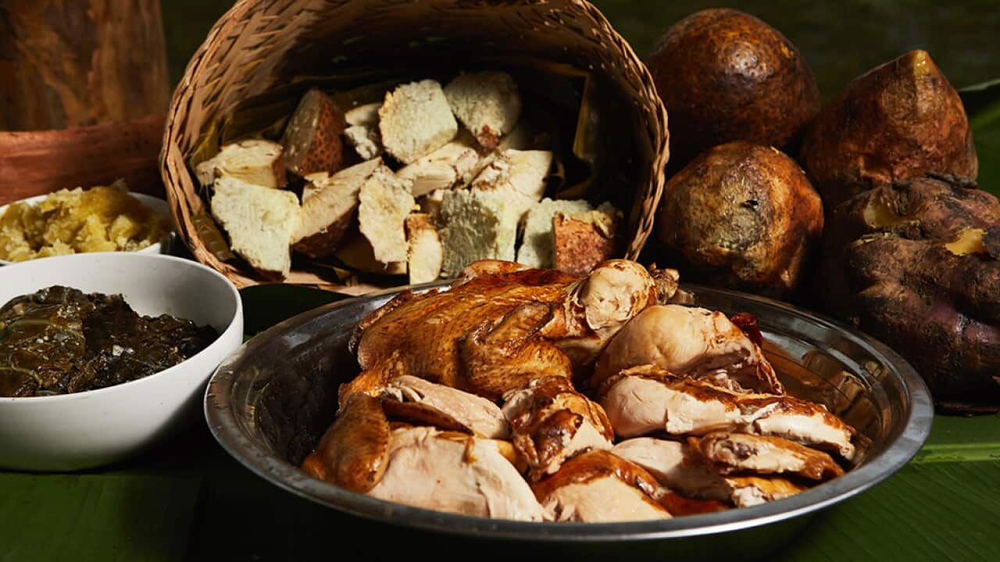

# Lovo

*Fijian earth-oven feast: pork, chicken, dalo and fish wrapped in banana leaves and slow-cooked over hot stones buried in the ground. The Sunday family meal and the centrepiece of village celebrations.*

**Serves:** 8-10

**Prep Time:** 1 hour

**Cook Time:** 2 hours 30 minutes (plus pit-heating time)

## Overview
Lovo is the Fijian earth-oven, and the name covers both the pit itself and the feast cooked in it. A pit is dug; a fire is built in it; stones (hard volcanic ones, traditionally) are heated until they glow; the meats and starches - whole chicken, pork shoulder, fish wrapped in banana leaves, fresh dalo (taro), kumara - are arranged on the hot stones, covered with more leaves and a wet sack, and buried under earth. Two and a half hours later the lovo is dug out: the meat is falling apart, the starches steamed soft, every bite carrying that unmistakable wood-smoke-and-banana-leaf flavour that only ground-cooking gives. The kitchen-oven version below recreates it as best you can without the pit.

## Ingredients

### Marinade for the proteins
- 1 whole chicken (about 1.5 kg)
- 1 kg pork shoulder, in 2-3 large pieces
- 500 g firm white fish (in steaks or fillets)
- 4 tbsp lime juice
- 4 cloves garlic, minced
- 1 tbsp grated ginger
- 1 tbsp sea salt
- 2 tsp ground turmeric
- 1 tsp black pepper
- 2 tbsp soy sauce
- 2 tbsp coconut oil

### Starches and aromatics
- 8 medium pieces dalo (taro), or substitute large potatoes
- 4 medium kumara (sweet potato), halved
- 8 large green banana leaves (from a Pacific or Asian shop; freezer aisle), softened over a flame
- 200 ml thick coconut cream
- 1 thumb of ginger, sliced
- 4 garlic cloves, smashed
- A few sprigs of fresh thyme or basil

## Method

### Stage 1 - Marinade
1. Mix the marinade ingredients in a wide bowl.
2. Coat the chicken (inside and out), pork pieces and fish thoroughly. Cover; refrigerate at least 4 hours, ideally overnight.

### Stage 2 - Prep the dalo
1. Peel the dalo and kumara. Cut dalo into large chunks; halve the kumara.
2. Boil in salted water 10 minutes; drain. The starch is partially cooked through.

### Stage 3 - Soften the banana leaves
1. Pass each leaf briefly over a gas flame, 5 seconds per side, until they shift from rigid green to pliable and slightly darker. This stops them tearing when wrapped.

### Stage 4 - Wrap the fish
1. Lay 2 banana leaves overlapping on a board. Place the fish fillets on top.
2. Drizzle with 2 tbsp coconut cream; scatter ginger slices, garlic and herbs.
3. Wrap into a tight parcel, tying with kitchen twine or extra leaf strips.

### Stage 5 - Layer in a roasting tin
1. Heat oven to 160 C.
2. Line a deep roasting tin with overlapping banana leaves, leaves coming up the sides (this is the kitchen's stand-in for the pit).
3. Arrange the dalo and kumara across the bottom.
4. Lay the pork pieces on top.
5. Drizzle over the remaining coconut cream.
6. Place the chicken (with marinade) on top of the pork.
7. Tuck the fish parcel in among the meats.
8. Fold the banana leaves over the top to enclose everything; cover the tin tightly with foil.

### Stage 6 - Slow cook
1. Bake covered for 2 hours.
2. Remove the foil and top layer of banana leaves for the last 30 minutes.
3. Check the chicken: probe-test - juices should run clear, the thigh meat falls off the bone. Pork should pull apart with a fork.

### Stage 7 - Unwrap and serve
1. Lift the chicken, pork and fish onto a wide wooden board.
2. Arrange the dalo and kumara around them.
3. Pour the pan juices over.
4. Pull the chicken and pork apart with two forks; let everyone serve themselves.

## Notes
- **The real pit lovo:** A proper lovo is built outdoors with hot stones over hours; the closest home substitute is a deep covered roasting tin with banana leaves to capture the steamy aromatic.
- **Banana leaves:** Available frozen at Pacific, Asian and African shops. The leaves contribute a slight smokiness and tropical aroma that foil alone doesn't.
- **Coconut cream over the meats:** This is the key Fijian touch - the coconut basting through the cook gives the lovo its character. Without it, you have a regular slow-roast.

## Serving
Serve communally on the board with the unwrapped contents arranged together. Fijian fresh chutney (lolo chutney - coconut, chilli, lime) and pickled chilli on the side. Soft white rice if you want extra starch.

## Storage
- Refrigerate leftovers 3 days. Reheat in a covered dish at 150 C with a splash of water.
- Freezes 1 month; the texture of the dalo suffers slightly on thaw.
