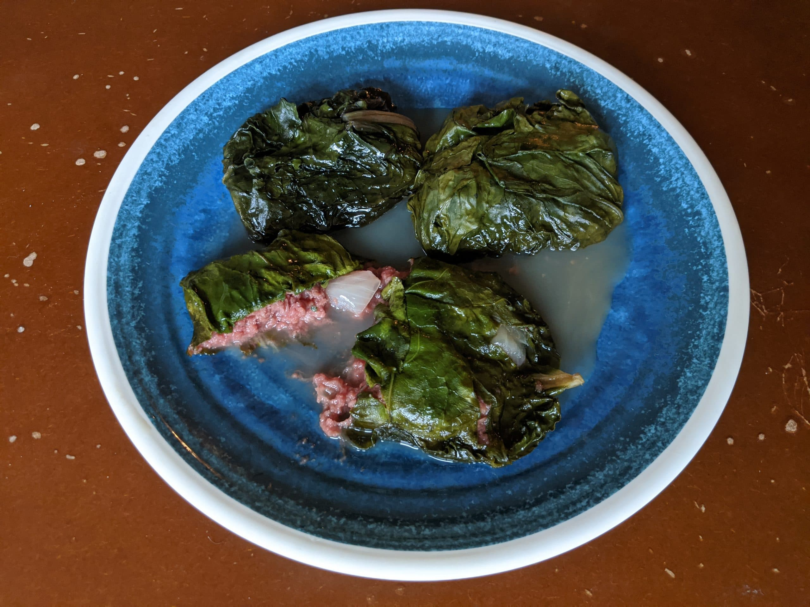

# Palusami

*Young taro leaves stacked into a parcel, filled with thick coconut cream, onion and lime juice, then slow-baked until the leaves collapse into a soft, dark, faintly sweet bundle that tastes of the Pacific kitchen at its plainest.*

**Serves:** 4

**Prep Time:** 20 minutes

**Cook Time:** 1 hour 30 minutes

## Overview
Palusami is the everyday parcel dish of Fiji and the wider South Pacific: tender young taro leaves (rourou) wrapped around a centre of thick coconut cream seasoned with onion, salt and a squeeze of lime, sometimes with a spoonful of corned beef tucked in for a Sunday version. The parcel is baked in an underground oven for a feast, or in a covered dish in a domestic oven for a Tuesday dinner. The leaves wilt and darken; the coconut cream thickens and absorbs the earthy taro flavour; the salt and lime cut through the richness. Cooked properly the leaves lose every trace of the sharp calcium oxalate that makes raw taro inedible. Eat hot with cassava, dalo or rice, scooping leaves and cream together with a spoon.

## Ingredients

- 24 young taro leaves (rourou), stems trimmed (about 400 g)
- 400 ml thick coconut cream
- 1 medium onion, finely chopped
- 1 tsp salt
- Juice of 1 lime
- A pinch of white pepper
- Optional: 100 g corned beef, finely chopped (for the Sunday version)
- 4 squares of foil or banana leaf (about 25 cm each)

## Method

### Stage 1 - Prepare the leaves
1. Wash the taro leaves; trim the thick stems off the back of each leaf.
2. Stack 6 leaves in a rough circle, overlapping at the centre, on each square of foil or banana leaf.
3. Set the four piles out on the work surface.

### Stage 2 - Make the filling
1. In a bowl, combine the coconut cream, chopped onion, salt, lime juice, white pepper and corned beef (if using).
2. Stir well; the mixture should be loose and pourable.

### Stage 3 - Fill and wrap
1. Spoon about 100 ml of the coconut mixture into the centre of each leaf pile.
2. Fold the leaves over the filling to form a rough parcel.
3. Wrap the foil or banana leaf tightly around each, sealing the top so no liquid escapes.

### Stage 4 - Bake
1. Heat the oven to 160 C.
2. Place the parcels in a deep dish (in case any cream leaks).
3. Bake 1 hour 30 minutes, until the leaves are completely soft when pressed through the foil.
4. Rest 10 minutes before opening; the cream settles.

## Notes
- **The leaves must cook fully:** raw taro leaves contain calcium oxalate crystals that sting the throat. A full hour and a half of moist heat breaks these down completely. If in doubt, cook longer.
- **Coconut cream, not milk:** the thick top fraction from a tin is what you want. Thin coconut milk leaves the parcel watery.
- **Spinach substitute:** if taro leaves are not available, use mature spinach leaves doubled up. The flavour is gentler but the technique is the same.

## Variations
- **Lovo palusami:** wrap in banana leaf and bake in the earth oven (lovo) alongside the meat and root vegetables; the smoke flavour is the point.
- **Corned beef palusami:** the Sunday lunch version, with tinned corned beef stirred through the coconut cream.
- **Fish palusami:** a piece of firm white fish tucked into the centre of the parcel.
- **Chicken palusami:** small pieces of cooked chicken folded through the filling.
- **Vegan everyday:** pure coconut cream, onion, salt and lime; the plainest and best version.

## Serving
Serve hot, one parcel per person, opened at the table · with steamed cassava or dalo · with rice for an Indo-Fijian table · alongside grilled fish · as part of a lovo feast · with a fresh chilli on the side.

## Storage
- Refrigerate 3 days in the wrapping; the flavour deepens overnight.
- Reheat in a covered dish at 150 C for 20 minutes.
- Freezes 2 months; thaw overnight before reheating.
