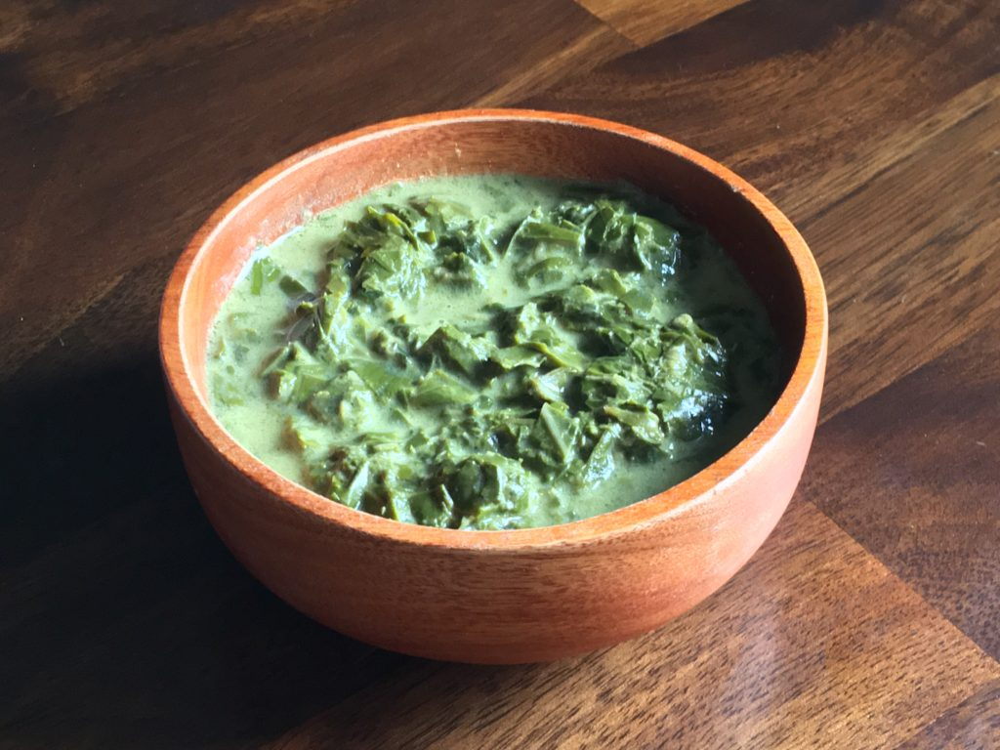

# Rourou

*Fijian taro-leaf curry: young taro leaves stewed slowly in coconut cream with onion, garlic, ginger and a small hit of curry powder. The everyday vegetable dish across rural Fiji.*

**Serves:** 4

**Prep Time:** 15 minutes

**Cook Time:** 45 minutes

## Overview
Rourou is what Fijian cooks make with the bumper crop of taro leaves that grow around every rural village. The young leaves are stripped of their thick central rib, sliced into ribbons, then simmered in coconut milk with browned onion, garlic and ginger - and, in modern Fijian-Indian-influenced kitchens, a teaspoon of curry powder. The result is rich, slightly bitter, deeply savoury, and the spinach-like leaves break down to a soft melting mass that holds the coconut sauce. Eaten over rice or as part of a bigger plate with grilled fish or chicken.

## Ingredients
- 500 g young taro leaves (lu), stems removed and discarded, leaves sliced into 1 cm ribbons
- 3 tbsp coconut oil (or any neutral oil)
- 1 large onion, finely chopped
- 4 cloves garlic, minced
- 1 thumb of ginger, grated
- 1 green chilli, finely chopped (or to taste)
- 1 tsp ground turmeric
- 1 tsp Madras-style curry powder (the Indo-Fijian touch)
- 1/2 tsp salt
- 400 ml coconut milk
- 100 ml thick coconut cream (for finishing)
- 1 lime, juiced

## Method

### Stage 1 - Pre-boil the taro leaves
1. Bring a large pot of salted water to a boil.
2. Add the sliced taro leaves; blanch 5 minutes. This removes the calcium oxalate crystals that make raw taro irritating.
3. Drain thoroughly. Press out excess water with the back of a spoon.

### Stage 2 - Build the base
1. Heat the coconut oil in a wide heavy pan over medium heat.
2. Add the onion; cook 8-10 minutes until softened and pale gold.
3. Add the garlic, ginger, chilli; cook 1 minute until fragrant.
4. Stir in the turmeric and curry powder; cook 30 seconds until the spices bloom.

### Stage 3 - Stew
1. Tip in the blanched taro leaves; stir to coat.
2. Pour over the coconut milk; add salt.
3. Bring to a simmer; reduce heat to low. Cover and cook 25-30 minutes, stirring occasionally, until the leaves are completely soft and the sauce has thickened.

### Stage 4 - Finish
1. Stir in the thick coconut cream.
2. Cook uncovered 5 more minutes to thicken.
3. Off heat, stir in lime juice. Taste; adjust salt and chilli.

## Notes
- **The blanching step:** Non-negotiable for raw taro leaves. Skipping it leaves a tongue-irritating raw taste and (in some sensitive people) a tight-throat itch. The blanch is what makes taro safe to eat.
- **Spinach substitute:** Fresh spinach or chard works if taro is unavailable. The result is closer to a Fijian-style creamed spinach than true rourou, but the flavour profile is similar.
- **Curry powder:** The Indo-Fijian influence is what distinguishes Fijian rourou from the Polynesian taro-and-coconut leaf dishes. Without curry powder, the dish is plainer and more Pacific-island; with it, it becomes the home Fijian version.

## Serving
- Serve hot over steamed white rice, with grilled fish or chicken alongside. A small dish of lime pickle and a sliced fresh chilli complete the plate.

## Storage
- Refrigerate 3 days; reheat gently with a splash of coconut milk if it has thickened.
- Freezes 2 months.
