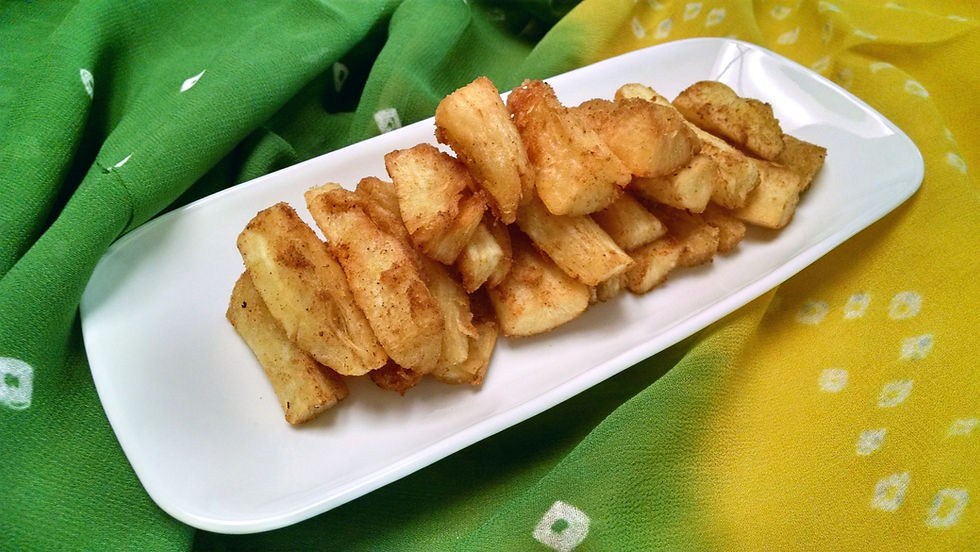

# Cassava Chips

*Fijian cassava chips: peeled cassava cut into batons, par-boiled, then deep-fried golden. The starchy crunchy snack-and-side that turns up alongside grilled fish or as a beer accompaniment.*

**Serves:** 4-6

**Prep Time:** 15 minutes

**Cook Time:** 25 minutes

## Overview
Cassava (also called yuca or manioc) is the other major Pacific tuber alongside dalo. Less sticky than taro and slightly sweeter, it makes spectacular fried chips - crispier than potato chips, with a denser starchy interior that satisfies more deeply. The Fijian everyday version is simple: peel, cut into thick batons, par-boil to part-cook, then deep-fry until golden. Salt liberally and serve hot. Eaten with grilled fish, BBQ chicken, or simply as a snack with cold Fiji Bitter beer.

## Ingredients
- 1 kg cassava (yuca, manioc) - usually sold whole or frozen at African and Caribbean shops
- 1 tsp salt (for the boil)
- 1 litre vegetable oil for frying
- Sea salt flakes to finish
- Optional: lime wedges and a small dish of chilli sauce

## Method

### Stage 1 - Peel
1. Cut the cassava into 8 cm sections.
2. Stand each section on end; cut down through the brown skin and the pink/white inner layer to expose the white starchy flesh. Discard the skin and pink layer.
3. **Important:** Cassava is poisonous raw (contains cyanogenic compounds). Always cook before eating; peel and boil are mandatory.

### Stage 2 - Cut and par-boil
1. Cut each peeled section into 1 cm thick batons.
2. Place in a pot; cover with salted cold water.
3. Bring to a boil; cook 8-10 minutes until just tender to a knife but not falling apart.
4. Drain thoroughly; pat dry with a tea towel.
5. Remove any visible woody central core from each baton (it stays tough even after cooking).

### Stage 3 - Fry
1. Heat the oil to 175 C in a deep heavy pan or wok.
2. Fry the batons in batches (do not crowd) for 4-5 minutes until deep golden and crisp.
3. Lift onto kitchen paper to drain briefly.
4. Sprinkle generously with sea salt flakes while still hot.

### Stage 4 - Serve
1. Pile onto a warm plate.
2. Serve immediately with lime wedges and chilli sauce.

## Notes
- **Cassava safety:** All cassava varieties contain cyanogenic compounds in the raw state. Peeling removes most; boiling destroys the rest. Never eat raw or under-cooked cassava.
- **Frozen cassava:** Already peeled, often par-boiled. Skip the peel step; reduce the par-boil to 5-6 minutes.
- **The woody core:** The central fibrous string in cassava stays tough even after cooking. Pull it out after par-boiling - the chips fry more evenly without it.

## Serving
- Serve hot from the fryer. Excellent with kokoda, grilled fish or chicken, or alongside a cold beer.

## Storage
- Best the same day. Cold cassava chips lose their crunch.
- Refrigerate 1 day; refry briefly to recrisp.
