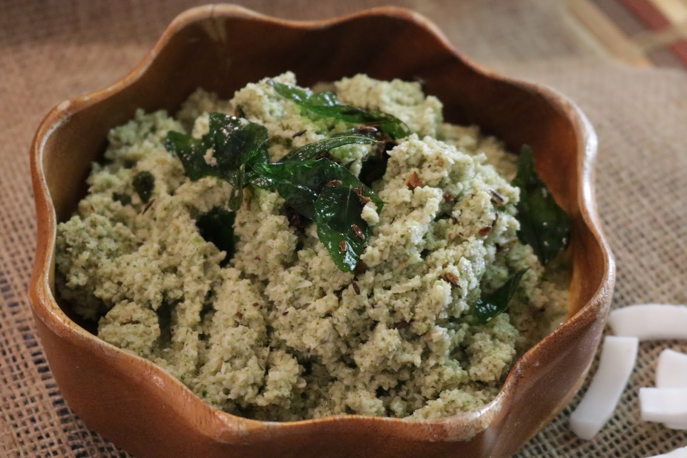

# Lolo Chutney

*Fijian fresh coconut chutney: grated young coconut mixed with chilli, lime, ginger and finely chopped onion. The bright cool relish that sits beside lovo, curry and grilled fish.*

**Serves:** 6 as a side dish

**Prep Time:** 15 minutes

**Cook Time:** None

## Overview
Lolo is the Fijian word for coconut cream, and lolo chutney is the fresh side that completes the Fijian table. Freshly grated young coconut (or rehydrated desiccated coconut as the home substitute) gets mixed with finely chopped onion, chilli, ginger, lime juice and salt - no cooking, just chopping and combining. The result is bright, slightly hot, deeply coconut, with a fresh sharpness that cuts through the richness of slow-cooked lovo or coconut-cream-heavy palusami. Eaten by the spoonful alongside the main dish or used as a dip for cassava chips.

## Ingredients
- 200 g fresh grated coconut (or 150 g desiccated coconut rehydrated in 100 ml hot water for 10 minutes, then drained)
- 1 small red onion, very finely diced
- 1 small green chilli, finely chopped
- 1 tbsp finely grated fresh ginger
- 2 tbsp lime juice
- 1/2 tsp salt
- 1 tbsp finely chopped fresh coriander
- 2 tbsp coconut milk (to loosen, optional)

## Method

### Stage 1 - Prep the coconut
1. If using fresh: grate the young coconut flesh on the fine side of a box grater (or a Pacific-style coconut scraper if you have one).
2. If using desiccated: cover with hot water, soak 10 minutes, drain thoroughly through a sieve, pressing out excess water.

### Stage 2 - Combine
1. In a bowl, mix the coconut, finely diced onion, chilli, ginger, lime juice, salt and coriander.
2. Toss thoroughly with a fork until evenly distributed.
3. If the mixture looks dry, add a splash of coconut milk to loosen.

### Stage 3 - Rest and serve
1. Rest 10 minutes for the flavours to meld.
2. Taste; adjust lime and salt - the chutney should be sharply bright but balanced.

## Notes
- **Fresh vs desiccated:** Fresh coconut is dramatically better - sweeter, juicier, less waxy. If desiccated is the only option, rehydrating before use is essential; using it dry gives a powdery texture.
- **Chilli heat:** Adjust to taste. The traditional version is moderately hot; the chutney should taste of coconut first, with the chilli as a warm undercurrent.
- **No cooking:** Lolo chutney is uncooked - the bright fresh quality is the point. Heat would dull everything.

## Serving
Serve in a small bowl alongside lovo, palusami, rourou, curry or grilled fish. The fresh sharp counterpoint to richer mains.

## Storage
- Refrigerate 2 days. The chutney releases liquid over time; drain before serving leftovers.
- Do not freeze.
