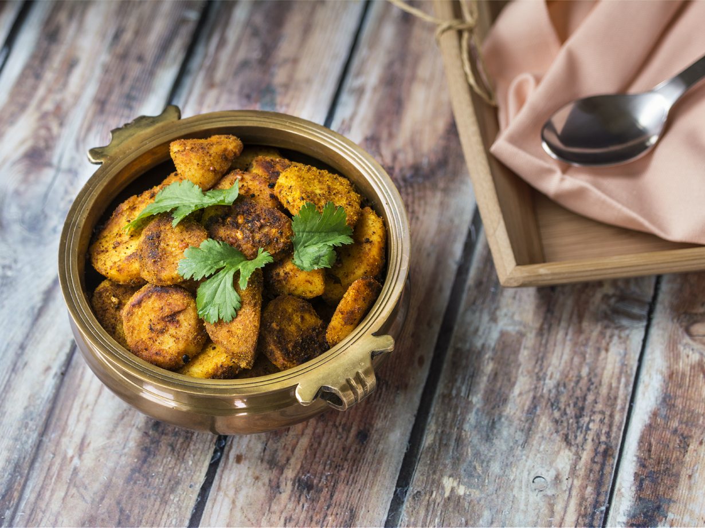

# Roast Dalo

*Whole taro root peeled, scored, rubbed with coconut cream and salt, then roasted slow until the outside is dark and crusted and the inside is dry, starchy and faintly sweet. The everyday Fijian root, treated with respect.*

**Serves:** 4 as a side

**Prep Time:** 15 minutes

**Cook Time:** 1 hour

## Overview
Dalo (taro) is the staple root of Fiji, eaten more often than any other carbohydrate and prepared in dozens of ways. Roasting is the everyday treatment: peel the corm, score the surface, rub it with thick coconut cream and a heavy pinch of salt, and bake until the outside crusts and the inside cooks to a dry, floury, slightly sweet flesh that holds its shape under a fork. Properly cooked dalo is never gummy or wet; the texture is closer to a roast parsnip than a boiled potato. Eat hot alongside fish, palusami, kokoda or curry. A few wedges of lime alongside lift the starchy flavour and bring it back to the table.

## Ingredients

- 800 g dalo (taro) corm, in 1-2 pieces
- 4 tbsp thick coconut cream
- 1 tsp sea salt
- A pinch of white pepper
- 1 lime, in wedges, to serve

## Method

### Stage 1 - Prepare the dalo
1. Peel the dalo with a sharp knife; the skin is thick and the flesh underneath is pale violet-flecked white.
2. Rinse under cold water to wash off the slippery starch.
3. Cut into pieces about the size of a large fist (250 g each).
4. Score the surface with a sharp knife in a shallow crosshatch pattern, 5 mm deep.

### Stage 2 - Season
1. In a bowl, mix the coconut cream, salt and white pepper.
2. Rub the cream into the scored surface of each piece, working it into the cuts.

### Stage 3 - Roast
1. Heat the oven to 200 C.
2. Place the pieces on a baking tray lined with baking paper, scored side up.
3. Roast 1 hour, basting once at the 40 minute mark with any cream that has run onto the tray.
4. The dalo is done when a skewer slides into the centre without resistance, the surface is dark golden, and the cream has crusted into the scored cuts.

## Notes
- **Score the surface:** the cuts catch the coconut cream and crisp into dark crusts; an unscored dalo roasts to a smooth pale surface that never crisps.
- **Wear gloves if your skin is sensitive:** raw dalo contains calcium oxalate that can irritate hands. Rinse hands well after peeling.
- **Test with a skewer:** dalo is dense; the centre is the slowest part to cook. If the skewer meets any resistance, give it another 10 minutes.

## Variations
- **Lovo dalo:** wrap whole peeled dalo in banana leaf and bake in the earth oven for 2 hours; the smoke flavour is the point.
- **Boiled dalo:** the quicker everyday treatment; simmer in salted water 30 minutes, drain well, dry over low heat 2 minutes.
- **Coconut-baked dalo:** sit the pieces in a shallow dish of coconut cream and bake covered; the result is softer and richer.
- **Dalo wedges:** cut into chip-sized wedges before roasting; the surface area gives more crust.
- **With chilli:** mix a finely chopped red chilli into the coconut cream before rubbing.

## Serving
Serve hot in chunks · with lime wedges alongside · with grilled fish or kokoda · with palusami and lovo meat · with Indo-Fijian curry as the starch · with a fresh tomato and chilli relish.

## Storage
- Refrigerate 3 days, well wrapped; the texture firms when cold.
- Reheat in a 180 C oven 15 minutes, or slice and pan-fry in coconut oil for a crisp finish.
- Does not freeze well; the texture turns watery.

