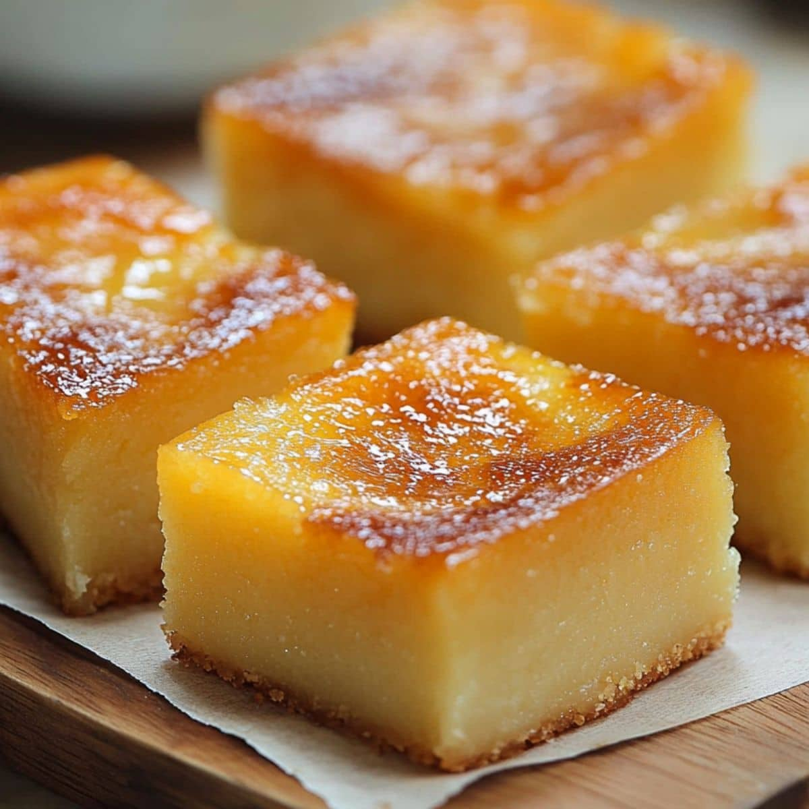

# Cassava Cake

*Grated fresh cassava bound with thick coconut milk and a little sugar, baked in a shallow tin until the top is dark golden and the inside has set to a dense, chewy, faintly sweet square. The Fijian afternoon snack.*

**Serves:** 12 small squares

**Prep Time:** 20 minutes

**Cook Time:** 50 minutes

## Overview
Cassava cake is the Fijian household snack of choice with afternoon tea: grated fresh cassava (manioc), thick coconut milk, a measured amount of sugar, sometimes a stick of vanilla or a pinch of cardamom, baked in a shallow tin until the surface caramelises into a dark golden crust and the inside has set to a dense, almost gummy, satisfying square. It is not a sponge cake; the texture is closer to a tropical fudge or a Caribbean cassava pone, with a chew that comes from the cassava starch itself. Cut into squares and eaten warm with a cup of sweet milky tea or a glass of cold coconut water. Every Fijian aunty has her own ratio and her own slight twist; the version below is the everyday baseline.

## Ingredients

- 700 g fresh cassava (manioc), peeled and finely grated (about 1 kg unpeeled)
- 400 ml thick coconut milk
- 200 g caster sugar
- 2 large eggs, lightly beaten
- 50 g butter, melted
- 1 tsp vanilla extract
- 1/2 tsp ground cardamom (optional)
- A pinch of salt
- 2 tbsp grated fresh coconut (optional, for the top)

## Method

### Stage 1 - Grate the cassava
1. Peel the cassava with a sharp knife; the brown bark and the pink layer beneath both come off.
2. Cut into chunks; remove the woody central fibre if there is one.
3. Grate on the fine side of a box grater, or pulse in a food processor to a coarse fluff.
4. Squeeze out about half the liquid in a clean cloth; keep the squeezed cassava in a bowl.

### Stage 2 - Mix the batter
1. In a large bowl, combine the squeezed grated cassava, coconut milk, sugar, eggs, melted butter, vanilla, cardamom and salt.
2. Stir well until the mixture is uniform; the consistency is a thick wet batter.

### Stage 3 - Bake
1. Heat the oven to 180 C.
2. Line a 20 by 25 cm shallow tin with baking paper.
3. Pour in the batter and level the surface.
4. Scatter the grated coconut over the top if using.
5. Bake 50 minutes, until the top is dark golden, the edges have pulled away slightly, and a skewer comes out only just clean.

### Stage 4 - Cool and cut
1. Cool in the tin 30 minutes; the cake firms as it cools.
2. Lift out using the paper.
3. Cut into 12 squares with a sharp knife wiped between cuts.

## Notes
- **Squeeze the grated cassava:** fresh cassava holds a lot of water; squeezing out half is what gives the finished cake its dense chewy texture rather than a wet pudding.
- **The colour clue:** a properly baked cassava cake is dark golden on top, not pale. If the surface is pale at 50 minutes, give it another 5-10 minutes.
- **Use fresh cassava:** frozen grated cassava (available in some Pacific shops) works but yields a softer texture; the fresh root is the standard.

## Variations
- **Pandan version:** stir 1 teaspoon of pandan extract into the batter for a green-tinted aromatic cake.
- **Pineapple top:** lay thin pineapple rings on the surface before baking; the fruit caramelises into the crust.
- **Banana folded in:** mash a ripe banana into the batter for a softer sweeter result.
- **Coconut cream finish:** brush a tablespoon of coconut cream over the hot cake as it comes out of the oven.
- **Sweetened-condensed-milk version:** replace the sugar and 100 ml of the coconut milk with 200 ml of sweetened condensed milk for a Filipino-style richness.

## Serving
- Serve warm or at room temperature, cut into small squares · with a cup of sweet milky tea · with strong filter coffee · with a glass of cold coconut water · alongside fresh pineapple · at a Fijian afternoon tea · as a packed-lunch sweet.

## Storage
- Keeps 3 days in an airtight container at room temperature; the texture firms.
- Refrigerate up to 5 days; warm gently before eating to bring back the chew.
- Freezes 2 months; thaw at room temperature and warm in a low oven.

