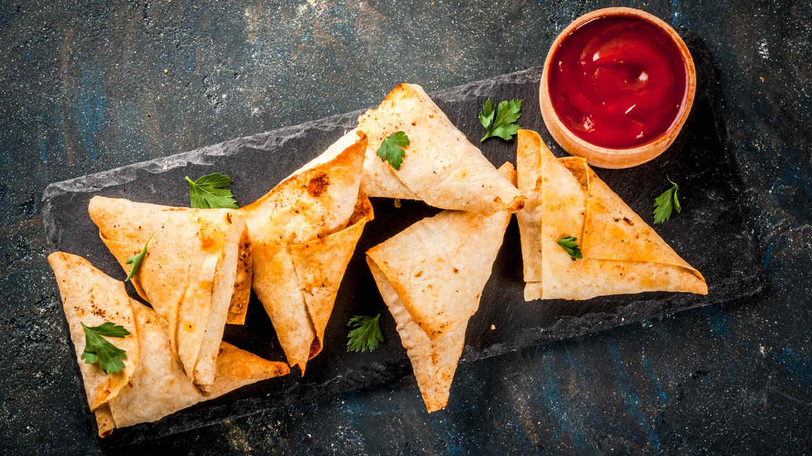

# Fijian Samosa

*The Indo-Fijian street and roadside snack: a triangular pastry parcel filled with curried potato and peas, deep-fried until the shell shatters at the first bite, sold from glass cabinets at every Fijian petrol station and bus stand.*

**Serves:** 12 samosa

**Prep Time:** 40 minutes

**Cook Time:** 25 minutes

## Overview
The samosa came to Fiji with the indentured labourers brought from India in the late nineteenth century; over five generations the recipe has settled into its own Indo-Fijian shape. The pastry is slightly thicker than its North Indian cousin so it stays crisp longer in the warm humid air; the filling leans on potato and peas with a measured hand on the chilli; the spice mix is the Fijian curry powder rather than a custom garam masala. Sold from glass display cabinets at petrol stations, bus stands and roadside stalls all across Viti Levu, eaten as a mid-morning snack with sweet milky tea or a cold can of soft drink. The dipping companion is a sharp green coriander-chilli chutney or a sweet tamarind sauce.

## Ingredients

### For the pastry
- 300 g plain flour
- 1 tsp salt
- 1 tsp ajwain (carom) seeds
- 4 tbsp vegetable oil or ghee
- 130 ml warm water

### For the filling
- 500 g potatoes, peeled and cut into 1 cm dice
- 100 g frozen peas
- 2 tbsp vegetable oil
- 1 tsp cumin seeds
- 1 small onion, finely chopped
- 1 thumb of ginger, finely grated
- 2 green chillies, finely chopped
- 1 tbsp Fijian or Madras curry powder
- 1 tsp ground coriander
- 1/2 tsp turmeric
- 1/2 tsp garam masala
- 1 tsp salt
- Juice of half a lemon
- A handful of fresh coriander, chopped

### For frying
- 1 litre vegetable oil

## Method

### Stage 1 - Make the pastry
1. Combine flour, salt and ajwain in a bowl.
2. Rub in the oil with your fingertips until the mixture resembles coarse breadcrumbs.
3. Add the warm water gradually; knead 5 minutes to a firm smooth dough.
4. Cover; rest 30 minutes.

### Stage 2 - Cook the filling
1. Boil the diced potatoes 8 minutes until tender; drain.
2. Heat the oil in a wide pan over medium heat; add the cumin seeds; sizzle 20 seconds.
3. Add onion; cook 5 minutes until soft.
4. Add ginger and green chillies; cook 1 minute.
5. Stir in the curry powder, ground coriander, turmeric and garam masala; 30 seconds.
6. Add the potatoes and peas; mash lightly with the back of a spoon, leaving plenty of texture.
7. Season with salt and lemon juice; stir through the fresh coriander.
8. Cool the filling completely before using.

### Stage 3 - Shape the samosa
1. Divide the rested dough into 6 balls.
2. Roll each into a thin oval about 18 cm long.
3. Cut each oval in half across the middle; you have 12 semicircles.
4. Take a semicircle; brush the straight edge with water; fold into a cone with a 1 cm overlap; press to seal.
5. Hold the cone open; spoon in 1 generous tablespoon of filling.
6. Brush the open top edge with water; press to seal into a flat triangle.
7. Repeat with the rest.

### Stage 4 - Fry
1. Heat the oil in a deep pan to 160 C (a piece of dough should bubble gently when dropped in, not fizz).
2. Fry the samosa in batches of 4, turning, for 6-7 minutes until deep golden and the pastry is set right through.
3. The lower temperature is intentional; a hotter oil browns the outside before the pastry cooks through and leaves a doughy core.
4. Drain on kitchen paper.

## Notes
- **Cool the filling fully before shaping:** warm filling steams the pastry and gives a doughy result.
- **Low-and-slow fry:** 160 C for the full 6-7 minutes is the Indo-Fijian standard; high-heat short-time frying gives a pale doughy interior.
- **Seal the edges well:** any gap and the filling spills into the oil. A pastry brush of water before pressing is the fix.

## Variations
- **Meat samosa:** replace the potato with finely minced mutton or chicken cooked with the same spices.
- **Coconut samosa:** stir 3 tablespoons of grated fresh coconut through the filling for the Pacific touch.
- **Cumin-heavy:** double the cumin seeds in the pastry for a more aromatic shell.
- **Baked samosa:** brush with oil and bake at 200 C for 25 minutes; the shell is less shatter-crisp but the kitchen stays cooler.
- **Mini samosa:** halve the pastry rounds again for a one-bite party version.

## Serving
Serve hot from the fryer · with green coriander-chilli chutney · with sweet tamarind sauce · with a glass of sweet milky tea · at a Fijian bus stand · at a Diwali table · alongside a plate of curry as the starter.

## Storage
- Eat the same day; the pastry softens overnight.
- Reheat in a hot oven 5 minutes to crisp the shell; do not microwave (the pastry goes leathery).
- The uncooked filled samosa freeze 2 months; fry from frozen, adding 2 minutes to the cook.
