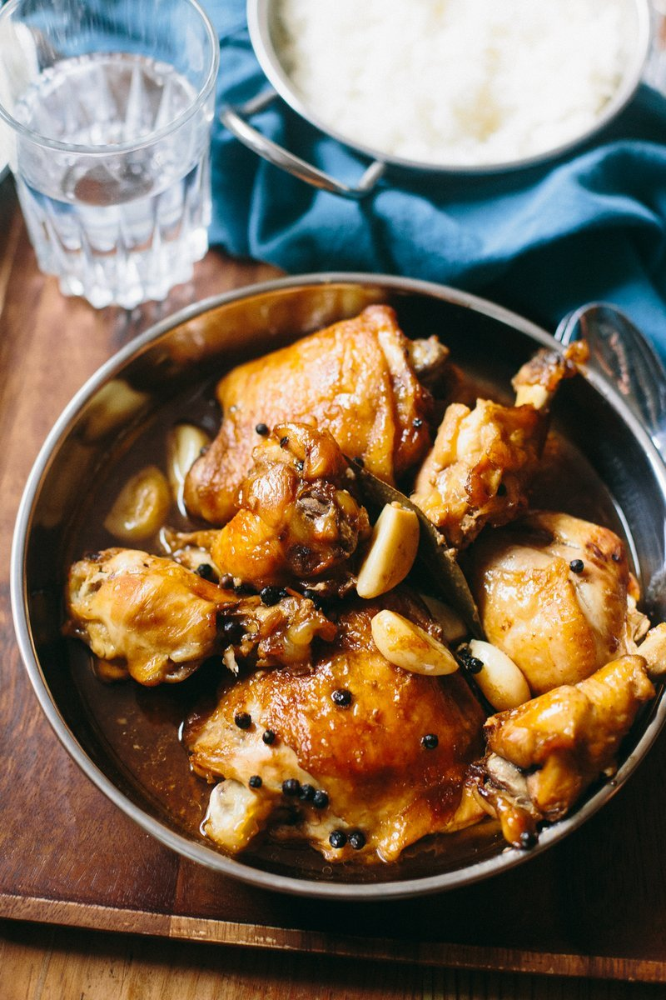

# Chicken Adobo

*The Filipino national dish: chicken simmered in soy sauce, vinegar, garlic and bay until the sauce reduces to a glossy, salty-sour glaze. The simplest serious dish you'll cook. Adobo means "marinade" in Spanish; here it's the cooking method, not the marinade.*

**Serves:** 4

**Prep Time:** 10 minutes

**Cook Time:** 45 minutes

## Overview
Chicken adobo is the unofficial national dish of the Philippines, the recipe every Filipino household keeps a version of, and the entire dish is in five ingredients: soy sauce, vinegar, garlic, bay leaves and black peppercorns. You simmer chicken thighs and drumsticks in a 1:1:1 mix of soy, vinegar and water with the garlic, peppercorns and bay until the chicken cooks through and the sauce has reduced into something glossy and dark. The meat picks up colour at the edges as the liquid thickens. That's the entire dish, no other technique, no other seasoning required. Serve over plain rice with a few extra spoonfuls of sauce ladled over the top.

## Ingredients

- 1 kg chicken thighs and drumsticks (bone-in, skin on)
- 100 ml soy sauce
- 100 ml white wine vinegar (or cane vinegar)
- 100 ml water
- 6 garlic cloves (crushed)
- 1 teaspoon black peppercorns
- 3 bay leaves
- 1 tablespoon brown sugar (optional)
- 1 tablespoon vegetable oil (for browning)
- Cooked white rice, to serve
- 2 spring onions (sliced, to finish)

## Method

### Stage 1 - Marinate (optional)
1. Combine the soy, vinegar, garlic, peppercorns and bay in a large bowl with the chicken.
1. Marinate at room temperature for 30 minutes (or skip this and cook straight away, adobo works either way).

### Stage 2 - Simmer
1. Tip everything into a heavy pan; add the water and brown sugar.
1. Bring to a simmer; cover and cook 25 minutes, turning the chicken halfway, until cooked through and tender.

### Stage 3 - Reduce
1. Lift the chicken out; uncover the pan.
1. Reduce the cooking liquid over high heat for 5-8 minutes until glossy and slightly thickened.

### Stage 4 - Brown
1. While the sauce reduces, heat the oil in a separate frying pan.
1. Fry the chicken pieces skin-side down for 3-4 minutes until the skin is crisp and deep brown.

### Stage 5 - Serve
1. Return the chicken to the reduced sauce; turn to coat.
1. Serve over rice; spoon extra sauce over.
1. Scatter spring onions on top.

## Notes
- **Don't stir during the simmer:** The vinegar needs to cook slowly without agitation; stirring keeps it sharp. Leave it alone.
- **Cane vinegar is traditional:** Available at Filipino or Asian grocers; gives a slightly sweeter, more aromatic sour note. White wine vinegar is fine.
- **Brown the chicken at the end, not start:** Adobo's chicken poaches first, browns last; the order is opposite to most stews and gives the characteristic glossy meat.

## Storage
- Improves overnight. Keeps 4 days refrigerated; the flavour deepens.
- Freezes 3 months.
