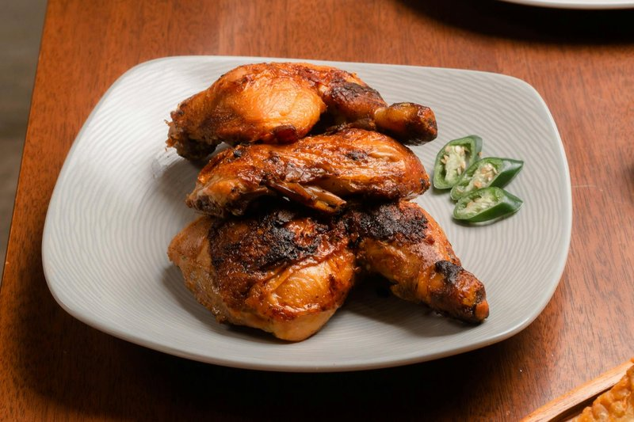

# Chicken Inasal

*Bacolod's grilled chicken: butterflied bird marinated in calamansi, vinegar and lemongrass, basted with bright orange annatto oil while it chars.*

**Serves:** 4

**Prep Time:** 25 minutes (plus 4 hours marinating)

**Cook Time:** 25 minutes

## Overview
Chicken inasal is the pride of Bacolod City on Negros Occidental, where streetside grill houses serve nothing else: trays of chicken parts skewered on bamboo, smoking over long coal pits, with the cook brushing on bright orange annatto oil every few turns. The marinade is what marks it as Filipino: calamansi (a small, sour citrus halfway between lime and tangerine), cane vinegar, ginger, lemongrass, garlic and a generous slug of black pepper. The annatto oil (atsuete) is just neutral oil warmed gently with annatto seeds until it stains a vivid orange-red; this is the dish's signature look and a mild peppery flavour. Basting starts halfway through cooking so the colour goes onto skin that's already partly cooked, and continues right up to the moment the chicken leaves the grill. Difficulty for a home cook is low; the only special ingredients are calamansi (lime juice plus a touch of orange juice substitutes well) and annatto seeds (sometimes sold as achiote, found in any Filipino or Latin American shop). The flavour profile is sharp, herbal, slightly smoky, with a peppery edge from black pepper rather than chilli, and ribbon-thin lemongrass perfume running through everything. Service is non-negotiable: a heap of garlic rice (sinangag), a saucer of toyomansi (soy-calamansi-vinegar dipping sauce with sliced chillies), and the cook's pot of warm annatto oil for the table.

## Ingredients

### Chicken
- 1 ½ kg chicken pieces (thighs and drumsticks, bone-in skin-on, or butterflied chicken halves)

### Marinade
- 80 ml calamansi juice (or 60 ml lime juice plus 20 ml orange juice)
- 60 ml cane vinegar (or rice vinegar)
- 30 ml soy sauce
- 30 ml lemon-lime soda (Sprite or 7-Up)
- 6 garlic cloves (crushed)
- 30 g ginger (grated)
- 2 stalks lemongrass (bashed, white parts roughly chopped)
- 2 bay leaves
- 10 g salt
- 5 g ground black pepper
- 30 g brown sugar

### Annatto basting oil
- 80 ml neutral oil
- 30 g butter
- 15 g annatto (atsuete) seeds
- 2 garlic cloves (smashed)
- 1 stalk lemongrass (bashed)
- 3 g salt

### Dipping sauce (toyomansi)
- 45 ml soy sauce
- 30 ml calamansi (or lime juice)
- 15 ml cane vinegar
- 1 bird's eye chilli (sliced)
- 1 shallot (small, finely chopped)

## Method

### Stage 1 - Marinade
1. Combine calamansi juice, vinegar, soy, soda, garlic, ginger, lemongrass, bay, salt, pepper and brown sugar in a bowl.
1. Stir well to dissolve the sugar and salt.
1. Add the chicken; turn to coat thoroughly.
1. Cover and refrigerate 4-12 hours.

### Stage 2 - Annatto oil
1. Warm the oil and butter in a small pan over low heat until the butter melts.
1. Add the annatto seeds, smashed garlic, lemongrass and salt.
1. Heat gently 5-7 minutes, swirling occasionally, until the oil turns bright orange-red. Do not let it boil or smoke.
1. Strain into a small jug; discard the seeds and aromatics. Keep warm.

### Stage 3 - Grill
1. Build a medium-hot charcoal fire, or set a gas grill to medium. Oil the grates well.
1. Lift the chicken from the marinade; let excess drip off.
1. Grill the chicken 5-6 minutes per side over direct heat to mark and start the colour.
1. Move to the cooler edge or reduce heat; baste generously with the annatto oil.
1. Continue cooking, turning and basting every 3-4 minutes, until thighs reach 75°C and breasts 72°C, about 15-20 minutes total.
1. Give a final baste off the heat so the skin is glossy and orange.

### Stage 4 - Sauce and serve
1. Whisk all toyomansi ingredients together in a small bowl.
1. Plate the chicken with garlic rice; drizzle a little extra annatto oil over the rice.
1. Serve the toyomansi at the table for dipping.

## Notes
- **Annatto oil keeps:** make double; the leftover oil is the secret to a lot of Filipino home cooking and stains rice or noodles a great colour.
- **Don't burn the seeds:** annatto turns bitter if oil gets too hot. Low and slow; pull the pan off if you see any smoke.
- **Lemongrass on the grill:** save a lemongrass stalk to use as a basting brush; tear the top into ribbons and dip into the annatto oil.
- **Calamansi substitute:** equal parts lime juice with a small splash of mandarin or orange juice is the closest mimic.

## Storage
- Refrigerate up to 3 days in a sealed container.
- Annatto oil keeps 2 weeks refrigerated; warm gently before reusing.
- Reheat chicken in a covered pan with a tablespoon of water to steam-warm without drying.
