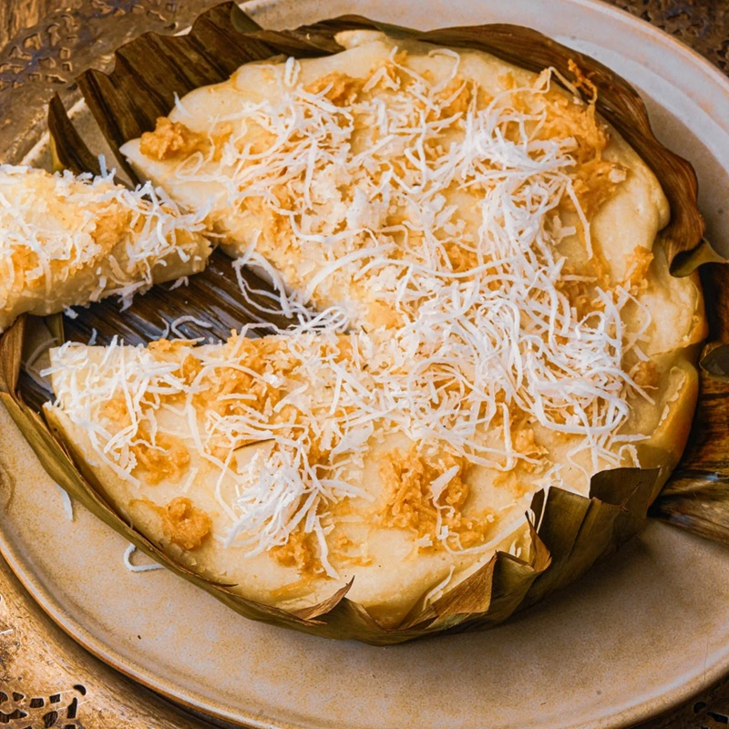

# Bibingka

*The Philippines' Christmas cake: a springy rice-flour cake baked in banana leaf, topped with salted egg, cheese and grated coconut.*

**Serves:** Makes 1 large bibingka (serves 6) or 6 individual portions

**Prep Time:** 20 minutes

**Cook Time:** 25 minutes

## Overview
Rice flour, glutinous rice flour, sugar, baking powder and salt are sifted together. Coconut milk, melted butter and beaten eggs are whisked in until smooth. A banana leaf lines a cake tin (or individual ramekins), brushed with butter. The batter is poured in to 2 cm depth. Baked at 200°C 15 minutes; salted egg slices and grated cheese are pressed on top; baked another 10 minutes. Finished with butter, sugar and a thick layer of fresh grated coconut.

## Ingredients

### Batter
- 200 g rice flour
- 50 g glutinous rice flour
- 200 g caster sugar
- 2 teaspoons baking powder
- ½ teaspoon salt
- 3 eggs (large)
- 400 ml coconut milk
- 60 g unsalted butter (melted)
- 1 teaspoon vanilla extract

### Topping (per bibingka)
- 1 salted duck egg (sliced 5 mm thick, or substitute 1 salted hen egg)
- 50 g kesong puti (or salty white cheese, or substitute mild feta or queso fresco)
- 30 g unsalted butter (extra, for brushing)
- 2 tablespoons caster sugar (for sprinkling)
- 80 g fresh grated coconut (or rehydrated desiccated)

### Lining
- Banana leaf (cut to fit the tin or ramekins, pass over a gas flame briefly to soften)
- Butter (for brushing the leaf)

## Method

### Stage 1 - Prepare the tin
1. Heat the oven to 200°C (180°C fan).
1. Pass the banana leaf over a low gas flame for a few seconds on each side - it changes colour from matte to shiny and becomes pliable.
1. Line a 22 cm round cake tin or 6 ramekins with the banana leaf, brushing with melted butter to help it stick.
1. The leaf should come up the sides.

### Stage 2 - Batter
1. In a wide bowl, whisk both rice flours, sugar, baking powder and salt.
1. In a jug, whisk the eggs, coconut milk, melted butter and vanilla.
1. Pour wet into dry; whisk until smooth and lump-free.
1. Pour the batter into the prepared tin(s) to a depth of 2 cm.

### Stage 3 - First bake
1. Bake 15 minutes - the batter should be set but pale.

### Stage 4 - Top
1. Slide the rack out (don't fully remove the bibingka from the oven).
1. Arrange salted egg slices over the top.
1. Crumble the kesong puti / cheese evenly.
1. Slide back in for another 10 minutes - the surface should be lightly golden.

### Stage 5 - Finish
1. Brush the top of the still-hot bibingka with melted butter.
1. Sprinkle with caster sugar.
1. Pile fresh grated coconut generously on top.
1. Serve warm in wedges or directly in the ramekin.

## Notes
- **Two rice flours, not one:** plain rice flour gives the structure; glutinous rice flour gives the springy chew. Ratio matters - too much glutinous turns sticky, too little gives a crumbly cake.
- **Banana leaf isn't optional for authenticity:** it imparts a subtle grassy aroma that defines bibingka. Buy frozen banana leaves at any Asian grocery; pass over a flame briefly to release the fragrance and make them flexible. Skip if truly unobtainable; line the tin with parchment.
- **Salted egg:** small, perfect bricks of savoury. Look for them at Filipino or Chinese groceries; if unavailable, brine a regular hard-boiled egg in heavy salt water overnight.
- **Coconut milk, not coconut cream:** the cream is too rich and the bibingka turns dense.

## Storage
- Best eaten warm the day it's made.
- Keeps 1 day at room temperature in the banana leaf.
- Reheats poorly in a microwave; better to wrap in foil and warm in a 150°C oven 10 minutes.
- The grated coconut topping should be re-applied fresh if reheated.
