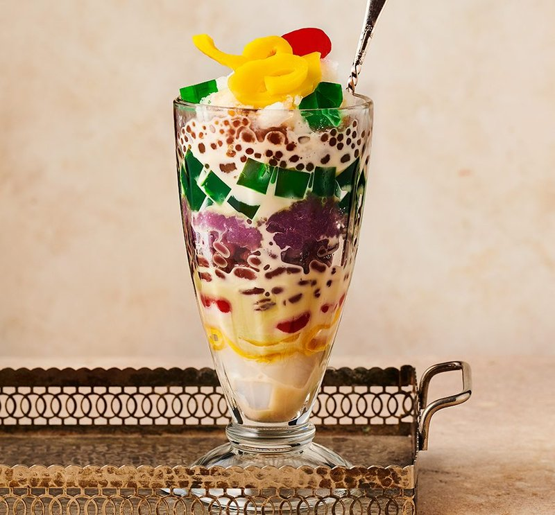

# Halo-Halo

*The Philippines' hot-afternoon dessert: a tall glass of sweetened beans, jellies and fruit topped with shaved ice and ube ice cream.*

**Serves:** 4

**Prep Time:** 30 minutes (components made ahead)

**Cook Time:** 0 minutes (assembly only; components have their own prep)

## Overview
Halo-halo is an assembly, not a cooking project. Each tall glass gets a spoonful of 6-8 different sweetened components: red mung beans, white beans, kaong (sugar palm), nata de coco, sweet jackfruit, sweetened bananas, sago pearls, leche flan. Shaved ice piles on top of the layered components. Evaporated milk pours over. Topped with a scoop of ube ice cream and a small piece of leche flan. Sprinkled with toasted pinipig (pounded young rice) or crushed cornflakes.

## Ingredients (per serving)

### Bottom layers (any 6-8 of these)
- 2 tablespoons red sweet azuki beans (canned, drained)
- 2 tablespoons white kidney beans (canned in syrup, drained)
- 2 tablespoons kaong (sugar palm fruit in syrup)
- 2 tablespoons nata de coco (jellied coconut, drained)
- 2 tablespoons sweet jackfruit (langka), sliced thin
- 2 tablespoons sweetened saba banana slices
- 2 tablespoons sago pearls (cooked from dry; see below)
- 2 tablespoons macapuno (sweetened young coconut strings)
- A small piece of leche flan (about 50 g)

### Top
- 2 cups shaved ice (very finely shaved - a snow texture)
- 80 ml evaporated milk (or 50/50 evaporated + sweetened condensed)
- 1 scoop ube (purple yam) ice cream
- 1 tablespoon toasted pinipig (pounded young rice; sub: crushed cornflakes)
- A drizzle of leche-flan caramel (optional)

### Sago pearls (cooked from dry)
- 100 g dry small sago (or tapioca pearls)
- 1 litre water
- 80 g caster sugar (added at the end)

## Method

### Stage 1 - Cook the sago (if needed)
1. Bring 1 litre water to a rolling boil.
1. Sprinkle in the dry sago pearls slowly; stir.
1. Boil 15-18 minutes, stirring often, until the pearls turn translucent with a tiny white dot in the centre.
1. Drain; rinse cold; transfer to a small bowl.
1. Stir in 80 g caster sugar plus 2 tablespoons of warm water; let cool to room temperature (the pearls absorb the syrup).

### Stage 2 - Shave ice
1. The ice must be finely shaved or crushed to a snow texture. Use a snow-cone machine, ice shaver, or pulse ice cubes in a powerful blender briefly.
1. Texture target: light, fluffy, like packed snow.

### Stage 3 - Layer the glass
1. Use a tall sundae glass or a parfait glass (300-400 ml).
1. Spoon each component in turn into the bottom of the glass: about 2 tablespoons each, layered.
1. Aim for 6-8 different components, filling the glass to about a third.
1. Add a small wedge of leche flan.

### Stage 4 - Top with ice and milk
1. Pile the shaved ice on top, mounding generously above the rim.
1. Pour the evaporated milk evenly over the ice.

### Stage 5 - Crown
1. Place a scoop of ube ice cream on the top.
1. Sprinkle the pinipig (or crushed cornflakes) over.
1. Drizzle a teaspoon of leche-flan caramel if desired.

### Stage 6 - Serve
1. Provide a long spoon.
1. Instruct each diner to "halo-halo" (mix-mix) thoroughly before eating.
1. Serve immediately - once the ice melts, the texture is lost.

## Notes
- **No fixed recipe:** halo-halo varies by region, family, and season. 6-8 components is plenty; 12+ becomes a mess.
- **Sweet components, drained well:** wet components dilute the ice and the result swims. Drain each from its syrup before layering.
- **Fine-shaved ice, not cubes:** the dessert depends on the snow-soft top layer. Cubes give a slushy not a snowy halo-halo.
- **Ube ice cream is iconic:** the purple colour is the visual signature. Filipino groceries sell it; failing that, vanilla or coconut works.

## Storage
- Assemble immediately before eating.
- The components (cooked beans, jellies, sago, fruit) keep separately for 5 days refrigerated.
- The ice and milk obviously don't keep - assemble at the table.
