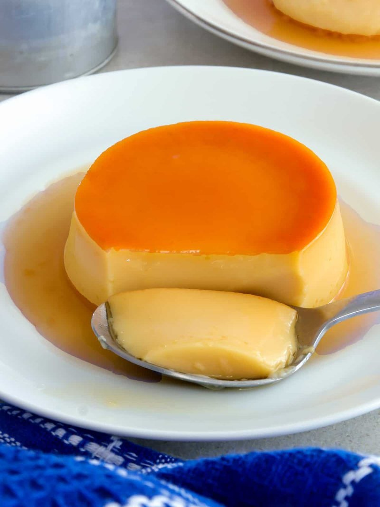

# Leche Flan

*The Filipino caramel custard: dense egg-yolk-and-condensed-milk custard steamed in moulds, inverted so the dark caramel pours over.*

**Serves:** 8

**Prep Time:** 20 minutes

**Cook Time:** 45 minutes (plus 4 hours chilling)

## Overview
Sugar caramelises in each llanera tin until amber and runny; tins set aside to cool. Yolks whisk gently (don't aerate, that creates bubbles in the set flan) with condensed milk, evaporated milk and a splash of vanilla. Custard strains through a fine sieve into the caramel-lined tins. Steams in a bain-marie 40-45 minutes (or oven-bakes covered in a water bath at 160°C). Cools completely; chills for 4 hours. Inverted onto plates at service, the caramel becomes the sauce.

## Ingredients

### Caramel
- 200 g caster sugar
- 2 tablespoons water

### Custard
- 10 egg yolks (large)
- 400 g sweetened condensed milk (1 standard tin)
- 350 ml evaporated milk
- 1 tablespoon vanilla extract
- 1 strip of lemon peel (optional, just the yellow zest)

## Method

### Stage 1 - Caramel
1. Combine the sugar and water in a small heavy-based pan over medium heat.
1. Don't stir - swirl the pan occasionally as the sugar dissolves.
1. Cook 6-8 minutes until the syrup turns deep amber (the colour of strong tea).
1. Working quickly: pour into 8 small individual moulds or 2 oval llanera tins, tilting to coat the bottom evenly.
1. Cool to set the caramel hard.

### Stage 2 - Custard
1. In a wide bowl, gently whisk the egg yolks with a fork (don't use an electric whisk - air bubbles ruin the texture).
1. Whisk in the condensed milk slowly until smooth.
1. Whisk in the evaporated milk and vanilla.
1. Add the lemon peel if using; let infuse 5 minutes; remove.

### Stage 3 - Strain
1. Pour the custard through a fine sieve into a jug.
1. This removes any chalazae (the white strings in egg yolks) and gives a silky-smooth flan.

### Stage 4 - Fill the moulds
1. Pour the strained custard over the set caramel in each mould, filling to 1 cm below the rim.
1. Cover each mould with foil (to keep steam off the surface).

### Stage 5 - Cook (steam method)
1. Place the moulds in a deep tray; pour boiling water around them until it reaches halfway up the sides.
1. Cover the whole tray with foil; transfer to a 160°C oven.
1. Bake 40-45 minutes - the custards should be just-set with a slight wobble in the centre.
1. Test by inserting a knife at the edge; it should come out clean.

### Stage 5b - Cook (stovetop steam alternative)
1. Place the moulds in a wide deep pot.
1. Pour boiling water around them to halfway up the sides.
1. Cover; steam over low heat 35-40 minutes till just-set.

### Stage 6 - Cool and chill
1. Remove from the water bath; cool to room temperature.
1. Cover; chill at least 4 hours (overnight is better).

### Stage 7 - Serve
1. Run a thin knife around the edge of each mould.
1. Place a small plate over the top; invert quickly.
1. The flan should slide out, the caramel running down the sides as a sauce.
1. Serve cold.

## Notes
- **Egg yolks only:** whole-egg flan tastes more eggy and sets firmer than the classic Filipino texture. Save the whites for meringue, financiers or macarons.
- **Whisk gently, no bubbles:** the bubbles in egg foam survive cooking and pock the surface. Use a fork, not a whisk.
- **Strain twice if needed:** silky leche flan is the goal. Sieve out every speck of egg white.
- **Foil-covered steam:** uncovered, water vapour condenses on the surface of the custard and makes it pitted. Foil keeps the surface dry.

## Storage
- Keeps 4 days refrigerated, covered.
- Tastes better on day 2 (the caramel softens further into the custard).
- Doesn't freeze well - the texture goes grainy.
