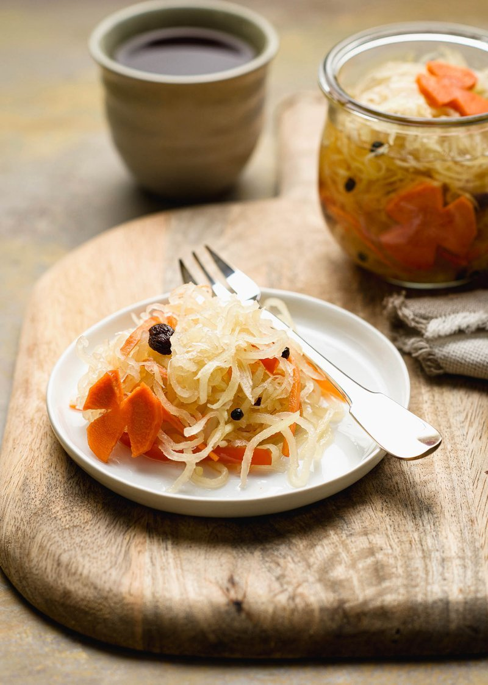

# Atchara

*The Philippines' sweet-sour pickle: shredded green papaya, carrot, ginger and pepper in a cane-vinegar syrup. Cuts through grilled meat.*

**Serves:** Makes a 1-litre jar (about 10 servings)

**Prep Time:** 30 minutes (plus 1 hour salting + overnight pickling)

**Cook Time:** 10 minutes

## Overview
Green papaya is peeled, seeded and shredded on a coarse grater. Carrot, ginger, garlic, red pepper, onion and raisins are all prepared in matching shreds. The vegetables are salted and rested for 1 hour to draw water; rinsed and squeezed dry. A syrup of cane vinegar, sugar and whole peppercorns simmers for 5 minutes. Hot syrup is poured over the vegetables in a sterilised jar. Sealed, cooled, refrigerated overnight before eating. Improves over the following week.

## Ingredients

### Vegetables
- 500 g green (unripe) papaya
- 1 medium carrot
- 1 red bell pepper
- 1 small red onion
- 4 garlic cloves
- 30 g fresh ginger (peeled)
- 30 g raisins (optional but traditional)

### Salting
- 2 tablespoons fine sea salt

### Pickling syrup
- 350 ml white cane vinegar (or distilled white vinegar)
- 200 g caster sugar (or muscovado for darker colour)
- 1 teaspoon whole black peppercorns
- 2 small dried red chillies (optional, for heat)
- 1 teaspoon salt

## Method

### Stage 1 - Prep the vegetables
1. Peel the green papaya; halve lengthways; scoop out the seeds.
1. Grate on the coarse side of a box grater (long shreds, not paste).
1. Peel and grate the carrot the same way.
1. Deseed the pepper; julienne 3 mm thick.
1. Slice the red onion thin.
1. Slice the garlic and ginger into matchsticks.

### Stage 2 - Salt to draw water
1. Combine all vegetables in a large bowl.
1. Sprinkle 2 tablespoons salt; toss thoroughly.
1. Rest 1 hour at room temperature.
1. After an hour, take handfuls of the vegetable mix and squeeze hard over the sink - you'll release a surprising amount of water.
1. Tip the squeezed vegetables back into a clean bowl.
1. Stir in the raisins.

### Stage 3 - Make the syrup
1. In a small saucepan, combine the vinegar, sugar, peppercorns, dried chillies (if using) and 1 teaspoon salt.
1. Bring to a gentle simmer, stirring until the sugar dissolves.
1. Simmer 5 minutes; remove from heat.

### Stage 4 - Pack and pickle
1. Pack the vegetables tightly into a sterilised 1-litre glass jar.
1. Pour the hot syrup over until the vegetables are submerged (push them down with a clean spoon if needed).
1. Cool to room temperature; seal the jar.
1. Refrigerate at least overnight (24 hours is better; one week is the sweet spot).

## Notes
- **Green papaya, not ripe:** ripe papaya turns to mush in the salt. The fruit should be firm and pale green when cut.
- **Squeeze hard:** undrained vegetables release water into the syrup over time and the atchara becomes weak and watery.
- **Sterilise the jar:** wash in hot soapy water, rinse, dry in a 130°C oven 15 minutes. Pickles in unsterilised jars grow fuzz.
- **Improves with time:** the first 24 hours give a sharp pickle; week 1 onwards the flavours meld and mellow.

## Storage
- Keeps 1 month refrigerated in a sealed jar.
- Once opened (decanted), the unopened jar continues; once the seal is broken, eat within 3 weeks.
- Doesn't need processing for shelf stability if always refrigerated.
