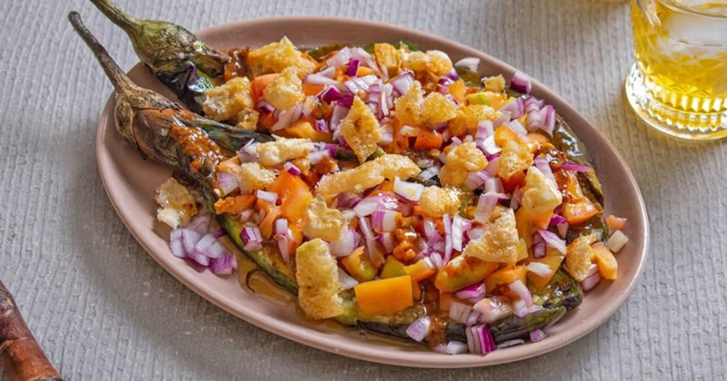

# Ensaladang Talong (Grilled Eggplant Salad)

*The Filipino smoky aubergine salad: long aubergines char-grilled till silky, then dressed with tomato, onion, fish sauce and calamansi.*

**Serves:** 4

**Prep Time:** 15 minutes

**Cook Time:** 12 minutes

## Overview
Long Asian aubergines char directly over a gas flame or hot grill until blackened all over and totally soft inside (poke through to test, no resistance). Cool for 10 minutes; peel away the charred skin (it slips off if cooked enough). Tear the flesh into 5 cm strips. Dress with diced tomato, thin-sliced red onion, fish sauce, white-cane vinegar and calamansi juice. Rest for 5 minutes to let the eggplant absorb the dressing. Serve room temperature.

## Ingredients

### Eggplant
- 4 long Asian aubergines (about 600 g; Japanese or Chinese variety, not globe)

### Dressing
- 2 ripe tomatoes (diced 5 mm)
- ½ small red onion (very thinly sliced)
- 3 tablespoons fish sauce (patis)
- 2 tablespoons white cane vinegar (or rice vinegar)
- 2 tablespoons calamansi juice (or substitute lime juice)
- 1 teaspoon caster sugar
- 1 small red chilli (deseeded, finely sliced, optional)
- 2 tablespoons fresh coriander (chopped)

## Method

### Stage 1 - Char the aubergines
1. **Gas flame method:** Place each aubergine directly on a gas burner ring over medium-high flame. Turn with tongs every 2-3 minutes. The skin should char black all over and the flesh inside collapse to softness. Total time 8-12 minutes per aubergine.
1. **Grill method:** Heat a grill to maximum. Lay the aubergines on the grate; cook 5-6 minutes per side, turning, until charred and soft throughout.
1. **Oven method (last resort):** Cook on a tray under a hot grill, turning every 4 minutes, 16-20 minutes total. The flavour is less smoky but acceptable.

### Stage 2 - Peel and tear
1. Transfer the charred aubergines to a plate; cool 10 minutes (they keep cooking through residual heat).
1. Peel away the blackened skin with your fingers (it should slip off in big pieces).
1. Remove the stem.
1. Tear the flesh lengthways into 5 cm strips and lay on a serving platter.

### Stage 3 - Dress
1. In a small bowl, whisk the fish sauce, vinegar, calamansi juice and sugar until the sugar dissolves.
1. Scatter the diced tomato and thin-sliced red onion over the eggplant strips.
1. Pour the dressing evenly across.
1. Scatter the optional chilli and coriander.

### Stage 4 - Rest and serve
1. Rest 5 minutes (the eggplant absorbs the dressing).
1. Serve at room temperature or just-warm.
1. Pairs especially well alongside grilled or fried fish.

## Notes
- **Long Asian aubergines, not globe:** the small Asian varieties have more flesh per skin and char more evenly. Globe aubergines turn watery and the skin doesn't blister cleanly.
- **Char fully or fail:** under-cooked eggplant is spongy and refuses to take the dressing. The skin should be completely blackened and the flesh feel completely yielding.
- **Don't pulp:** ensaladang talong keeps the eggplant in strips - tear it, don't mash.

## Storage
- Best within 2 hours of dressing.
- Undressed grilled-and-peeled eggplant keeps 24 hours refrigerated; dress at the last minute.
- The dressing alone keeps 1 week refrigerated.
