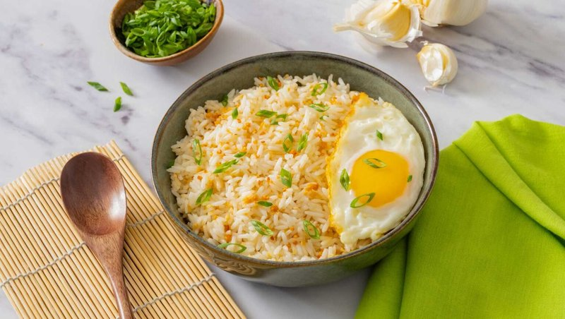

# Sinangag (Garlic Fried Rice)

*The Filipino breakfast cornerstone: day-old rice stir-fried hard in oil with a punishing amount of crisped garlic, salt and pepper.*

**Serves:** 4

**Prep Time:** 5 minutes

**Cook Time:** 10 minutes

## Overview
Sinangag is the Filipino garlic fried rice that anchors every Filipino breakfast, the foundational rice dish that turns yesterday's plain steamed rice into something with a deep toasted flavour and a generous crunch from crisped garlic chips. Day-old jasmine rice goes into the fridge overnight to dry out the grains so they fry separate instead of clumping. Garlic slices fine and fries slowly in oil until it goes crisp gold (the trick: low heat, plenty of time, and you lift the garlic out before it burns). Cold rice goes into the same garlic-flavoured oil and stir-fries for four minutes, breaking up the clumps with a spatula. Garlic returns at the end; salt and pepper season to taste. Top each plate with a second handful of crispy garlic for textural punch. Serve with a fried egg and a piece of cured longganisa or tocino on the side.

## Ingredients
- 600 g cooked jasmine rice (day-old, refrigerated overnight, broken up with a fork)
- 12 garlic cloves (peeled, sliced 2 mm thick)
- 4 tablespoons neutral oil (sunflower, peanut, or rapeseed)
- 1 teaspoon salt (or to taste)
- ½ teaspoon ground white pepper
- 2 spring onions (green parts only, sliced thin)

## Method

### Stage 1 - Crisp the garlic
1. Heat the oil in a wide wok or heavy frying pan over medium-low heat.
1. Add the sliced garlic; cook 4-5 minutes, stirring almost continuously.
1. The garlic will go from translucent to pale gold to amber. STOP at amber-gold - burnt garlic is bitter and ruins the rice.
1. Lift the garlic out with a slotted spoon onto kitchen paper (it will crisp as it cools).
1. Reserve half for cooking, half for the topping.

### Stage 2 - Fry the rice
1. Turn the heat up to medium-high under the same pan (the garlic oil stays in).
1. Break the cold rice up with your fingers to separate any clumps.
1. Tip into the hot oil; spread out in a single layer.
1. Let it sit 1 minute without stirring - the bottom grains crisp slightly.
1. Toss with a wooden spoon or wok spatula; spread out again; rest 1 minute.
1. Repeat for 3-4 minutes total until every grain is hot, lightly toasted, and separate.

### Stage 3 - Season and finish
1. Sprinkle the salt and pepper over the rice.
1. Stir in half the crisped garlic.
1. Taste; adjust salt.
1. Tip onto a serving plate.

### Stage 4 - Top
1. Scatter the remaining crispy garlic generously over the top.
1. Sprinkle the spring onion greens.
1. Serve at once, with a fried egg on top and a piece of cured meat alongside.

## Notes
- **Day-old rice or fail:** fresh rice steams together into clumps and never separates. Refrigerated rice loses moisture, the grains harden, and they stir-fry beautifully.
- **Slow garlic, hot rice:** the garlic needs gentle heat to crisp without burning. The rice needs high heat to toast. Two different temperatures, same pan.
- **Don't add soy sauce:** sinangag is not nasi goreng. The flavour is garlic, salt, oil - nothing else.

## Storage
- Best straight from the pan.
- Keeps 2 days refrigerated; reheat in a hot dry pan with a teaspoon of oil to revive the crisp grains.
- The garlic crisps soften within hours; cook fresh garlic chips for any reheated portion.
