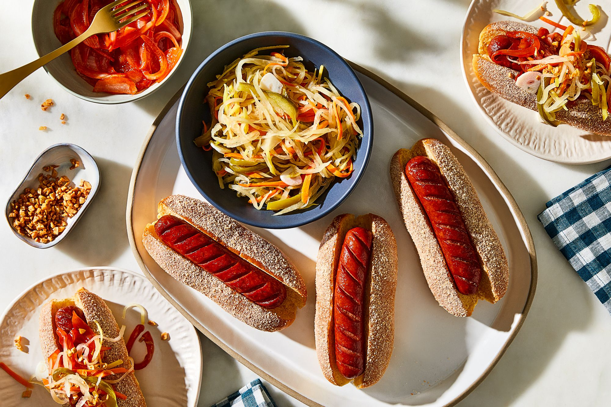

# Filipino Hot Dog

*The Philippines' breakfast-plate hot dog: a bright-red Filipino hot dog (the iconic crimson-coloured sweet pork-and-beef sausage) notched and pan-fried till the notches curl outward, served with garlic rice (sinangag), a sunny-side-up fried egg, and a side dish of banana ketchup. The Filipino silog breakfast version of the hot dog, no bun.*

**Serves:** 4

**Prep Time:** 15 minutes

**Cook Time:** 20 minutes

## Overview
The Filipino hot dog (called "hotsilog" or "hotdogsilog" when served as the breakfast plate; just "hotdog" when sold from street stands) is one of the Philippines' most iconic everyday breakfasts and a fixture of every silog menu (the Filipino breakfast-as-a-name-pattern: "X" + "si" for sinangag (garlic rice) + "log" for itlog (egg) = X-silog). The hot dog itself is distinctive: a bright-red sweet pork-and-beef sausage (Purefoods, CDO and Tender Juicy are the three major Filipino brands; the red colour comes from food colouring and is so traditional that locals reject paler hot dogs as wrong). The eating geometry is also distinctive: NO bun. Instead, the hot dog is notched (a series of shallow diagonal cuts on each side, which open up when cooked), pan-fried till the notches splay outward into little fins, then served with a mound of garlic rice, a fried egg with a runny yolk, and a small dish of banana ketchup (the Filipino sweet-spicy-savoury ketchup made from banana, sugar, vinegar and red food colouring; invented during WWII when tomatoes were scarce).

## Ingredients

### Hot dogs
- 4 Filipino red hot dogs (Purefoods, CDO, Tender Juicy, or substitute any sweet pork-and-beef hot dog and tint with a few drops of red food colouring if you want the traditional colour)
- 2 tablespoons vegetable oil

### Garlic rice (sinangag) - make this from day-old rice for best texture
- 800 g cooked rice (preferably day-old jasmine; freshly cooked rice goes mushy when fried)
- 12 garlic cloves (chopped finely)
- 4 tablespoons vegetable oil
- 1 ½ teaspoons fine sea salt
- ½ teaspoon ground black pepper
- 2 spring onions (sliced thin)

### Fried eggs
- 4 large eggs
- 1 tablespoon butter
- Salt and pepper

### Banana ketchup
- 200 ml tomato ketchup (as base) OR if you can find it: bottled Filipino banana ketchup (Jufran or UFC brand)
- 1 ripe banana (mashed)
- 2 tablespoons brown sugar
- 2 tablespoons white vinegar
- 1 teaspoon ground cumin
- 1 teaspoon paprika
- ½ teaspoon ground allspice
- 2 drops red food colouring (optional, for the traditional Filipino orange-red)

### To serve
- Lemon or calamansi wedge
- Cold Coke or San Miguel beer
- Sliced fresh tomato or sliced atchara (pickled green papaya)

## Method

### Stage 1 - Make (or warm) banana ketchup
1. If using bottled banana ketchup: warm 4 tablespoons in a small saucepan.
2. If making the substitute: in a saucepan, combine ketchup, mashed banana, brown sugar, vinegar, cumin, paprika, allspice, red food colouring.
3. Simmer 8 minutes till smooth and thickened.
4. Cool briefly.

### Stage 2 - Make garlic rice (sinangag)
1. Heat oil in a wide pan over medium-high heat.
2. Add chopped garlic; cook 1-2 minutes till deep golden (not burnt; remove some for garnish).
3. Add cold day-old rice; toss to coat with garlic-oil.
4. Stir-fry 5 minutes, breaking up any clumps.
5. Season with salt and pepper.
6. Keep warm.

### Stage 3 - Notch and cook hot dogs
1. Lay each hot dog on a board.
2. With a sharp knife, make 4-5 shallow diagonal cuts on one side (don't cut through; just score about a third deep).
3. Roll over; make matching cuts on the other side.
4. Heat oil in a wide pan over medium-high heat.
5. Place hot dogs in. As they heat, the notches will open up and the sausage will fan out.
6. Cook 3-4 minutes per side till browned and the notches are visibly splayed.

### Stage 4 - Fry the eggs
1. In a separate pan, melt butter; fry the eggs sunny-side up till the whites are set and yolks are runny.

### Stage 5 - Plate the silog
1. Mound garlic rice on one side of each plate (the centrepiece).
2. Place a hot dog alongside the rice.
3. A sunny-side-up egg on top of the rice (or perched between rice and dog).
4. A small dish of banana ketchup on the side for dipping the dog.
5. Sprinkle reserved crispy garlic and chopped spring onions over the rice.

### Stage 6 - Serve immediately
1. Sliced atchara or fresh tomato on the side.
2. A lemon or calamansi wedge.
3. Coffee, juice, or a cold Coke.

## Notes
- **Red hot dog:** the traditional Filipino sausage. If yours is pale, dye it.
- **No bun:** plated breakfast-style, not handheld.
- **Banana ketchup:** the Filipino signature; tomato ketchup tastes wrong here.
- **Notched and fanned:** the cooking transformation IS the dish's look.
- **Day-old rice for sinangag:** fresh rice goes gluey when fried.

## Variations
- **Hotsilog-tapsilog combo:** add cured beef (tapa) alongside the hot dog.
- **Spam-hotsilog:** add fried Spam slices on top of the rice (Filipino-style additions are stackable).
- **Spicier:** add chopped fresh siling labuyo (bird's eye chillies) to the rice or sauce.
- **With longganisa instead:** swap the hot dog for Filipino longganisa sweet sausages.
- **With pancit canton on the side:** the all-day-breakfast extended version.

## Serving
- At a Filipino jollibee or chowking; at home as a hearty breakfast or merienda (afternoon snack); at a tito's-house gathering.

## Storage
- Garlic rice refrigerates 2 days; reheat in a hot pan with a splash of oil.
- Hot dogs refrigerate 5 days.
- Banana ketchup refrigerates 1 month.
- Eggs: cook fresh each time.
