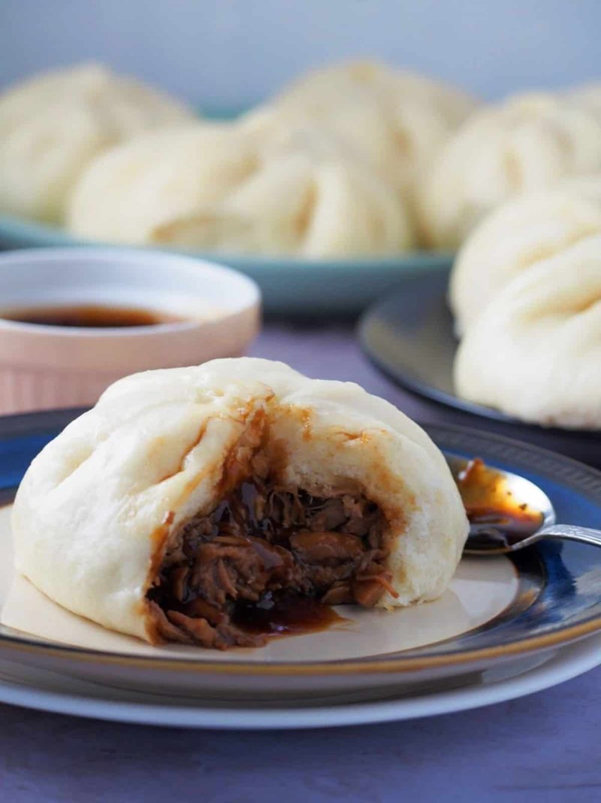

# Siopao

*The Philippines' street-stand bun: a pillowy steamed pocket of sweet pork and hoisin, sold from every cart from Manila to Cebu.*

**Serves:** Makes 12 buns

**Prep Time:** 1 hour (plus 1 hour rising)

**Cook Time:** 30 minutes (in batches)

## Overview
A yeasted dough enriched with milk, sugar and butter rises for 1 hour. Filling: pork mince browns with garlic, soy sauce, oyster sauce, brown sugar and Chinese five-spice, simmered for 10 minutes till thick. Eggs hard-boil, quarter. Dough divides into 12 portions, each rolls into a 12 cm disc thicker in the middle than the edges. Filling spoons in with a quarter of egg. Edges pleat up over the filling like a money purse, twisted closed. Buns rest for 20 minutes on parchment squares; steam for 15 minutes in batches.

## Ingredients

### Dough
- 500 g plain flour
- 7 g instant yeast
- 80 g caster sugar
- ½ teaspoon salt
- 240 ml warm milk
- 1 egg (large)
- 50 g unsalted butter (melted)

### Filling
- 500 g pork mince (20% fat)
- 2 tablespoons neutral oil
- 4 garlic cloves (minced)
- 1 onion (small, finely diced)
- 3 tablespoons soy sauce
- 2 tablespoons oyster sauce
- 2 tablespoons dark brown sugar
- 1 teaspoon Chinese five-spice
- 1 tablespoon cornflour (mixed with 2 tablespoons cold water)
- 4 hard-boiled eggs (each quartered)

### To serve
- Soy-vinegar dip (3 tablespoons soy + 2 tablespoons cane vinegar + 1 sliced garlic + 1 sliced chilli)

## Method

### Stage 1 - Dough
1. In a wide bowl, whisk flour, yeast, sugar and salt.
1. Combine warm milk, egg and melted butter in a jug.
1. Pour wet into dry; knead 10 minutes to a smooth elastic dough.
1. Rest in a covered bowl 1 hour until doubled.

### Stage 2 - Filling
1. Heat the oil in a wide pan over medium-high heat.
1. Add garlic and onion; cook 2 minutes till fragrant.
1. Add the pork mince; brown 5-6 minutes, breaking up with a spoon.
1. Stir in soy, oyster sauce, brown sugar and five-spice.
1. Cook 4 minutes till glossy.
1. Pour in the cornflour slurry; stir 1 minute as it thickens.
1. Tip onto a plate; cool to room temperature.

### Stage 3 - Shape
1. Knock back the risen dough; divide into 12 portions (~75 g each).
1. Cover with a damp cloth.
1. Take one ball; roll on a lightly floured surface to a 12 cm disc, thicker (5 mm) in the middle, thinner (2 mm) at the edges.
1. Place a heaped tablespoon of filling in the centre.
1. Add a quarter of hard-boiled egg on top of the filling.
1. Lift opposite sides of the dough up; pleat-and-pinch around the centre to gather all the dough at the top.
1. Twist the gathered top firmly; the seam should be at the very top.

### Stage 4 - Rest
1. Place each bun seam-up on a 8 cm square of parchment.
1. Arrange in the steamer baskets, leaving 4 cm between each (they expand).
1. Rest 20 minutes.

### Stage 5 - Steam
1. Bring a wide pot of water to a rolling boil.
1. Place a bamboo steamer (or any tier-steamer) over the pot; the water should not touch the bottom of the steamer.
1. Lower in a batch of buns (don't overcrowd); cover.
1. Steam 15 minutes.
1. Lift the lid carefully (steam burns); buns should be puffed, glossy white and pillowy.

### Stage 6 - Serve
1. Eat warm.
1. Mix the soy-vinegar dip; serve in small bowls alongside.

## Notes
- **Cool the filling fully:** warm filling melts the dough during shaping and the seam splits during steaming.
- **Thick middle, thin edge:** the centre supports the filling; the thin edge pleats neatly. Even-thickness dough makes a stodgy bun.
- **Don't skip the second rest:** 20 minutes after shaping gives the buns their final pillowy lift. Steaming cold-from-shaping gives dense, doughy results.
- **Seam up:** the pleat is the decoration; steam with the gathered seam facing you.

## Storage
- Cooked buns refrigerate 3 days; re-steam 5-7 minutes to revive the soft texture.
- Freeze cooked buns on a tray, then bag; re-steam 12-15 minutes from frozen.
- Don't microwave - the dough turns gummy.
