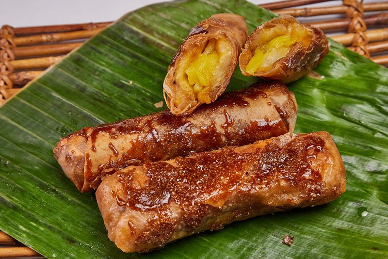

# Turon

*The Philippines' caramel banana roll: saba banana and jackfruit wrapped in a spring-roll skin, dusted in brown sugar, deep-fried till amber.*

**Serves:** Makes 12 turon (serves 4-6 as a snack)

**Prep Time:** 20 minutes

**Cook Time:** 20 minutes

## Overview
Saba (cooking) bananas halve lengthways; if using regular bananas, choose under-ripe ones. Jackfruit (ripe, fresh or canned) cuts into matchstick strips. A spring-roll wrapper lays flat; banana half plus 2-3 jackfruit strips go in the centre; dusts with brown sugar. Wrapper rolls up, edges sealed with water. The whole rolled turon dredges through more brown sugar. Fries in moderately hot oil 3-4 minutes till the sugar caramelises gold-amber on the surface. Eats hot.

## Ingredients
- 6 saba bananas (or 6 firm regular bananas, just-ripe)
- 200 g fresh jackfruit (or canned ripe jackfruit, drained and sliced into 5 mm strips)
- 12 spring roll wrappers (8 inch / 20 cm size; usually called "lumpia wrappers")
- 200 g light muscovado (or dark brown sugar)
- 600 ml neutral oil (for frying)

### To finish (optional)
- Vanilla ice cream
- A drizzle of palm-sugar caramel

## Method

### Stage 1 - Prep filling
1. Peel the bananas; halve lengthways down the long axis.
1. Cut each half in two crossways so you have 4 pieces per banana (24 pieces total - you'll use 2 per turon).
1. Drain the jackfruit if from a tin; pat dry; slice into thin strips.

### Stage 2 - Wrap
1. Place a wrapper on the work surface in a diamond orientation (one corner toward you).
1. Lay 2 pieces of banana end-to-end in the centre, parallel to the surface edge.
1. Add 2-3 jackfruit strips alongside.
1. Sprinkle 1 generous teaspoon of brown sugar over the filling.
1. Fold the bottom corner up over the filling.
1. Fold the left and right corners in over the bottom.
1. Roll up tightly toward the top corner.
1. Dip a finger in water; brush the top corner; press to seal.

### Stage 3 - Sugar coat
1. Spread the remaining brown sugar on a plate.
1. Roll each finished turon firmly in the sugar to coat the outside.
1. The sugar should stick in patches; gaps are fine - the wrapper itself will gold.

### Stage 4 - Fry
1. Heat the oil to 170°C (a piece of bread should brown in 40 seconds).
1. Lay 4 turon in the oil seam-down.
1. Fry 3-4 minutes, turning once, until the sugar coating has melted into a glossy amber shell and the wrapper is crackling gold.
1. Lift onto a wire rack with tongs; the residual heat keeps caramelising for 1-2 minutes.
1. Skim sugar bits from the oil between batches (otherwise they burn).

### Stage 5 - Serve
1. Eat hot from the rack.
1. For dessert presentation, serve with a scoop of vanilla ice cream and a drizzle of palm-sugar caramel.

## Notes
- **Saba over regular bananas:** saba (cooking banana) holds shape during frying; regular bananas turn to mush. If using regular, pick the firmest, just-ripe ones.
- **Spring roll, not rice-paper, wrappers:** the thin wheat-flour wrappers caramelise; rice paper goes soggy.
- **Hot oil, watch the colour:** sugar caramelises fast. Pull the turon out when the shell is amber, not when it's mahogany - it keeps darkening after.
- **Eat within minutes:** the sugar shell loses its crackle as the moisture from the banana migrates outward.

## Storage
- Best within 10 minutes of frying.
- Leftovers go soft; re-crisp briefly in a hot dry oven (200°C, 4 minutes) but the magic is the fresh sugar shell.
- Don't refrigerate cooked turon - the sugar absorbs fridge moisture and goes gummy.
