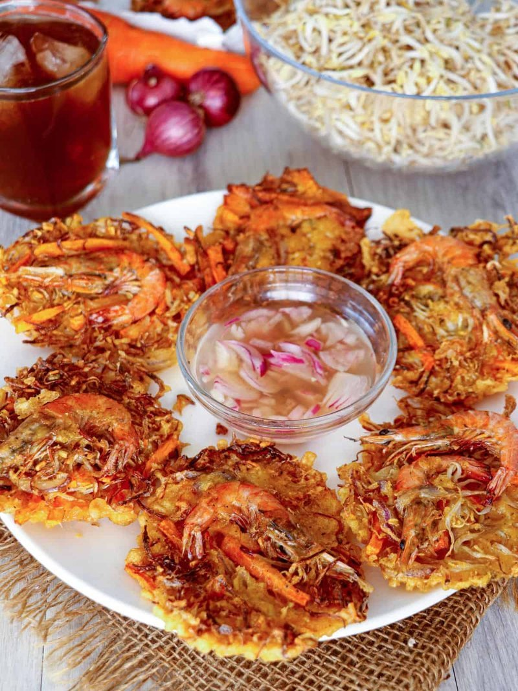

# Ukoy (Shrimp Fritters)

*The Philippines' merienda fritter: whole shell-on shrimp buried in a batter of grated squash, sprouts and spring onion, deep-fried crisp gold.*

**Serves:** Makes 12 fritters (serves 4 as a snack)

**Prep Time:** 20 minutes

**Cook Time:** 25 minutes (in batches)

## Overview
Ukoy is the Filipino shrimp fritter, an open-lattice cake of grated squash and bean sprouts crowned with small whole shrimp that fries up crisp at the edges and tender at the centre. You rinse small head-on shrimp but keep the shells on (the shells provide crunch and flavour). A loose batter of rice flour, plain flour, water and egg comes together; grated kabocha squash, mung-bean sprouts and chopped spring onion fold through. A ladleful of the mixture drops into hot oil; three or four shrimp press onto the top before the batter sets. Four minutes on one side until deep gold, flip, two minutes more. Drain briefly on a rack. Eat with a garlic-vinegar dipping sauce.

## Ingredients

### Batter
- 80 g rice flour
- 80 g plain flour
- 1 teaspoon salt
- ½ teaspoon ground white pepper
- ½ teaspoon ground turmeric (for colour)
- 1 egg (large)
- 250 ml cold water

### Mix-ins
- 300 g grated kabocha (or butternut squash, about 2 cups loose)
- 200 g mung bean sprouts
- 4 spring onions (finely sliced)
- 12 whole shrimp (small, head and shell on, about 200 g total; or 24 if very small)

### Frying
- 800 ml neutral oil (sunflower or rapeseed)

### Garlic-vinegar dip
- 4 tablespoons white cane vinegar
- 4 garlic cloves (minced)
- 1 teaspoon salt
- ½ teaspoon ground black pepper
- 1 red chilli (small, sliced thin)

## Method

### Stage 1 - Shrimp
1. Rinse the small whole shrimp under cold water.
1. Pat dry on kitchen paper (don't peel, the shells become crispy when fried).
1. Set aside.

### Stage 2 - Batter
1. In a wide bowl, whisk both flours, salt, white pepper and turmeric.
1. Add the egg and cold water; whisk to a smooth batter (consistency of double cream).
1. Stir in the grated squash, mung-bean sprouts and spring onions.
1. The mixture should be loose and full of vegetables.

### Stage 3 - Garlic-vinegar dip
1. In a small bowl, combine vinegar, minced garlic, salt, pepper and chilli.
1. Whisk; rest 10 minutes for the garlic to mellow.

### Stage 4 - Fry
1. Heat the oil in a wide pan to 175°C (a cube of bread should sizzle and brown in 30 seconds).
1. Spoon a generous ladle of batter into the oil to form a 10 cm disc.
1. Quickly arrange 1 whole shrimp on top of each disc, pressing gently so they stick (you can do 3-4 fritters per batch in a large pan).
1. Fry 3-4 minutes till crisp gold underneath; flip carefully with a slotted spoon; fry 2 more minutes.
1. Lift onto a wire rack to drain (paper towels make the bottoms soggy).
1. Skim any debris from the oil between batches.

### Stage 5 - Serve
1. Pile the fritters on a warm platter.
1. Serve with the garlic-vinegar dip in small bowls for each diner.

## Notes
- **Shell-on shrimp:** the shells fry to a sweet crisp and are entirely edible (and the best bit). Don't peel them.
- **Hot oil, not just warm:** below 170°C the batter absorbs oil and the fritters go greasy. Use a thermometer or test with bread.
- **Drain on a rack:** any flat surface traps steam and softens the bottom. A wire rack lets air circulate.
- **Best shrimp size:** small (8-10 cm body) are ideal, large prawns are too meaty for the batter ratio.

## Storage
- Best straight from the fryer.
- Reheat any leftovers in a hot dry oven (200°C, 5 minutes): never microwave.
- The batter must be made fresh; the rice flour separates within 30 minutes of mixing.
