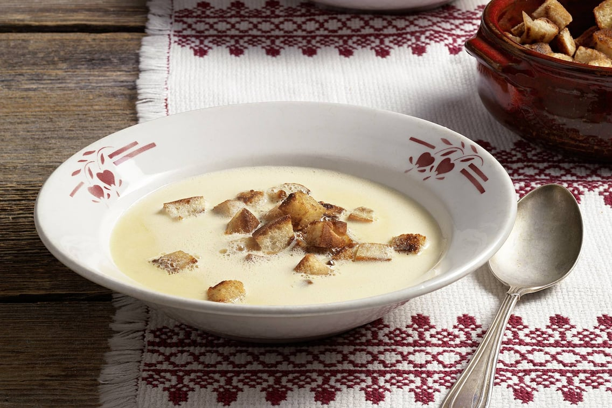

# Beef and Wine Soup

*A French-Italian border soup from the Alpine Eisacktal valley: beef broth lifted with white wine, finished with cream and Parmesan, and topped with a cinnamon-dusted slice of toast that floats while the broth warms beneath.*

**Serves:** 4

**Prep Time:** 10 minutes

**Cook Time:** 10 minutes

## Overview
This is the Alpine border-soup that crosses between France and Italy, beef broth lifted with white wine and the warming Alpine signature of cinnamon-spiced toast floating on top. You start with a properly rich beef stock (homemade if you can, good shop-bought if not) and reduce it with a generous splash of white wine until the alcohol cooks off and the broth carries the wine's perfume. Slices of crusty country bread toast dry, get dusted with cinnamon and a generous grating of Parmesan, and float on top of the bowl just before serving. The cinnamon is the surprise, not enough to register as "cinnamon" but enough to round out the broth into something warming. Eat with a glass of the cooking wine and a thick wool jumper.

## Ingredients

### Seasonings
- 1 litre strong beef stock (or broth)
- 500 ml white wine
- ½ teaspoon ground cinnamon
- 100 ml double cream

### Bread
- 4 slices country bread

### Fat
- 40 grams unsalted butter

### Cheese
- 100 grams freshly grated Parmesan cheese
- Freshly grated Parmesan cheese (to serve)

## Method

### Stage 1 - Prepare bread
1. Fry the bread in the butter on both sides until golden.
1. Sprinkle the cinnamon over each slice of bread.

### Stage 2 - Cook soup
1. Put the stock and the wine together in a large saucepan and bring to the boil.
1. Cook for 1 minute only.
1. Remove from the heat and set aside.
1. Add the cream to the soup and heat gently to warm through.
1. Stir the Parmesan into the soup.

### Stage 3 - Assemble and serve
1. Put one slice of bread in each soup bowl.
1. Pour the soup over the bread and sprinkle with a little more Parmesan.

## Notes
- **Bread:** Use stale bread for better texture when toasting.
- **Cheese:** Freshly grated Parmesan melts better and adds more flavor.
- **Wine:** Choose a dry white wine that complements the beef stock.

## Serving
Serve hot, sprinkled with extra freshly grated Parmesan.

## Storage
- Best served immediately; soup base can be refrigerated for 2 days. Reheat gently and assemble fresh.

*From Eisacktaler in the Italian Valle d'Isarco - the extreme eastern part of the Alps - comes this heart-warming and delightful soup. There as as many people speak German as they do Italian, thus the name 'wine soup', a good example of the influence neighbouring countries have on the Italian regions and their food.*
