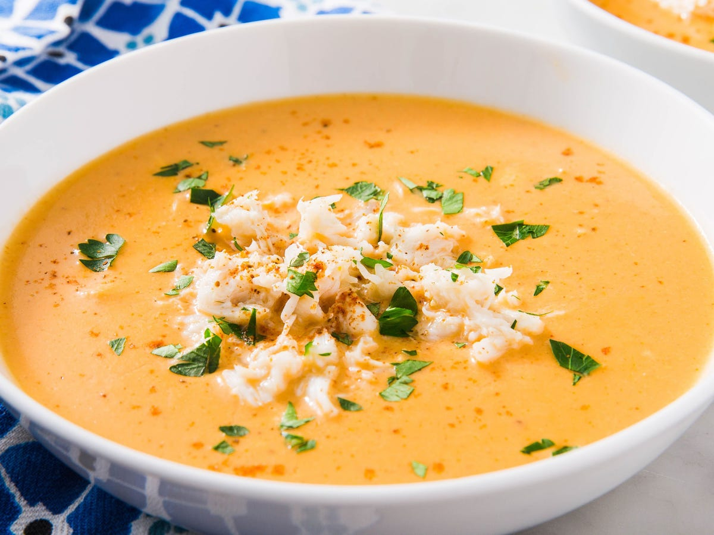

<!-- TODO: hero image undersized, refresh from Pexels or hand-curate -->
# Crab Bisque

*France's classic crab bisque: shells simmered for a rich stock, blended with cream, brandy and tomato paste into a silky smooth.*

**Serves:** 4

**Prep Time:** 20 minutes

**Cook Time:** 40 minutes

## Overview
Crab bisque is the French shellfish soup that turns the heads and shells you'd otherwise throw away into a rich coral-coloured broth, the dish that proves frugality and elegance live in the same kitchen. Crab shells and trimmings simmer hard in a stock with white wine, fennel, leek and tomato to extract every drop of flavour. The strained stock reduces with a splash of brandy, gets enriched with cream, and the picked white crab meat folds in at the end so it stays in delicate pieces. A pinch of cayenne or a few drops of hot sauce wakes the bisque up; the soup gets strained one more time through a fine sieve for the proper silky texture. Serve in small cups with a slice of toasted baguette on the side.

## Ingredients

### Base
- 50 grams butter

### Aromatics
- ½ carrot (finely chopped)
- ½ onion (finely chopped)
- 1 celery stalk (finely chopped)

### Protein
- 1 kg live crabs (cleaned and claws detached)

### Seasonings
- 1 bay leaf
- 2 thyme sprigs
- 2 tablespoons tomato purée
- ¼ teaspoon cayenne pepper

### Liquid/Broth
- 150 ml dry white wine
- 1 litre fish stock
- 500 ml water

### Other
- 2 tablespoons brandy
- 60 grams rice
- 3 tablespoons double cream

## Method

### Stage 1 - Cook crab
1. Heat the butter in a large saucepan.
2. Add the vegetables, bay leaf and thyme and cook over a medium heat for 3 minutes, making sure that the vegetables do not colour.
3. Add the crab claws, legs and bodies and cook for 5 minutes, or until the crab shells turn red.

### Stage 2 - Build broth
1. Add the tomato paste, brandy and white wine and simmer for 2 minutes, or until reduced by half.
2. Add the stock along with 500 ml of water and bring to the boil.
3. As soon as the liquid boils, reduce the heat and simmer gently for 5 minutes.
4. Remove the crab shells, leaving the crab meat in the stock, and reserve the claws to use as a garnish.
5. Finely crush the shells in a mortar and pestle.
6. Return the crushed shells to the soup with the rice.
7. Bring to the boil, and immediately reduce to a simmer again and cook for 20 minutes, or until soft.

### Stage 3 - Strain and finish
1. Immediately strain the bisque into a clean saucepan through a fine sieve lined with damp muslin, pressing down to extract as much liquid as possible.
2. Add the cream and season with salt and cayenne pepper, then gently reheat.
3. Serve at once, garnished with the crab claws.

## Notes
- **Crab:** Use fresh live crabs for best flavor; cleaning can be done by a fishmonger.
- **Straining:** Use muslin for a smooth bisque; press firmly to extract all flavor.
- **Brandy:** Adds depth; substitute with sherry if preferred.
- **Cream:** Stir in just before serving to prevent curdling.

## Serving
Serve hot in bowls, garnished with reserved crab claws. Pair with crusty bread.

## Storage
- Refrigerate up to 2 days; reheat gently.
- Freezes well for up to 1 month (without cream; add fresh).
- Best eaten fresh for optimal seafood flavor.
