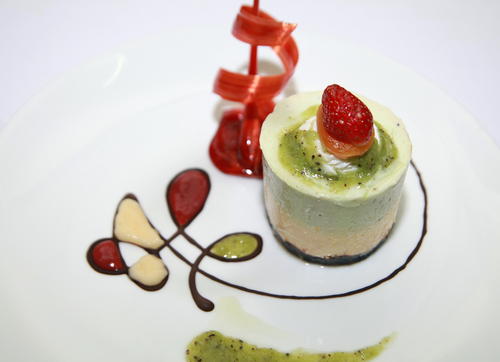

# Anise Parfait

*A French frozen parfait: egg yolks whisked with sugar over heat, folded with whipped cream and infused with star anise.*

**Serves:** 8

**Prep Time:** 10 minutes

## Ingredients
- 1 egg plus 3 egg yolks
- 50 grams caster sugar
- 100 ml whipping cream
- 100 ml double cream
- 30 ml Ricard (or Pernod)

### to serve
- 100 ml strawberry coulis
- 100 ml kiwi coulis
- 8 strawberries
- 100 ml [Syrup for Sorbet (Sirop à Sorbet)](../../../base-ingredients/syrup/sirop-a-sorbet.md)

## Overview
This is the elegant frozen parfait flavoured with anise liqueur (Ricard or Pernod), shaped in a ring mould and served with fresh berries and a bright fruit coulis. The base is a sabayon-and-cream parfait: egg yolks whisked over heat with sugar to a thick pale foam, then folded with whipped double cream and a generous splash of pastis. The frozen parfait gives you the lightness of a mousse with the make-ahead convenience of an ice cream, no last-minute oven work required. Pour into a ring mould and freeze overnight. To serve, briefly dip the mould in warm water and invert onto a chilled plate; arrange berries in the centre and pour the coulis around the base.

## Method
1. Heat the sirop a sorbet in a pan until it bubbles, and immediately remove from the heat.
1. Put the egg, egg yolks and sugar into a small heatproof bowl.
1. Stand the bowl over a small saucepan one-third filled with hot water at 50 - 60°C, making sure that the bottom of the bowl doesn't touch the water in any way.
1. Place the saucepan over a gentle heat.
1. Whisk the mixture , using a balloon whisk until it reaches a ribbon consistency,
1. Immediately remove the bowl from the pan and continue to whisk until the mixture has cooled noticeably to 25 - 30°C.
1. In another bowl, whip the creams together with the Ricard or Pernod to a ribbon consistency.
1. Fold into the whisked egg and sugar mixture, using a rubber spatula, making sure you do not overwork the mixture.
1. Place 8 metal rings, 7 cm in diameter, on a baking sheet or tray lined with greaseproof paper, and divide the parfait mixture between them.
1. Cover the rings with cling film and freeze until ready to serve.
1. One at a time, briefly warm the outside of each ring using a cook's blowtorch or hot tea towel and release the parfait on to a serving plate. 
1. Using a warm spoon, carefully dribble a teaspoon of kiwi coulis on each parfait, topped with a glazed strawberry.
1. Dribble the strawberry and kiwi coulis around each parfait and serve immediately.

## Notes
- The egg and sugar mixture must reach 80°C (check with a thermometer) for food safety when using raw eggs, then cooled to 25-30°C before folding in creams
- Fold the creams gently into the cooled egg mixture using a rubber spatula; avoid overmixing which deflates the mixture and results in a dense texture rather than light and airy
- The metal rings should be placed on a lined tray before filling to prevent sliding; cling film covering ensures the parfait won't absorb freezer odors or develop ice crystals
- Use a warm torch or tea towel to briefly heat the ring's exterior; this loosens the parfait just enough for easy release without melting the structure

## Serving
Release the parfait directly onto a chilled plate, creating an elegant presentation. Drizzle the colorful coulis artfully around the plate and top with a fresh strawberry for color. Serve immediately from removal from the freezer for the best texture and appearance. This requires no additional accompaniments.

## Storage
The assembled parfait freezes beautifully for up to one week in its mold, making it an excellent choice for advance preparation. Keep covered with cling film to prevent freezer burn. The coulis can be prepared 2-3 days ahead and stored covered in the refrigerator. Release from the mold only when ready to serve.
