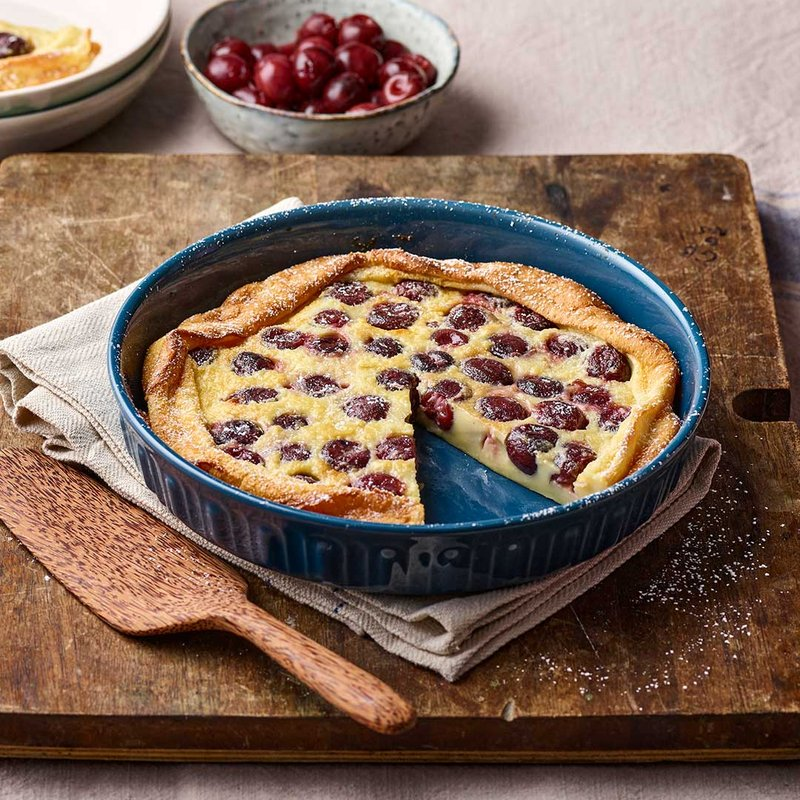

# Clafoutis

*The Limousin's harvest pudding: ripe cherries sat in a buttered dish and drowned in a sweet eggy batter. Baked till puffed and gold.*

**Serves:** 6

**Prep Time:** 15 minutes

**Cook Time:** 40 minutes

## Overview
A round baking dish (or shallow gratin dish, or 9-inch pie plate) butters and dusts with sugar. Ripe cherries (washed; traditionally stones in, see Notes) scatter in a single layer. A simple batter of eggs, sugar, salt, vanilla, plain flour, whole milk, double cream and a touch of melted butter whisks together (or blender'd) to a smooth thin consistency. Poured over the cherries; sprinkled with a little extra sugar. Baked at 180°C for 35-40 minutes until risen, golden, slightly cracked on the surface, just-set in the centre. Dusted with icing sugar; served warm with a glug of cream.

## Ingredients

### Dish prep
- 30 g unsalted butter (room temperature, for greasing)
- 1 tablespoon caster sugar (for dusting the dish)

### Cherries
- 500 g ripe sweet cherries (stones in OR pitted - your choice; see Notes)
- 1 tablespoon kirsch or brandy (optional, to macerate)
- 1 tablespoon caster sugar (for the cherries)

### Batter
- 3 eggs (large, room temperature)
- 80 g caster sugar (plus 1 tablespoon for sprinkling on top)
- A pinch of salt
- 1 teaspoon vanilla extract (OR scraped seeds from ½ vanilla pod)
- 80 g plain flour (sifted)
- 250 ml whole milk
- 150 ml double cream
- 30 g unsalted butter (melted)

### To serve
- 1 tablespoon icing sugar (for dusting)
- Cold double cream OR vanilla ice cream
- Crème fraîche (the traditional French accompaniment)

## Method

### Stage 1 - Prep the dish
1. Heat oven to 180°C (160°C fan).
1. Generously butter a 24 cm round baking dish (or a 22 x 28 cm rectangular).
1. Sprinkle the inside with 1 tablespoon caster sugar; tilt to coat the buttered surface; tip out excess.

### Stage 2 - Macerate the cherries
1. Place the cherries in a bowl; toss with the kirsch (if using) and 1 tablespoon sugar.
1. Let stand 10 minutes (releases a small amount of juice and flavours the cherries).

### Stage 3 - Batter
1. **By hand**: whisk eggs with 80 g sugar, salt and vanilla in a wide bowl until pale and slightly thick (1-2 minutes).
1. Whisk in the flour gradually (it'll be lumpy initially; keep whisking until smooth).
1. Whisk in the milk, double cream and melted butter to a thin pourable batter.
1. (Alternative - blender method, easier: blend all batter ingredients on high for 20 seconds; strain into a jug.)
1. The batter should be the consistency of thin cream - like a crepe batter.

### Stage 4 - Assemble
1. Tip the macerated cherries (and their juice) into the prepared dish; spread in a single layer.
1. Pour the batter slowly over the cherries - the cherries should mostly be submerged but the tops can poke through.
1. Sprinkle the remaining 1 tablespoon caster sugar over the top (gives a crisp sugary crust during baking).

### Stage 5 - Bake
1. Bake 35-40 minutes until:
   - The top is deep golden brown, possibly with a few crackles
   - The clafoutis has puffed up around the cherries (it'll settle as it cools)
   - A skewer inserted comes out almost clean (a little moist batter around the cherries is fine)
   - The centre has only the slightest jiggle when the dish is tapped

### Stage 6 - Cool
1. Lift out of the oven; cool 10-15 minutes.
1. The puff settles; the texture firms.

### Stage 7 - Serve
1. Dust generously with icing sugar (through a sieve for an even snow).
1. Spoon onto plates straight from the dish.
1. Serve warm with cold cream, crème fraîche or vanilla ice cream.

## Notes
- **Stones in vs out:** Traditional French clafoutis uses cherries with their stones still in - the stones release a faint almond aroma (from amygdalin) during baking that perfumes the dessert. Eaters spit the stones out as they go. Pitted cherries are easier for guests but give a slightly milder flavour. If serving to children or those who'd be alarmed by stones, pit them. For a true taste, leave the stones in.
- **Variations are called flaugnarde:** Strictly, clafoutis is cherries only. The same recipe with plums = flaugnarde aux prunes; with pears = flaugnarde aux poires. All work; most cooks use the names interchangeably.
- **The puff settles:** Out of the oven, clafoutis puffs dramatically like a Yorkshire pudding. It always settles as it cools - don't worry. The interior texture is meant to be soft, custardy, slightly springy.

## Storage
- Best within 4 hours of baking, served warm.
- Refrigerate 3 days; warm individual portions in a 160°C oven 8 minutes.
- Doesn't freeze well - the custard separates on thaw.
